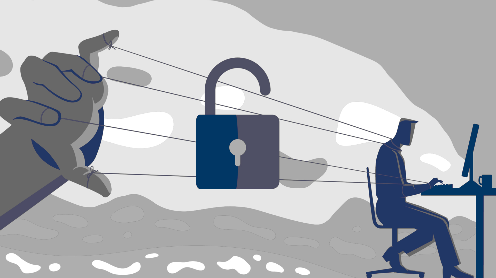

<link rel="stylesheet" href="../../CSS/style.css" type="text/css">

# Sosyal Mühendislik 102 - Gaslighting ve Bal Tuzağı ile Phising | Siber Güvenlik Eğitimi

<!-- SEO Meta Tags -->
<meta name="description" content="Gaslighting ve Bal Tuzağı (Honeypot) teknikleri ile modern phishing saldırıları hakkında kapsamlı rehber. Siber güvenlik uzmanı Ali Can Gönüllü'den pratik korunma yöntemleri ve gerçek dünya örnekleri.">
<meta name="keywords" content="gaslighting, honeypot, phishing, sosyal mühendislik, siber güvenlik, phishing korunma, gaslighting phishing, bal tuzağı, sosyal medya güvenliği, e-posta güvenliği">
<meta name="author" content="Ali Can Gönüllü">
<meta name="robots" content="index, follow">
<meta property="og:title" content="Sosyal Mühendislik 102 - Gaslighting ve Bal Tuzağı ile Phising">
<meta property="og:description" content="Modern phishing saldırılarının en tehlikeli formları olan gaslighting ve honeypot teknikleri hakkında detaylı analiz ve korunma yöntemleri.">
<meta property="og:type" content="article">
<meta property="og:url" content="https://github.com/alicangnll/CTI_Arastirmalarim/Info101/Phising-102/">
<meta property="og:image" content="https://alicangnll.github.io/CTI_Arastirmalarim/Info101/Phising-102/phising102_title.jpg">
<meta name="twitter:card" content="summary_large_image">
<meta name="twitter:title" content="Sosyal Mühendislik 102 - Gaslighting ve Bal Tuzağı ile Phising">
<meta name="twitter:description" content="Gaslighting ve honeypot teknikleri ile modern phishing saldırıları hakkında kapsamlı rehber.">
<meta name="twitter:image" content="phising102_title.jpg">

  

  

    
<strong>Ali Can Gönüllü</strong> | Siber Güvenlik Uzmanı | <a href="mailto:alicangonullu@yahoo.com">alicangonullu@yahoo.com</a> 
    <em>LinkedIn: <a href="https://linkedin.com/in/alicangonullu" target="_blank">linkedin.com/in/alicangonullu</a></em>
 

# Disclaimer | Yasal Uyarı

  Bu blog yazısında sağlanan bilgiler yalnızca eğitim ve bilgilendirme amaçlıdır. <b>Bilgisayar korsanlığı, siber saldırılar veya bilgisayar sistemlerine, ağlara veya verilere herhangi bir şekilde yetkisiz erişim de dahil olmak üzere herhangi bir yasa dışı veya etik olmayan faaliyeti</b> teşvik etme veya reklam etme amacı taşımaz.
  
  Disclaimer: The information provided in this blog post is intended for educational and informational purposes only. It is not intended to encourage or promote any illegal or unethical activities, including hacking, cyberattacks, or any form of unauthorized access to computer systems, networks or data.

# Giriş

  İnternet ve genel anlamıyla siber dünyanın gelişmesiyle insanlık olarak büyük bir gelişim sağlamış ve bu gelişimle beraber hayatımıza pek çok yeni kavram girmiştir. Bu kavramlar genel olarak faydalı olarak görülmüş olsa da her fayda gibi hayatımıza yeni giren bu kavramlar da zamanla kendi antisini oluşturarak kötücül olarak kullanılmaya başlanmıştır.
    
  <strong>Phishing</strong> yani oltalama kavramı da siber dünyada iletişim kavramının antisi olarak tanımlanabilir. Siber dünyada insanlar birbirleriyle iletişim kurarken kötü niyetli kişiler bu konuşmalarla insanları manipüle etmenin yolunu bularak "Phishing" adlı kavramın ortaya çıkmasına ön ayak olmuştur.
    
  Ancak günümüzde phishing saldırıları sadece basit kandırma teknikleriyle sınırlı kalmamış, <strong>psikolojik manipülasyonun en gelişmiş formlarını</strong> kullanarak kurbanların zihinsel savunma mekanizmalarını hedef almaya başlamıştır. <strong>Gaslighting</strong> ve <strong>Bal Tuzağı (Honeypot)</strong> teknikleri, bu gelişmiş manipülasyon yöntemlerinin en tehlikeli örnekleridir.
    
  <strong>Gaslighting tekniği</strong>, kurbanın kendi gerçekliğini ve hafızasını sorgulamasına neden olarak, saldırganın istediği bilgileri kolayca elde etmesini sağlar. <strong>Bal Tuzağı</strong> ise insanların doğal merak, açgözlülük ve fırsatçılık duygularını kullanarak onları çekici "ödüller" ile tuzağa düşürür.
    
  Bu yazımda sizlere bu gelişmiş phishing tekniklerinin nasıl çalıştığını, gerçek dünyadan örneklerle nasıl uygulandığını ve bu tehlikeli saldırılara karşı nasıl korunabileceğinizi detaylıca açıklamaya çalışacağım.

# Gaslighting ve Bal Tuzağı Saldırılarının Önemi

  Gaslighting ve Bal Tuzağı (Honeypot) teknikleri, modern phishing saldırılarının en tehlikeli ve etkili formlarıdır. Bu teknikler, kurbanların psikolojik savunma mekanizmalarını hedef alarak, geleneksel güvenlik önlemlerini aşmayı başarır.
    
  <b>Gaslighting</b>, kurbanın kendi gerçekliğini ve hafızasını sorgulamasına neden olan sistematik bir manipülasyon yöntemidir. Bu teknik, 1938 yılında yazılan "Gas Light" adlı oyundan gelmekte ve siber güvenlik dünyasında phishing saldırılarında kritik bir rol oynamaktadır. Gaslighting, sosyal mühendislik saldırılarında kurbanların kendi algılarını ve hafızalarını sorgulamasına neden olarak, saldırganların istediği bilgileri kolayca elde etmesini sağlar.
    
  <b>Bal Tuzağı (Honeypot)</b> ise kurbanları çekici "ödüller" veya "fırsatlar" ile tuzağa düşürme yöntemidir. Bu teknik, insanların doğal merak, açgözlülük ve fırsatçılık duygularını kullanarak onları manipüle eder.
    
  Her iki teknik de kurbanların mantıklı düşünme yetisini zayıflatır ve saldırganların istediği bilgileri kolayca elde etmesini sağlar. Bu durum, modern phishing saldırılarının en etkili yöntemlerinden biri haline gelmiştir.
    
  <b>Gaslighting'in Siber Güvenlikteki Rolü:</b> Gaslighting, siber güvenlik bağlamında sosyal mühendislik saldırılarının etkinliğini artıran kritik bir faktördür. Saldırganlar, kurbanların gerçeklik algısını bozarak, onları kendi hafızalarını ve gözlemlerini sorgulamaya iter. Bu durum, kurbanların savunma mekanizmalarını zayıflatır ve saldırganların istediği bilgileri kolayca elde etmesini sağlar.

# Gaslighting ve Bal Tuzağı Saldırılarının Çeşitleri

  Bu gelişmiş manipülasyon tekniklerinin genel çeşitlerini saymamız gerekirse,
  <ul>
    <li>E-posta ile Gaslighting Saldırıları</li>
    <li>Sosyal Medya ile Honeypot Saldırıları</li>
    <li>Telefon ile Hibrit Saldırılar</li>
    <li>Mesajlaşma Uygulamaları ile Manipülasyon</li>
  </ul>
  olarak sayabiliriz. Şimdi bu çeşitleri örnekler üzerinden açıklamaya çalışalım.

# E-posta ile Gaslighting Saldırıları

  E-posta ile gaslighting saldırıları, kurbanların kendi hafızalarını ve algılarını sorgulamasına neden olan en yaygın phishing yöntemlerinden biridir. Bu saldırılarda saldırgan, kurbanın kendi güvenlik duygusunu sorgulamasına neden olarak istediği bilgileri kolayca elde eder.
    
  <b>Örnek Senaryo:</b> Kurban, bankasından geldiğini iddia eden bir e-posta alır. E-posta şu mesajı içerir:
    
  <i>"Sayın Müşterimiz, hesabınızda 15:30'da 50.000 TL tutarında bir işlem gerçekleştirildi. Bu işlemi siz yapmadıysanız, hemen aşağıdaki linke tıklayarak hesabınızı güvence altına alın. Aksi takdirde hesabınız dondurulacaktır."</i>
    
  <b>Gaslighting Tekniği:</b> Kurban bu işlemi yapmadığını biliyor ancak e-posta o kadar ikna edici ki, kendi hafızasını sorgulamaya başlar. "Belki de yaptım ama unuttum?" düşüncesi oluşur. Bu durum, gaslighting'in temel prensiplerinden biri olan "gerçeklik çarpıtması"nın mükemmel bir örneğidir.
    
  <b>Psikolojik Etki:</b> Kurban, kendi hafızasını sorguladığı için kendisini "hatalı" olarak görmeye başlar. Bu durum, gaslighting'in en tehlikeli yanıdır çünkü kurban kendi gerçekliğini sorgular ve saldırganın istediği bilgileri paylaşır.
    
  <b>Sonuç:</b> Kurban, "kendi hatası" olduğunu düşünerek linke tıklar ve kimlik bilgilerini girer.
    
  Bu tür saldırılar özellikle bankacılık, e-ticaret ve sosyal medya hesaplarında yaygın olarak kullanılmaktadır.

# Sosyal Medya ile Honeypot Saldırıları

  Sosyal medya platformları, honeypot saldırıları için ideal ortamlar sağlar. Bu saldırılarda saldırgan, kurbanların dikkatini çekecek çekici ödüller sunarak onları tuzağa düşürür.
    
  <b>Örnek Senaryo:</b> Kurban, sosyal medyada şu mesajı görür:
    
  <i>"TEBRİKLER! Apple'ın 100.000.000. kullanıcısı sizsiniz! Ücretsiz iPhone 15 Pro Max kazanmak için aşağıdaki linke tıklayın. Sadece 24 saat geçerli!"</i>
    
  <b>Honeypot Tekniği:</b> Kurban ücretsiz iPhone fırsatını kaçırmak istemez. "Belki de gerçektir" düşüncesi oluşur.
    
  <b>Sonuç:</b> Kurban linke tıklar, kişisel bilgilerini girer ve zararlı yazılım indirir.
    
  Bu tür saldırılar Facebook, Instagram, Twitter ve TikTok gibi platformlarda yaygın olarak görülmektedir.

# Telefon ile Hibrit Saldırılar

  Telefon ile hibrit saldırılar, gaslighting ve honeypot tekniklerinin birlikte kullanıldığı en tehlikeli saldırı türlerinden biridir. Bu saldırılarda saldırgan, kurbanın hem kendi hafızasını sorgulamasına hem de çekici fırsatlar sunarak onları manipüle eder.
    
  <b>Örnek Senaryo:</b> Kurban, telefon ile arayan bir kişiden şu mesajı alır:
    
  <i>"Merhaba, bankanızdan arıyorum. Hesabınızda 1 milyon TL tutarında bir hata tespit ettik. Bu hata sizin hatanız değil, sistem hatası. Ancak bu parayı geri almak için hemen aşağıdaki linke tıklayın. Aksi takdirde para kaybolacak!"</i>
    
  <b>Hibrit Teknik:</b> Bu mesajda hem gaslighting (kurbanın kendi hatasını sorgulaması) hem de honeypot (büyük para fırsatı) teknikleri birlikte kullanılmıştır.
    
  <b>Güç Dengesizliği ve Korku:</b> Saldırgan, kurbanın kendisini otorite olarak görmesini sağlar. Bu durum, kurbanın korku ve stres yaşamasına neden olur. Korku, beynimizin eleştirel düşünme kısmını kapatır ve korku merkezinin devreye girmesine neden olur. Bu durumda kurban mantıklı düşünemez ve korku duygusuyla hareket eder.
    
  <b>Sonuç:</b> Kurban, kendi hatası olduğunu düşünerek ve büyük para fırsatını kaçırmak istemeyerek saldırganın istediği bilgileri paylaşır.
    
  Bu tür saldırılar özellikle yaşlı bireyler, yaslı kişiler ve güvenlik konusunda deneyimsiz kişiler üzerinde çok etkilidir. Ayrıca finansal olarak zor durumda olan kişiler de bu tür saldırılara daha açıktır.

# Mesajlaşma Uygulamaları ile Manipülasyon

  WhatsApp, Telegram ve Signal gibi mesajlaşma uygulamaları, gaslighting ve honeypot saldırıları için yeni bir alan oluşturmuştur. Bu platformlarda saldırganlar, kurbanları daha kişisel bir şekilde manipüle edebilir.
    
  <b>Örnek Senaryo:</b> Kurban, Telegram'da şu mesajı alır:
    
  <i>"🚀 BÜYÜK HABER! Yeni kripto para projemizde erken yatırımcılar %1000 kar elde ediyor! Sadece ilk 100 kişi kabul ediliyor. Hemen aşağıdaki linke tıklayın!"</i>
    
  <b>Honeypot Tekniği:</b> Kurban büyük kar fırsatını kaçırmak istemez. "Belki de gerçek bir fırsattır" düşüncesi oluşur.
    
  <b>Sonuç:</b> Kurban linke tıklar, cüzdan bilgilerini girer ve tüm kripto parasını kaybeder.
    
  Bu tür saldırılar özellikle kripto para yatırımcıları ve yüksek gelirli bireyler üzerinde hedeflenmektedir.

# Korunma Yöntemleri

  Açıkçası en büyük korunma yöntemi personellerin eğitimi ve konuya hakim olmasıdır. Personelleriniz ne kadar bu konuda bilinçliyse o kadar güvendesiniz demektir. Bunların dışında, <b>IP ve URL engelleme, Mail filtreleme, antivirüs sistemlerinin politikalarını sıkılaştırma, açık kaynak veri politikalarını sıkılaştırma, sinyalleri engelleyici ofis tasarımları</b> gibi önlemleri de alabilirsiniz. Ne kadar az açık veri o kadar büyük bir güvenlik demektir.
    
  <b>Gaslighting ve Honeypot saldırılarına karşı özel korunma yöntemleri:</b>
  <ul>
    <li><b>Gerçeklik Kontrolü:</b> Her zaman resmi kanallardan doğrulama yapın</li>
    <li><b>Zaman Baskısı:</b> Acele karar vermeyin, düşünmek için zaman ayırın</li>
    <li><b>Duygusal Kontrol:</b> Heyecan ve korku anlarında karar vermeyin</li>
    <li><b>Kaynak Doğrulama:</b> Gönderenin kimliğini mutlaka doğrulayın</li>
    <li><b>Şüphecilik:</b> "Çok iyi olan şeyler genellikle gerçek değildir" prensibini benimseyin</li>
    <li><b>Güçlü Duygusal Tepkiler:</b> Tanımadığınız birinden güçlü duygusal tepki (korku, "içgüdüsel his") uyandıran bir mesaj alırsanız, durun ve kendinize "manipüle ediliyor muyum?" diye sorun</li>
    <li><b>Kritik Düşünme:</b> Bu organizasyon/işletme/ajans daha önce sizden kişisel bilgi istemek için sizinle iletişime geçmiş mi? (Çoğu geçmemiştir)</li>
    <li><b>Aile Şifresi:</b> Yakınlarınızla bir şifre oluşturun, böylece acil durumda arayan biri size şifreyi vermek zorunda kalır</li>
    <li><b>Yardım Arama:</b> Eğer tuzağa düştüyseniz, utanç ve mahcubiyet sizi yardım aramaktan alıkoymasın. Bu herkesin başına gelebilir!</li>
  </ul>
    
  <b>Gaslighting'e Karşı Korunma:</b> Gaslighting'e karşı korunmanın en iyi yolu, bunun var olduğunu ve nasıl çalıştığını bilmek ve bildiklerinize ve inandıklarınıza sıkı sıkıya bağlı kalmaktır. Siber suçlulara ve dolandırıcılara karşı korunmak için de aynı şey geçerlidir.
    
  Her zaman dediğimiz gibi <b>"kırılamaz şifre ve aşılamaz güvenlik sistemi yoktur"</b> fakat önlemimizi alarak bu tip saldırılardan çok büyük bir oranda korunabiliriz.

# Kaynaklar

## 📚 Akademik ve Resmi Kaynaklar
- [Açık Kaynak İstihbarat ve Sosyal Mühendislik](https://acikbilim.yok.gov.tr/bitstream/handle/20.500.12812/127310/yokAcikBilim_10293666.pdf?sequence=-1&isAllowed=y) - YÖK Açık Bilim
- [Gaslighting in Cyber Security Context](https://www.cyberdefensemagazine.com/whats-the-role-of-gaslighting-in-the-cyber-security-context-of-social-engineering/) - Cyber Defense Magazine
- [Social Engineering Attacks](https://www.cisa.gov/news-events/news/understanding-social-engineering-attacks) - CISA (Cybersecurity and Infrastructure Security Agency)
- [Internet Fraud Prevention](https://www.fbi.gov/scams-and-safety/common-scams-and-crimes/internet-fraud) - FBI

## 📖 Kitaplar
- **Aldatma Sanatı** - Kevin Mitnick
- **The Art of Deception** - Kevin Mitnick & William L. Simon

## 🔗 İlgili Bağlantılar
- [Sosyal Mühendislik Görsel Rehberi](https://www.telsy.com/wp-content/uploads/2021/10/social-engineering-telsy-2.jpg) - Telsy
- [Gaslighting Psychology](https://www.psychologytoday.com/us/basics/gaslighting) - Psychology Today
- [Identity Theft Prevention](https://www.ftc.gov/news-events/topics/identity-theft) - Federal Trade Commission

---

## 📞 İletişim ve Sosyal Medya

**Ali Can Gönüllü** | Siber Güvenlik Uzmanı
- 📧 **E-posta**: [alicangonullu@yahoo.com](mailto:alicangonullu@yahoo.com)
- 💼 **LinkedIn**: [linkedin.com/in/alicangonullu](https://linkedin.com/in/alicangonullu)
- 🐙 **GitHub**: [github.com/alicangonullu](https://github.com/alicangnll)

---

## 🏷️ Etiketler ve Hashtag'ler

`#Gaslighting` `#Honeypot` `#Phishing` `#SosyalMühendislik` `#SiberGüvenlik` `#CyberSecurity` `#PhishingKorunma` `#BalTuzağı` `#SosyalMedyaGüvenliği` `#EPostaGüvenliği` `#SiberGüvenlikEğitimi` `#CTI` `#ThreatIntelligence` `#SocialEngineering` `#CybersecurityAwareness`

---

## ⚠️ Yasal Uyarı

Bu içerik yalnızca eğitim ve bilgilendirme amaçlıdır. Siber güvenlik farkındalığını artırmak için hazırlanmıştır. Herhangi bir yasa dışı faaliyeti teşvik etmez.

---

*Son güncelleme: 2024 | Tüm hakları saklıdır.*