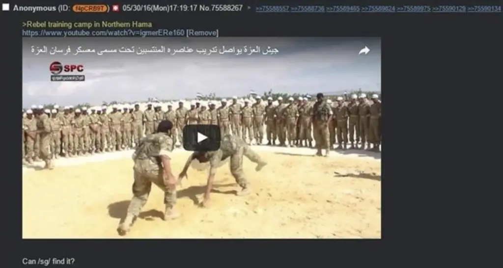
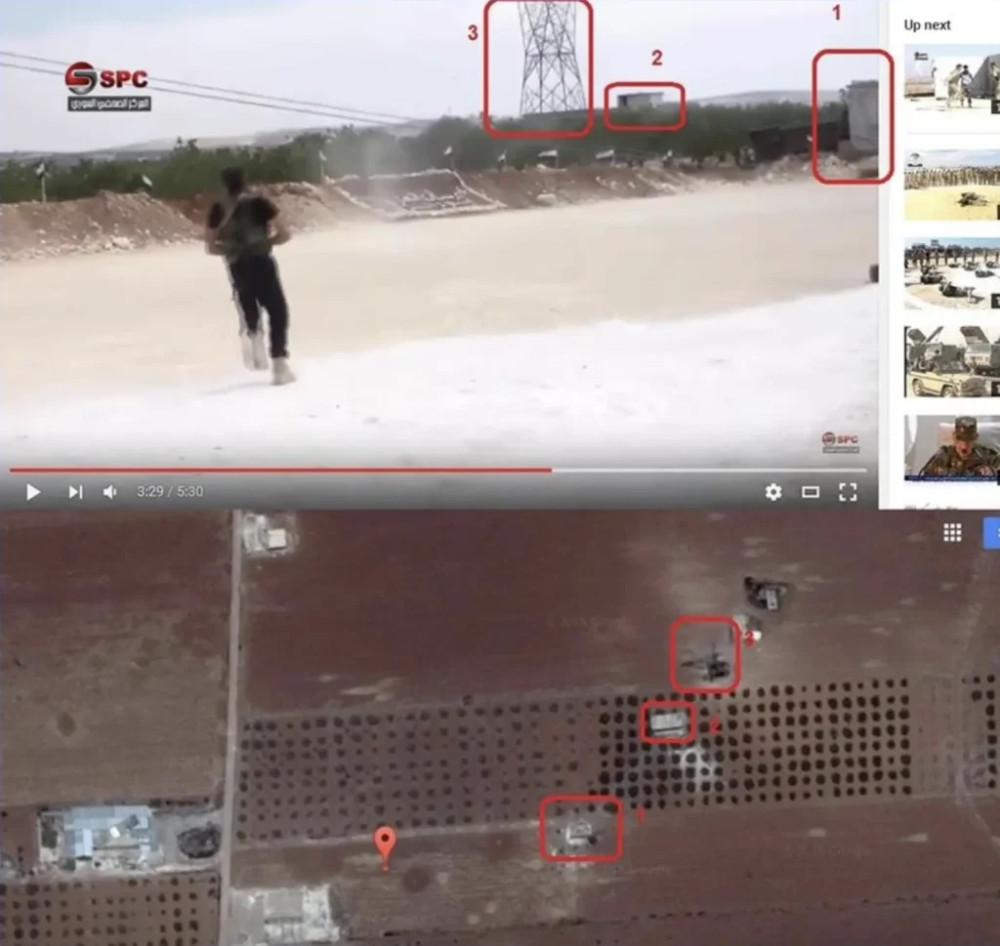
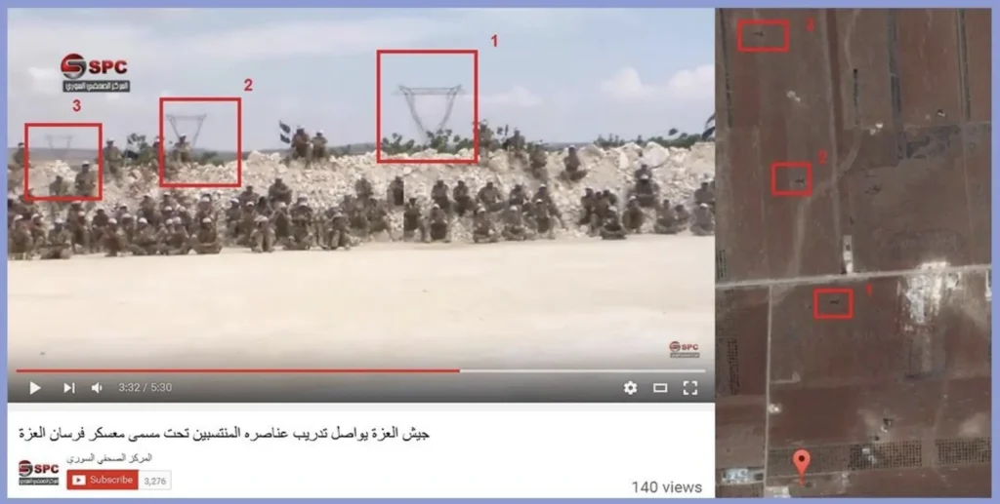
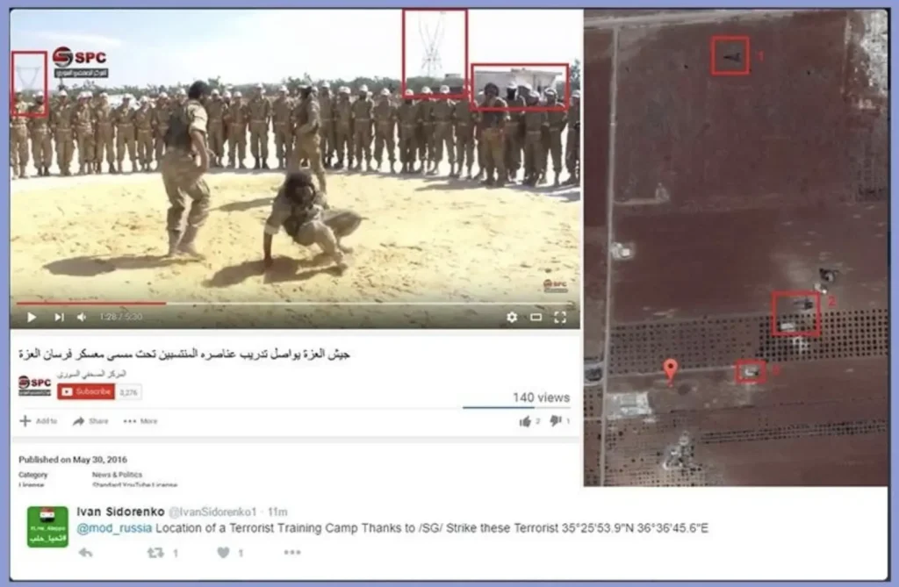
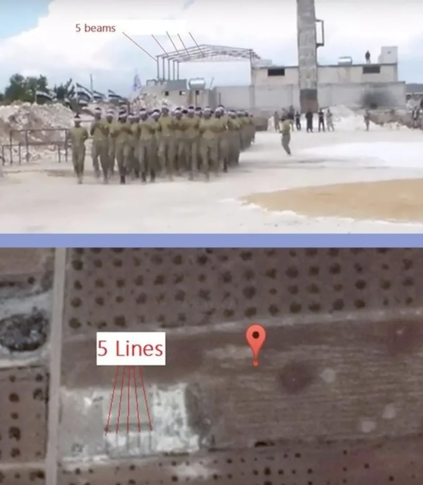
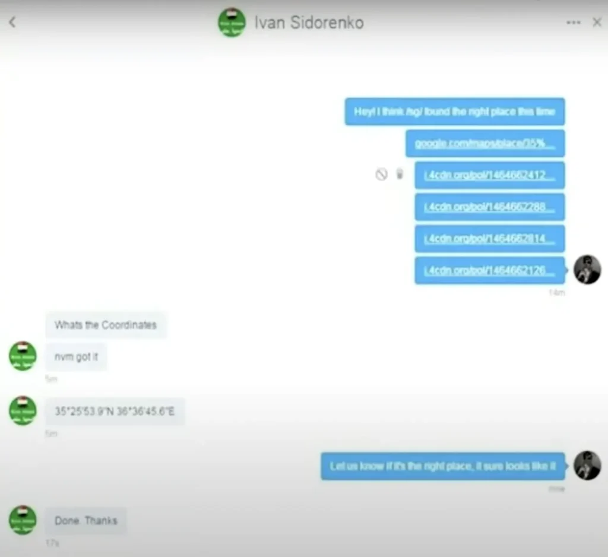
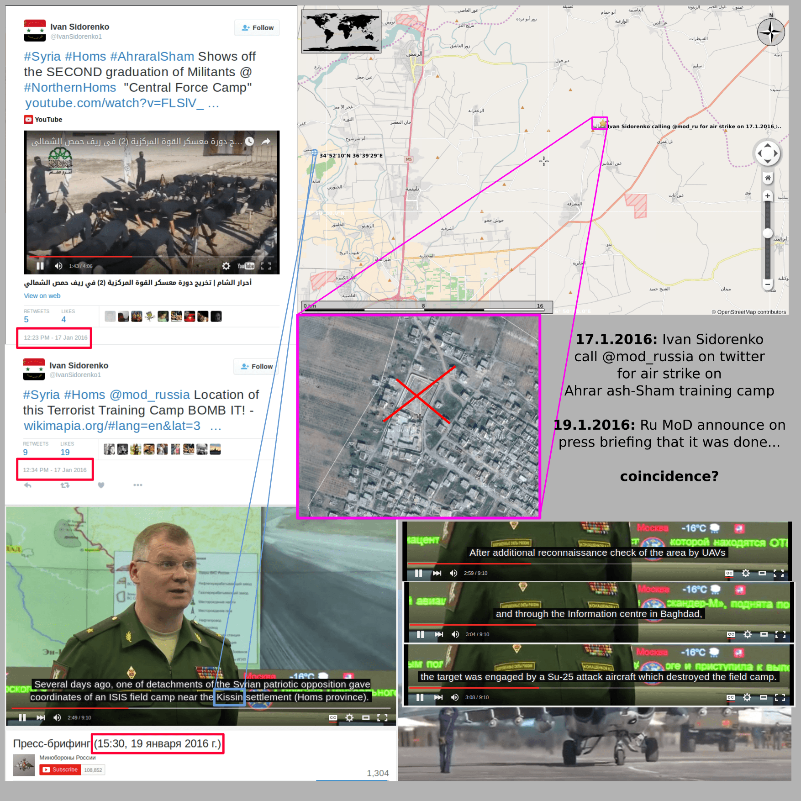
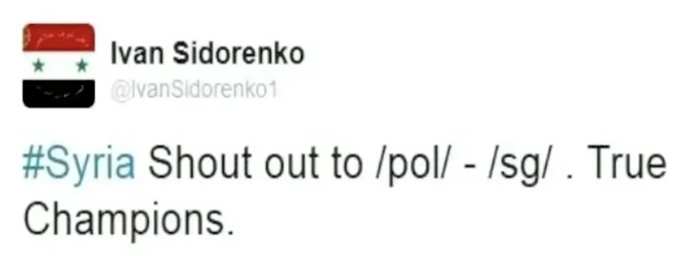

<link rel="stylesheet" href="../../CSS/style.css" type="text/css">

# Sosyal Mühendislik 101 - Phising Saldırıları
  

  

    
Ali Can Gönüllü | Siber Güvenlik Uzmanı  alicangonullu[at]yahoo.com
 

# Disclaimer | Yasal Uyarı

  Bu blog yazısında sağlanan bilgiler yalnızca eğitim ve bilgilendirme amaçlıdır. <b>Bilgisayar korsanlığı, siber saldırılar veya bilgisayar sistemlerine, ağlara veya verilere herhangi bir şekilde yetkisiz erişim de dahil olmak üzere herhangi bir yasa dışı veya etik olmayan faaliyeti</b> teşvik etme veya reklam etme amacı taşımaz.
  
  Disclaimer: The information provided in this blog post is intended for educational and informational purposes only. It is not intended to encourage or promote any illegal or unethical activities, including hacking, cyberattacks, or any form of unauthorized access to computer systems, networks or data.

# Giriş

  İnternet ve genel anlamıyla siber dünyanın gelişmesiyle insanlık olarak büyük bir gelişim sağlamış ve bu gelişimle beraber hayatımıza pek çok yeni kavram girmiştir. Bu kavramlar genel olarak faydalı olarak görülmüş olsa da her fayda gibi hayatımıza yeni giren bu kavramlar da zamanla kendi antisini oluşturarak kötücül olarak kullanılmaya başlanmıştır.
    
  Phising yani oltalama kavramı da siber dünyada iletişim kavramının antisi olarak tanımlanabilir. Siber dünyada insanlar birbirleriyle iletişim kurarken kötü niyetli kişiler bu konuşmalarla insanları manipüle etmenin yolunu bularak "Phising" adlı kavramın ortaya çıkmasına ön ayak olmuştur.
    
  Bu yazımda sizlere phising kavramının tarihçesini, ne olduğunu ve nasıl korunabileceğinizi detaylıca açıklamaya çalışacağım.

# Oltalama Saldırıları Tarihçesi

  Oltalama yani phising teriminin ilk olarak insanların hayatına girmiş olduğu tarih hemen hemen insanlığın doğumuyla eşdeğer bir tarih olsa da siber dünyada <b>"internet kullanıcılarının kişisel verilerini onları kandırmak suretiyle alınmasını"</b> tanımlamak için ilk olarak 1987 yılında hayatımıza girmiştir. O yıllarda ortaya çıkan bu kavram internetin gelişmesiyle hayatımıza tam anlamıyla 1990'lı yıllarda dahil olmuştur.

# Oltalama Saldırılarının Önemi

  Phising, teknik herhangi bir zafiyeti ön plana çıkarmaktan ziyade, insan zafiyetini ön plana çıkaran bir saldırı tekniği olması ve insan zafiyetlerinin giderilmesinin hem maddi hem de manevi olarak daha ağır bir yükü olduğu için çağımızın ve geleceğin en büyük saldırı tipi olduğunu söylemek sanırım yanlış olmaz.
    
  Phising kavramının babası olarak tanımlanabilecek olan Kevin Mitnick, Aldatma Sanatı adlı kitabında <b>"bir kurum en üst düzey koruma sistemlerini kursa dahi personelinin zafiyetli olması nedeniyle güvende değildir."</b> sözleriyle Phising saldırılarının ciddiyetini açık bir şekilde belirtmiştir.
    
  Yine Kevin Mitnick, aynı kitabında <b>"insan unsuru aslında güvenliğin en zayıf halkasıdır"</b> diyerek insan unsurunun ne kadar zafiyetli bir varlık olduğunu açıkça belirterek Phising saldırılarının ve saldırıyla bağlantılı manipülasyon tekniklerinin ne kadar tehlikeli olduğunu göstermiştir.

# Oltalama Saldırılarının Çeşitleri

  Phising saldırılarının genel çeşitlerini saymamız gerekirse,
  <ul>
    <li>OSINT Yardımıyla Oltalama</li>
    <li>HUMINT Yardımıyla Oltalama</li>
    <li>SIGINT Yardımıyla Oltalama</li>
    <li>IMGINT Yardımıyla Oltalama</li>
  </ul>
  olarak sayabiliriz. Şimdi bu çeşitleri örnekler üzerinden açıklamaya çalışalım.

# OSINT Yardımıyla Oltalama

  OSINT, İngilizce "açık kaynak istihbaratının" kısaltılmış halidir. Bu yöntemde veriler açık kaynaklar taranarak bulunur ve bu veriler kişiye karşı kullanılır. Şöyle bir örnekle açıklayalım,
    
  Bir ofis hayal edelim. Ofisteki çalışanların sisteme girişlerinde <b>SMS ile çift faktörlü doğrulama gibi sistemler kullanıldığını ve sistemde kullanılan uygulamaların personellerin dışarıdan da erişebilmesi için dışa açık olduğunu</b> düşünelim. X kişisi bu ofiste bir İnsan Kaynakları personeli ve <b>x@ofis.com</b> adlı bir iş maili ile birlikle <b>+90 555 666 99 88</b> numaralı bir iş telefonu kullandığını düşünelim. 
    
  X kişisi, bir iş arama sitesine <b>x@ofis.com</b> mail adresi ve <b>+90 555 666 99 88</b> telefonunu kaydetmiştir ve bu iş arama sitesinde bir Siber Güvenlik Uzmanı ilanı oluşturmuş ve iletişim bilgisi olarak iş arama sitesine girdiği mail ve telefon bilgisini girmiştir. Bu ilanı da herkese açık hale getirerek daha fazla personeli iş ilanına çekmeyi hedefleyerek rekabeti arttırmayı amaçlamıştır.
    
  Y kişisi işinde iyi bir Siber Güvenlik Uzmanı olduğu halde şirket tarafından iş başvurusu uygun bulunmamış ve bu sebeple şirkete sinirlenmiştir. Şirkete beslediği kin sebebiyle şirkete zarar vermek istemektedir. Bu sebeple şirket hakkında bilgi toplamaya başlamış ve şirketin IP adreslerini tararken şirketin herkese açık bir Web uygulaması olduğunu görmüştür ve bu panele İnsan Kaynakları personelinin de ulaşabileceğini düşünmüştür.
    
  Bahsi geçen sisteme girmek için çokça teknik denemeler yapsa da girememiş ve açık kaynak araştırması yaparken X kişisinin <b>x@ofis.com</b> mail adresiyle <b>+90 555 666 99 88</b> telefonunu sisteme iletişim bilgisi olarak herkese açık bir şekilde kaydettiğini görmüştür. 
    
  Bu bilgileri kullanarak sisteme girmeyi denediğinde bir SMS doğrulaması olduğunu görmüştür. Bu korumayı aşmak için ise insan kaynakları personeline DOCX formatında mükemmel derecede bir CV dosyası hazırlamış ve aynı dosyanın içerisini zararlı kodlarla doldurmuştur.
    
  X kişisine bu dosyayı göndermiş ve X kişisi de işi gereği bu dosyayı açarak Y kişisinin amacına ulaşmasına yol açmıştır.
    
  Sizce bu senaryoyu uyduruyor muyum ? Hayır bunun bir benzeri geçtiğimiz günlerde çeşitli çok ama çok ünlü firmalarda yaşandı. İşin acı tarafı bu firmaların çok detaylı Siber Güvenlik araçları vardı. Fakat az önce dediğim gibi insan zafiyeti en büyük zafiyettir.

# HUMINT Yardımıyla Oltalama

  HUMINT, İngilizce "insan istihbaratının" kısaltılmış adıdır. Bu yöntemde insanları çeşitli manipülasyon teknikleriyle yanıltarak bilgi toplamak amaçlanmaktadır. Bir örnekle açıklayalım,
    
  Bir ofis hayal edelim. Bu ofiste çok detaylı ve gizli bir ürün fikri konuşulmaktadır. O kadar önemli bir üründür ki aynı ürüne talip üç firma vardır. Bu kadar önemli bir ürün için çok detaylı önlemler alınmış, bilgisayarlar en baştan kurulmuş, farklı yazılımlar kurmak yasaklanmış, belgeler şifrelenmiş ve şifresiz belge bulundurmak yasaklanmıştır.
    
  Bu ofiste yazılımcı olarak çalışan X kişisi çeşitli arkadaşlık uygulamaları kullanmaktadır ve bu uygulamalardaki kişilerle buluşmaktadır. Yine bu kişi uygulama içerisinde dolaşırken karşı cinsten Y takma adlı kişi eklemiş ve kendisine mesaj atmıştır.
    
  Y takma adlı kişi, aslında X kişisinin projesine talip olan firmalardan birinde çalışan bir kişidir. X kişisini gayet net şekilde tanımaktadır ve hangi şirkette çalıştığını da bilmektedir. X kişisi bu konuya uyanmasın diye de onu tanımıyormuş gibi çeşitli sorular sormaktadır.
    
  X kişisiyle işi biraz daha pişirdikten sonra Y kişisi hangi projelerle ilgilendiğini sorarak projenin aşaması hakkında bilgileri alıp firmasına iletmektedir. Gelgelelim en son kertede X kişisini iyice kendisine bağlayan Y kişisi proje hakkındaki tüm bilgileri direkt X kişisinden alarak projeyi klonlayacak kadar detaylı bilgiye erişmiştir ve projeyi klonlayarak rakiplerinden önce piyasaya sunmuştur.
    
  Peki bu senaryo uydurma mı ? Elbette hayır. Aynı vaka F-35 adlı jetlerin yapım süreci esnasında yaşanmış ve F-35 projesi aynı yöntemle çalınıp Çinliler tarafından koypası üretilmiştir.

# SIGINT Yardımıyla Oltalama

  SIGINT, belki de en tehlikeli phising / istihbarat yöntemidir. İngilizce "sinyal istihbaratının" kısaltılmış adıdır. Bu yöntemde sinyaller kullanılarak bilgilerin toplanması amaçlanmaktadır. Bir örnekle açıklayalım,
    
  Bir X ülkesi hayal edelim. Bu ülkede bir ildeki bir mekanda çok detaylı ve gizli bir proje hakkında konuşuluyor olsun. Bu proje ile büyük bir silah yapılacak olsun ve bu sebeple tüm işlemler büyük bir titizlikle işleniyor ve tüm güvenlik önlemleri alınıyor olsun.
    
  Y ülkesi ise bu proje hakkında bilgi edinmek istiyor olsun. Y ülkesinin istihbarat görevlileri sinyaller yardımıyla o odada konuşulan her kelimeyi duyabilmektedir ve bu proje hakkında bilgi edinen kişiler projeye karşı önlem almışlardır. Evet, ses dalgaları da bir dalga olarak kabul edilmekte ve SIGINT içerisinde kabul edilmektedir.
    
  Bu da mı ütopik geliyor? Ütopik gelmeye devam edebilir... Fakat ütopik değil. Örneğin Hard disk sesinden içerisindeki verileri ele geçirme çalışması yürüten <a href="https://www.computerworld.com/article/1672737/sounds-from-your-hard-disk-drive-can-be-used-to-steal-a-pcs-data.html">İsrail Ben-Gurion Üniversitesi makalesini inceleyebilirsiniz</a>

# IMGINT Yardımıyla Oltalama

  IMGINT, yer yer kişilerin hayatlarıyla sonuçlanabilen çok ciddi bir phising yöntemi olarak kabul edilebilmektedir. Çünkü bu istihbarat tekniği (diğerleri gibi) askeri ortamlarda çok kullanılmaktadır.
    
  Örneğin, bir binanın fotoğrafını çeken X adlı kişi düşünelim. Bu kişi fotoğrafı sosyal medyaya yüklerse eğer karşı güce fotoğraf üzerinden gerek EXIF gerek resim içerisindeki kara yapısından (dağ, vadi, akarsu şekilleri vb) fotoğrafın tam konumunu bulabilmektedir. Keza, bir silahın fotoğrafını çeken bir kişi de karşı güce kullanılan ekipmanlar hakkında ciddi istihbarat verileri sağlamaktadır.
    
  Eğer buna bir örnek isterseniz, 4chan adlı internet sitesinin kullanıcılarının 9 sene önce Suriye'de faaliyet gösteren "Jaysh al-Izza" adlı terör örgütünün bir video kaydından nasıl konumunu bulduğunu ve Rus askeri birliklerine o konumu nasıl bombalattıklarını inceleyelim.
    
  Bu günden 9 yıl önce, 4chan adlı forum sitesine Suriye'de eğitim yapan bir grup askeri kıyafetli örgüt fotoğrafları gönderildi.
    
  
    
  Ardından 4chan kullanıcıları bu durumu araştırmaya başladı ve videodaki bir kareden bulundukları alanı keşfetti.
    
  
    
  
    
  
    
  
    
  Tüm bu istihbarat verilerinin ardından bir 4chan kullanıcısı Rus Hava Kuvvetlerinde üst kademede bulunan bir kişiyle görüştü ve gerekli bilgileri bu kişiye teslim etti. Ardından...
    
  
    
  
    
  Rus ordusunda yer alan kişi ilgili kişilere iletmiş olacak ki birkaç gün sonrasında alanın bombalama haberleri ve videosu yayınlandı.
    
  
    
  <iframe width="700" height="706" src="https://www.youtube.com/embed/gwOWcFcGYiU" frameborder="0" allow="accelerometer; autoplay; clipboard-write; encrypted-media; gyroscope; picture-in-picture; web-share" referrerpolicy="strict-origin-when-cross-origin" allowfullscreen></iframe>
    
  Görüldüğü üzere bu tip istihbarat bilgileri herkesi ve hatta askeri birlikleri dahi ele verebilmektedir.

# Korunma Yöntemleri

  Açıkçası en büyük korunma yöntemi personellerin eğitimi ve konuya hakim olmasıdır. Personelleriniz ne kadar bu konuda bilinçliyse o kadar güvendesiniz demektir. Bunların dışında, <b>IP ve URL engelleme, Mail filtreleme, antivirüs sistemlerinin politikalarını sıkılaştırma, açık kaynak veri politikalarını sıkılaştırma, sinyalleri engelleyici ofis tasarımları</b> gibi önlemleri de alabilirsiniz. Ne kadar az açık veri o kadar büyük bir güvenlik demektir.
    
  Her zaman dediğimiz gibi <b>"kırılamaz şifre ve aşılamaz güvenlik sistemi yoktur"</b> fakat önlemimizi alarak bu tip saldırılardan çok büyük bir oranda korunabiliriz.

# Kaynaklar
<ul>
  <li>https://acikbilim.yok.gov.tr/bitstream/handle/20.500.12812/127310/yokAcikBilim_10293666.pdf?sequence=-1&isAllowed=y</li>
  <li>Aldatma Sanatı - Kevin Mitnick</li>
  <li>https://www.nydailynews.com/2015/01/20/chinese-hackers-stole-f-35-fighter-jet-blueprints-in-pentagon-hack-edward-snowden-documents-claim/</li>
  <li>https://dumayu.com/4chan-calls-airstrike-syria/</li>
</ul>