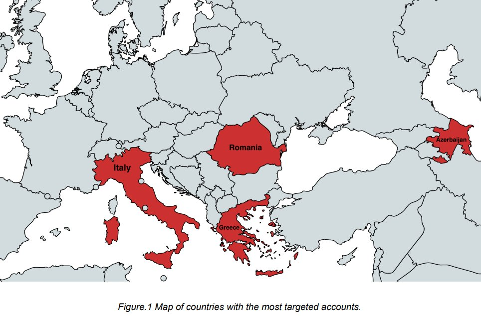
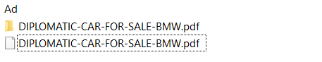
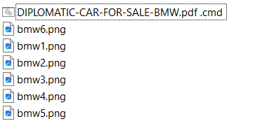
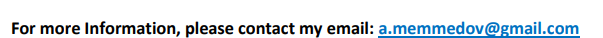
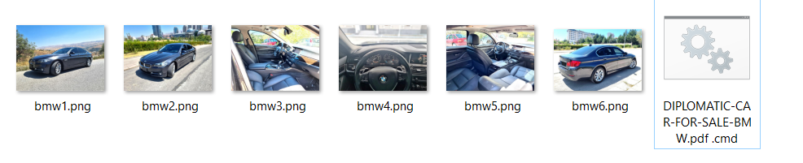
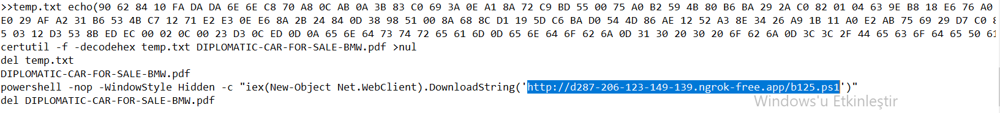
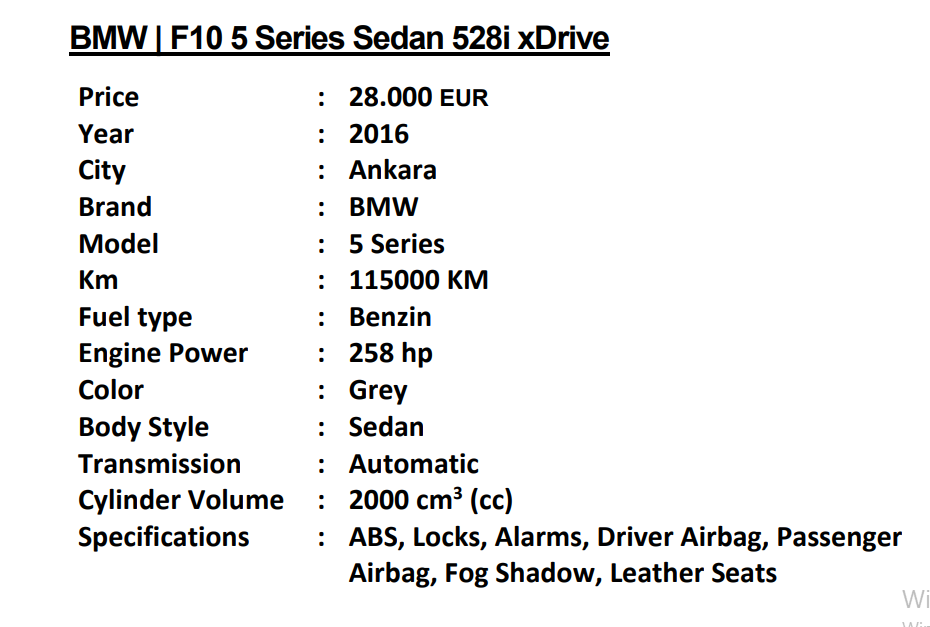
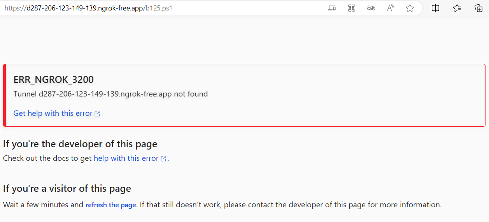
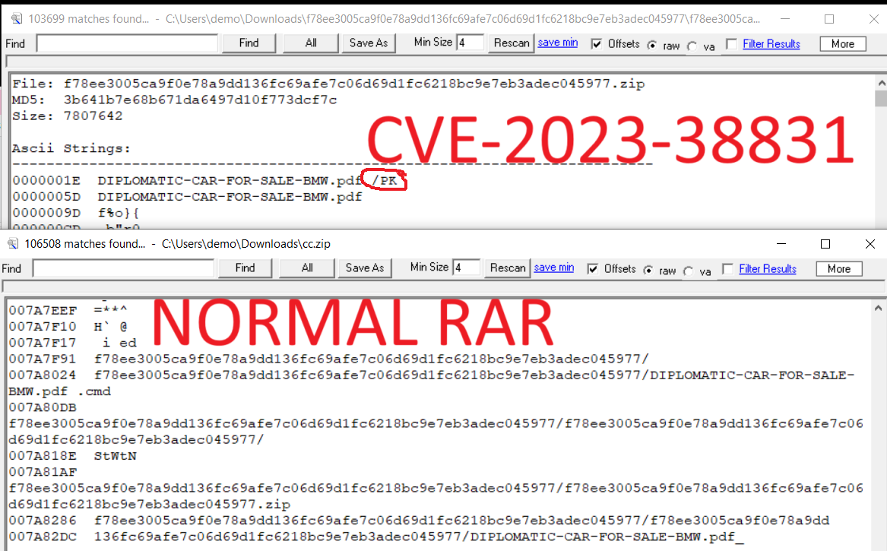

<link rel="stylesheet" href="../../CSS/style.css" type="text/css">

# APT29 (CozyBear) Zararlı Yazılımı IoC Çalışması

  

  

    
Ali Can Gönüllü | Siber Güvenlik Uzmanı  alicangonullu[at]yahoo.com
 
    Merhabalar, 
    Arkadaşlar bu yazımda sizlerle beraber APT29 adlı ve Rusya bağlantılı grubun zararlı yazılımını inceleyeceğiz.

# Disclaimer | Yasal Uyarı

  Bu blog yazısında sağlanan bilgiler yalnızca eğitim ve bilgilendirme amaçlıdır. <b>Bilgisayar korsanlığı, siber saldırılar veya bilgisayar sistemlerine, ağlara veya verilere herhangi bir şekilde yetkisiz erişim de dahil olmak üzere herhangi bir yasa dışı veya etik olmayan faaliyeti</b> teşvik etme veya reklam etme amacı taşımaz.
  
  Disclaimer: The information provided in this blog post is intended for educational and informational purposes only. It is not intended to encourage or promote any illegal or unethical activities, including hacking, cyberattacks, or any form of unauthorized access to computer systems, networks or data.

# Grup ve Bulaşma Şekli Hakkında Bilgi

    CozyBear, yani APT29 mahlasıyla bilinen bu grubun bu yazılımı bir siber-espiyonaj (istihbarat) yazılımıdır. Amacı içeriden uzun süre veri toplamak ve bunu proxy aracığıyla kaynağa aktarmaktır.
      
    Öncelikle zararlı yazılım WinRAR adlı yazılımın zafiyetini kullanarak zararlı yazılımı aktif etmektedir. 
    Bu zararlı yazılımla Azerbaycan, İtalya, Yunanistan ve Romanya başta olmak üzere pek çok ülkenin büyükelçiliklerini hedef almıştır. 
      
    
      
    Bulaşma mantığı olarak WinRAR dosyasının içerisine bir payload yüklenir ve RAR dosyası açılır açılmaz bir uzak sunucudan dosya çağırılır. Payload oluşturma örneğine <a href="https://packetstormsecurity.com/files/174573/WinRAR-Remote-Code-Execution.html">buradan</a> ulaşabilirsiniz.

# Çalışma Mantığı

    Öncelikle zararlı yazılım WinRAR adlı yazılımın "CVE-2023-38831" kodlu zafiyetini kullanarak bulaşmaktadır. 
    Zararlı yazılımın bulaştığı bilgisayar RAR içerisindeki bir BAT dosyası (MD5: ff7d1fb202bac38345be8cf267fa6688) yardımıyla uzaktan bir kod çağırmaktadır.
    RAR içeriğine baktığımızda bir adet klasör ve bir adet PDF dosyası bulunmaktadır.
      
    
      
    Klasörün içerisine baktığımızda ise bir adet CMD dosyası ile birkaç resim dosyası görmekteyiz. 
    Fark etmeniz güç fakat klasörün dışındaki PDF dosyasının uzantısı ".pdf_" şeklinde görünüyor.
      
    
      
    İncelemeler esnasında bir iletişim maili bıraktıklarını da görüyoruz
      
    
      
    Ardından klasörün içerisindekilere bakmaya başlıyoruz.
      
    
      
     Klasör içeriğini incelerken CMD dosyasını incelemeye başlarken ilk gözümüze takılan b125.ps1 dosyasının  d287-206-123-149-139.ngrok-free[.]app adresinden çağırılıyor oluşu oluyor.
      
    
      
    Ardından fark ettiğimiz ikinci veri ise belirli hex değerlerini text dosyasına yazdırıp ardından pdf dosyası olarak biçimlendirmesi oluyor ve baktığımızda önceden gördüğümüz ".PDF_" uzantılı dosyayla aynı içeriğe sahip olduğunu görüyoruz. Hex içeriğine <a href="apt29_pdf.txt">buradan</a> ulaşabilirsiniz.
      
    
      
    Buradan çıkaracağımız pek bir sonuç olmayınca PS1 dosyasının peşine düşüyoruz. Fakat NGROK uygulaması kapatıldığı için sonuç alamıyoruz. Muhtemelen bir shell kodunu uyguladığını ve C2 Server'a bağlandığını açık kaynaklardan bulmak durumunda kalıyoruz.
      
    
      

# Güncelleme

    RAR dosyasının içeriğini incelerken diğer RAR dosyalarından farklı olarak "PK" olarak paketlendiğini fark ettim ve bu nedenle yeni bir YARA kuralı (APT29_Ransom2) daha ekledim
      
    
      

# Sonuç

    WinRAR'ın "CVE-2023-38831" kodlu zafiyetini kullanarak içerisinde kod çalıştıran bu dosya ile NGROK Proxy üzerinden PS1 dosyası çalıştırılarak bir backdoor oluşturup ilgili bilgisayarda uzun süre veri toplayan bu zararlı yazılımı buluyoruz. Önlem olarak ise YARA kurallarını paylaşıyorum.
      
    <a href="apt29_rules.yara">YARA kuralları için tıklayın</a>

# Yazar | Author 

  Ali Can GÖNÜLLÜ 
  Siber Güvenlik Uzmanı 
  alicangonullu[at]yahoo.com

