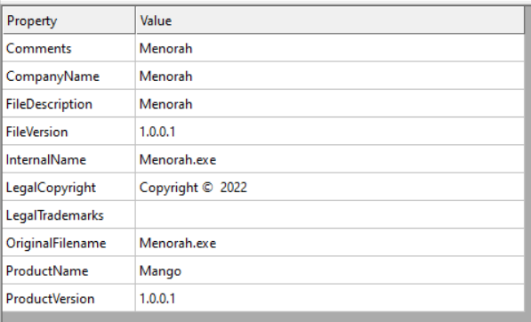

<link rel="stylesheet" href="../../CSS/style.css" type="text/css">

# APT34 (OilRig) Malware IoC Analizi | İran Destekli APT Grubu

<!-- SEO Meta Tags -->
<meta name="description" content="APT34 (OilRig) İran destekli APT grubunun malware analizi ve IoC çalışması. Siber güvenlik uzmanı Ali Can Gönüllü'den APT34 detaylı analizi.">
<meta name="keywords" content="APT34, OilRig, APT, malware analizi, IoC, threat intelligence, siber güvenlik, İran, APT grubu, zararlı yazılım">
<meta name="author" content="Ali Can Gönüllü">
<meta name="robots" content="index, follow">
<meta property="og:title" content="APT34 (OilRig) Malware IoC Analizi">
<meta property="og:description" content="İran destekli APT34 grubunun malware analizi ve tehdit istihbaratı çalışması.">
<meta property="og:type" content="article">
<meta property="og:url" content="https://github.com/alicangnll/CTI_Arastirmalarim/IoC/APT34_IoC/">
<meta property="og:image" content="https://alicangnll.github.io/CTI_Arastirmalarim/IoC/APT34_IoC/menorah.png">
<meta name="twitter:card" content="summary_large_image">
<meta name="twitter:title" content="APT34 (OilRig) Malware IoC Analizi">
<meta name="twitter:description" content="İran destekli APT grubunun detaylı malware analizi.">
<meta name="twitter:image" content="https://github.com/alicangnll/CTI_Arastirmalarim/IoC/APT34_IoC/menorah.png">

    
<strong>Ali Can Gönüllü</strong> | Siber Güvenlik Uzmanı | <a href="mailto:alicangonullu@yahoo.com">alicangonullu@yahoo.com</a> 
    <em>LinkedIn: <a href="https://linkedin.com/in/alicangonullu" target="_blank">linkedin.com/in/alicangonullu</a></em>
 
    <strong>Merhabalar,</strong> 
    Bu yazımda sizlerle birlikte <strong>APT34 (OilRig)</strong> adlı ransomware ve korunma yöntemlerini detaylıca inceleyeceğiz. 
    Yaptığımız açık kaynak taramalarında taramasını yaptığımız virüs <strong>OilRig (APT34)</strong> lakaplı <strong>İran tarafından desteklenen</strong> bir zararlı yazılım grubunun ürünü olduğunu öğrendik.
     
    <strong>NOT:</strong> Bu yazıyı yazarken grubun <strong>İsrail, Lübnan ve BAE</strong> ülkelerini hedef aldığını öğrendik.

# Disclaimer | Yasal Uyarı

  Bu blog yazısında sağlanan bilgiler yalnızca eğitim ve bilgilendirme amaçlıdır. <b>Bilgisayar korsanlığı, siber saldırılar veya bilgisayar sistemlerine, ağlara veya verilere herhangi bir şekilde yetkisiz erişim de dahil olmak üzere herhangi bir yasa dışı veya etik olmayan faaliyeti</b> teşvik etme veya reklam etme amacı taşımaz.
  
  Disclaimer: The information provided in this blog post is intended for educational and informational purposes only. It is not intended to encourage or promote any illegal or unethical activities, including hacking, cyberattacks, or any form of unauthorized access to computer systems, networks or data.

# Bulaşma Şekli

    Zararlı yazılım DOC formatında sisteme bulaşıp Macro denilen VBNet kodlarıyla çalışmaktadır.

# Çalışma Mantığı

    Öncelikle DOC dosyasını çeşitli yazılımlarla açıyoruz.
      
    
      
    DOC uzantılı dosyayı açtığımıza bizi şu tarz bir görüntü karşılıyor. Dosya bilgilerine <a href="apt34_info.txt"> buradan</a> ulaşabilirsiniz.
      
    
      
    Yazılımlarla içerisini açtığımızda ise Makroları gayet rahat görebilmekteyiz. Şimdi yapmamız gereken ise makro kodlarını açıp gittiği yollara bakmak. 
    Makro kodlarına bakarak dosyanın oluşturulma tarihini öğreniyoruz.
      
    
      
    Fakat incelemeye devam ederken önemli makro kodlarının şifreli olduğunu görüyoruz.
      
    
      
    Ve buradan sonra canlı test ortamına sokuyoruz ve tüm aktivitelerini kaydetmeye başlıyoruz. Network hareketlerini dinlesekte herhangi bir network hareketine rastlamıyoruz. Muhtemelen içeriden port veya program başlatıyor veya komut çalıştırıyor diyerek komut incelemeye başlıyoruz.
    Programı çalıştırdığımız anda dosya içeriği de değişmekte ve şu hale gelmektedir
      
    
      
    Ardından programı başlattığımız anda "C:\ProgramData\Office356\Menorah.exe" konumunda bir dosyayı çağırdığını görüyoruz.
    Menorah.EXE adlı dosyanın öncelikle oluşturulma tarihine baktığımızda 2022 tarihini görüyoruz. Muhtemelen DOC dosyası sadece bir Loader işlevi görmekte
      
    
      
    Menorah.EXE'nin header bilgilerine baktığımızda .NET ile yazıldığını görüyoruz ve bu da yazılımın kaynak kodlarının çeşitli programlarla açılabileceğini gösteriyor.
      
    
      
    Kodlarını incelerken çalıştırıldıktan sonra "tecforsc-001-site1.gtempurl[.]com/ads.asp" adresinin "d" GET değerine çeşitli veriler gönderdiğini görüyoruz.
    Ardından bunun bir C2 server olduğunu ve bu server üzerinden komut gönderildiğini yine kodlarından anlıyoruz.
      
    
      

## Sonuç

Teknolojinin gittikçe artmasıyla bu tarz DOC formatında gerçekleşen saldırılar artmaktadır. Bu sebeple alınabilecek önlemler ise,
<ul>
    <li>"tecforsc-001-site1.gtempurl[.]com" web sitelerini engellemek ve sürekli web engel listelerini güncel tutmaktır.</li>
    <li>Özellikle işyerlerinde public dediğimiz herkesin bağlanabildiği alanlarda bu korumalar arttırılmalıdır.</li>
</ul>

# Yazar | Author 

  Ali Can GÖNÜLLÜ 
  Siber Güvenlik Uzmanı 
  alicangonullu[at]yahoo.com

