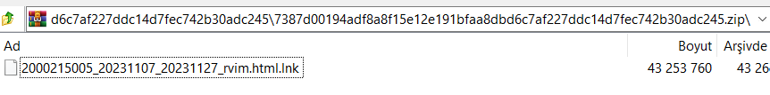
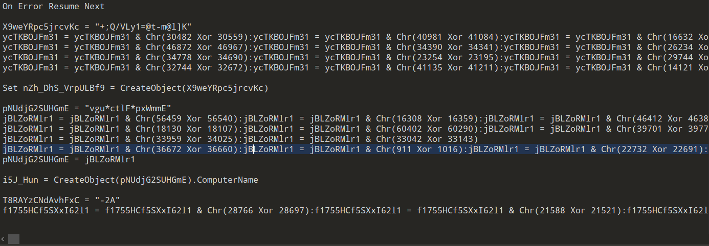
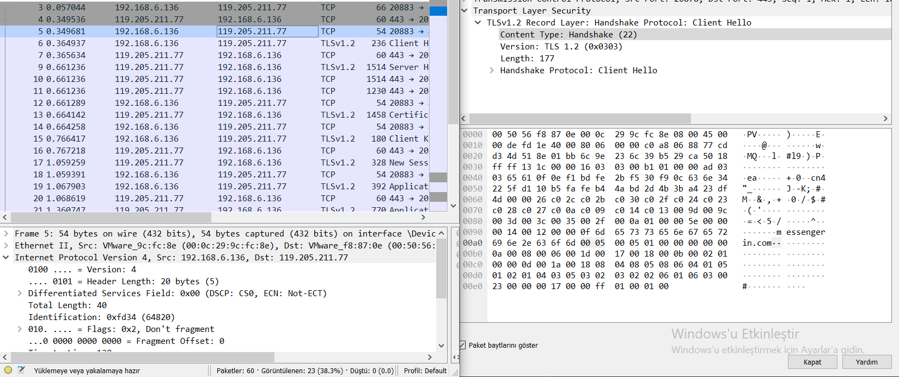
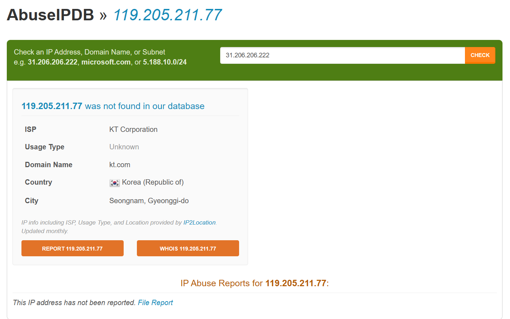
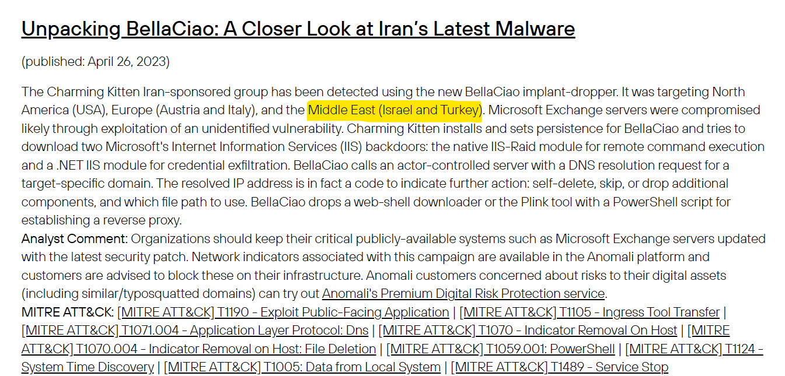

<link rel="stylesheet" href="../../CSS/style.css" type="text/css">

# APT37 Malware IoC Analizi | Kuzey Kore Destekli APT Grubu

<!-- SEO Meta Tags -->
<meta name="description" content="APT37 Kuzey Kore destekli APT grubunun malware analizi ve IoC çalışması. Siber güvenlik uzmanı Ali Can Gönüllü'den APT37 detaylı analizi.">
<meta name="keywords" content="APT37, APT, malware analizi, IoC, threat intelligence, siber güvenlik, Kuzey Kore, APT grubu, zararlı yazılım">
<meta name="author" content="Ali Can Gönüllü">
<meta name="robots" content="index, follow">
<meta property="og:title" content="APT37 Malware IoC Analizi">
<meta property="og:description" content="Kuzey Kore destekli APT37 grubunun malware analizi ve tehdit istihbaratı çalışması.">
<meta property="og:type" content="article">
<meta property="og:url" content="https://github.com/alicangnll/CTI_Arastirmalarim/IoC/APT37_IoC/">
<meta property="og:image" content="https://alicangnll.github.io/CTI_Arastirmalarim/IoC/APT37_IoC/title_pic.png">
<meta name="twitter:card" content="summary_large_image">
<meta name="twitter:title" content="APT37 Malware IoC Analizi">
<meta name="twitter:description" content="Kuzey Kore destekli APT grubunun detaylı malware analizi.">
<meta name="twitter:image" content="https://github.com/alicangnll/CTI_Arastirmalarim/IoC/APT37_IoC/title_pic.png">

  

  

<strong>Ali Can Gönüllü</strong> | Siber Güvenlik Uzmanı | <a href="mailto:alicangonullu@yahoo.com">alicangonullu@yahoo.com</a> 
<em>LinkedIn: <a href="https://linkedin.com/in/alicangonullu" target="_blank">linkedin.com/in/alicangonullu</a></em>
 

# Disclaimer | Yasal Uyarı

  Bu blog yazısında sağlanan bilgiler yalnızca eğitim ve bilgilendirme amaçlıdır. <b>Bilgisayar korsanlığı, siber saldırılar veya bilgisayar sistemlerine, ağlara veya verilere herhangi bir şekilde yetkisiz erişim de dahil olmak üzere herhangi bir yasa dışı veya etik olmayan faaliyeti</b> teşvik etme veya reklam etme amacı taşımaz.
  
  Disclaimer: The information provided in this blog post is intended for educational and informational purposes only. It is not intended to encourage or promote any illegal or unethical activities, including hacking, cyberattacks, or any form of unauthorized access to computer systems, networks or data.

# Grup Hakkında

APT37 grubu, Kuzey Kore'nin devlet destekli bir siber casusluk grubudur. En az 2012 yılından beri faaliyet göstermektedir. Grup, kurbanlarını öncelikle Güney Kore'de, ancak aynı zamanda Japonya, Vietnam, Rusya, Nepal, Çin, Hindistan, Romanya, Kuveyt ve Ortadoğu'nun diğer bölgelerinde de hedef almıştır. APT37 grubu, 2016-2018 yılları arasında Operation Daybreak, Operation Erebus, Golden Time, Evil New Year, Are you Happy?, FreeMilk, North Korean Human Rights ve Evil New Year 2018 gibi kampanyalarla da bağlantılıdır.
  
APT37 grubu, Kuzey Kore'nin stratejik ve kritik hedeflere yönelik kullandığı bir siber casusluk grubu olarak bilinir. Grup, Windows ve Linux sistemlerine arka kapılar yerleştirmek, web sitelerini ele geçirmek, ses kaydetmek, tarayıcılardan kimlik bilgileri çalmak, yerel sistemden veri toplamak ve disk yapısını silmek gibi çeşitli teknikleri kullanmaktadır.
  
APT37 grubu, ayrıca 2022 yılının sonlarında Internet Explorer'da bir 0-gün açığından yararlanarak Güney Kore'deki kullanıcıları hedef alan kötü amaçlı belgeler kullanmıştır.
  
APT37 grubu, 2021 yılının Kasım ayında Rusya'nın en büyük füze üreticisi olan Mashinostroyeniya şirketinin sistemlerine sızmayı başarmış ve 2022 yılının Mayıs ayına kadar içeride kalmıştır. Bu siber operasyon, Kuzey Kore'nin tartışmalı füze programını destekleyen bir stratejik casusluk görevi olarak tanımlanmaktadır.

# Bulaşma Yöntemi

    LNK, DOCM (Makro), XLSM (Makro) veya VBS uzantılı bir dosya ile bulaşmaktadır. LNK uzantılı dosya, bulaşmadan sonra HTML Enjeksiyon kullanarak kendi içerisine kod enjeksiyonu yapmakta ve bu komutu CMD'ye göndermektedir.

# Çalışma Mantığı

    Öncelikle "2023년 11월 청구내역.zip" adıyla gelen ZIP dosyası içeriği şu şekildedir.
      
    
      
    LNK uzantılı dosya (SHA256:7387d00194adf8a8f15e12e191bfaa8dbd6c7af227ddc14d7fec742b30adc245) sisteme bulaşmış olsa da içerisindeki VBS kodu devreye girmektedir. Ancak VBS kodu incelendiğinde XOR formatında şifrelendiği görülmektedir.
      
    
      
    XOR şifrelemesi olduğu için C2 serveri bulması zor olacak diye düşünürken kodu güvenli bir ortamda çalıştırıp ağı dinlediğimizde her ne kadar HTTPS ile haberleşiyor olsa da şifreyi çözüyoruz ve bilgileri ediniyoruz.
     
    <a href="apt37.pcapng">PCAP dosyasını indirmek için tıklayın</a>
      
    Görünüşe göre 119[.]205[.]211[.]77 adresi ile haberleşmekte. Bir domain adı olduğunu da fark ediyoruz ve domain adının da messengerin[.]com adlı adrese bağlandığını görüyoruz.
      
    
      
    IP adresini ve domain adresini çeşitli abuse sitelerinde sorgulatarak açık kaynak araştırması yapsakta herhangi bir abuse bildirimi göremiyoruz. Konum bilgisinden de bilgilerin doğruluğunu teyit ediyoruz.
      
    
      

# Sonuç

    Kuzey Korelilerin çeşitli yan enstrümanlarla kullandığı bu zararlı yazılım genel olarak espiyonaj amaçlı olduğu için hedefi son kullanıcı olmasa da, son kullanıcının çalıştığı şirkete zarar verebilmektedir. 
    Aşağıdaki yazıda da 26 Nisan 2023 tarihinde APT37 grubu yapılan bir saldırının etkilediği ülkeler yazılmıştır
      
    
      
    Kısacası, bu tip zararlı yazılımlara karşı da tetikte olmalıyız.

# Kaynaklar
<ul>
    <li>https://attack.mitre.org/groups/G0067/ (MITRE APT37)</li>
    <li>https://www.anomali.com/blog/anomali-cyber-watch-apt37-adopts-lnk-files-charming-kitten-uses-bellaciao-implant-dropper-vipersoftx-infostealer-unique-byte-remapping-encryption</li>
</ul>