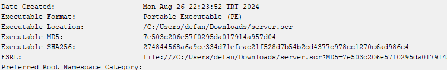
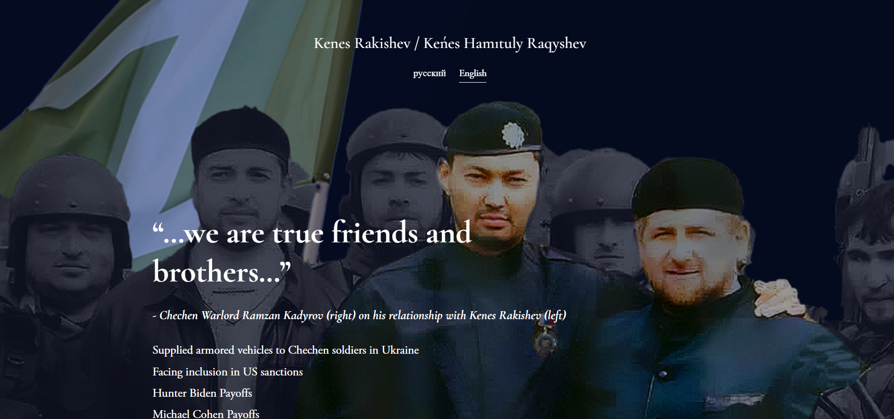
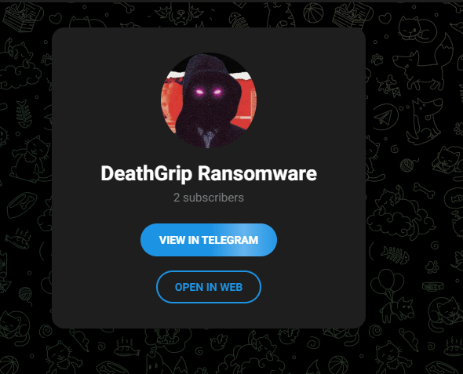

<link rel="stylesheet" href="../../CSS/style.css" type="text/css">

# DeathGrip Ransomware IoC Analizi | Sovyet Bağlantılı Ransomware

<!-- SEO Meta Tags -->
<meta name="description" content="DeathGrip Ransomware IoC analizi ve tehdit istihbaratı çalışması. Siber güvenlik uzmanı Ali Can Gönüllü'den Sovyet bağlantılı ransomware detaylı analizi.">
<meta name="keywords" content="DeathGrip, ransomware, IoC, malware analizi, siber güvenlik, threat intelligence, Sovyet, ransomware analizi, zararlı yazılım">
<meta name="author" content="Ali Can Gönüllü">
<meta name="robots" content="index, follow">
<meta property="og:title" content="DeathGrip Ransomware IoC Analizi">
<meta property="og:description" content="Sovyet bağlantılı DeathGrip ransomware detaylı analizi ve IoC çalışması.">
<meta property="og:type" content="article">
<meta property="og:url" content="https://github.com/alicangonullu/CTI_Arastirmalarim/IoC/DeathGripRansomware_IoC/">
<meta property="og:image" content="title.jpeg">
<meta name="twitter:card" content="summary_large_image">
<meta name="twitter:title" content="DeathGrip Ransomware IoC Analizi">
<meta name="twitter:description" content="Sovyet bağlantılı ransomware detaylı analizi.">
<meta name="twitter:image" content="title.jpeg">

  

  

<strong>Ali Can Gönüllü</strong> | Siber Güvenlik Uzmanı | <a href="mailto:alicangonullu@yahoo.com">alicangonullu@yahoo.com</a> 
<em>LinkedIn: <a href="https://linkedin.com/in/alicangonullu" target="_blank">linkedin.com/in/alicangonullu</a></em>
 

# Disclaimer | Yasal Uyarı

  Bu blog yazısında sağlanan bilgiler yalnızca eğitim ve bilgilendirme amaçlıdır. <b>Bilgisayar korsanlığı, siber saldırılar veya bilgisayar sistemlerine, ağlara veya verilere herhangi bir şekilde yetkisiz erişim de dahil olmak üzere herhangi bir yasa dışı veya etik olmayan faaliyeti</b> teşvik etme veya reklam etme amacı taşımaz.
  
  Disclaimer: The information provided in this blog post is intended for educational and informational purposes only. It is not intended to encourage or promote any illegal or unethical activities, including hacking, cyberattacks, or any form of unauthorized access to computer systems, networks or data.

# Grup Hakkında

  <b>DeathGrip Ransomware</b> grubu, 2024 yılında ortaya çıkmıştır. Telegram ve diğer yeraltı forumları aracılığıyla tanıtılan DeathGrip RaaS, karanlık web'deki tehdit aktörlerine LockBit 3.0 ve Chaos oluşturucuları da dahil olmak üzere gelişmiş fidye yazılımı araçları sunuyor. Sızdırılan fidye yazılımı oluşturucuları kullanılarak oluşturulan yükleri, gerçek dünya saldırılarında zaten gözlemleniyor ve asgari teknik becerilere sahip kişilerin tam gelişmiş fidye yazılımı saldırıları dağıtmasına olanak sağlıyor.

# Bulaşma Yöntemi

    Öncelikli olarak loader görevine sahip olan EXE dosyası çalışır ardından EXE dosyası bir SCR dosyası indirir ve sistemi enfekte eder.

# Çalışma Mantığı

    Öncelikle "F-Secure-Safe-Network-Installer.exe" adlı bir EXE dosyasıyla gelir. EXE dosyasının içeriğine bakıldığında iki adet URL ile bağlantı kurulduğu tespit edilmiştir. Bunlardan biri "kenesrakishevinfo[.]com" domain adresi diğeri ise asıl zararlının bulunduğu "master-repogen[.]vercel[.]app" (76[.]76[.]21[.]241) URL adresidir.
      
    
      
    URL adresine girildiğinde ise bir dosya bağlantısı bizi karşılamaktadır.
      
    
      
    Dosyalar indirildiğinde ise "Yashma Ransomware Builder" yazılımı çıkmaktadır.
      
    
      
    Serverin diğer SCR dosyasına baktığımızda ise farklı olduğunu görüyoruz. Bu da her iki zararlı yazılımın birbiriyle bağlantılı olduğunu göstermektedir. Ancak biz "server.scr" yani bununla ilgileniyoruz.
      
    
      
    "kenesrakishevinfo[.]com" web sitesine odaklandığımızda Rusya kaynaklı bir zararlı yazılım olduğunu Çeçen lider Kadirov'un görsellerinden anlıyoruz.
      
    
      
    Zararlı yazılım güvenli bir ortamda çalıştırıldığında ise bir ransomware notu ile çeşitli adresler gelmektedir.
    <code>
        ~~~ LockBit 3.0 the world's fastest ransomware since 2019~~~....>>>> Your data are stolen and encrypted.....The data will be published on TOR website if you do not pay the ransom ....DeathGrip Ransomware Attack | t[.]me/DeathGripRansomware....This computer is attacked by russian ransomware community of professional black hat hackers. ..Your every single documents / details is now under observation of those hackers...If you want to get it back then you have to  pay 1000$ for it.....This Attack Is Done By Team RansomVerse  You Can Find Us On Telegram.. @DeathGripRansomware Contact The Owner For The Decrypter Of This Ransomware....#DeathGripMalware......>>>> What guarantees that we will not deceive you? .....We are not a politically motivated group and we do not need anything other than your money. ..    ...If you pay, we will provide you the programs for decryption and we will delete your data. ...Life is too short to be sad. Be not sad, money, it is only paper...    ...If we Links for Tor Browser: http://lockbitsupt7nr3fa6e7xyb73lk6bw6rcneqhoyblniiabj4uwvzapqd[.]onion
    </code>
      
    Telegram adresine bakıldığında iki adet üyesi olduğu görülmektedir. 
      
    
      
    Telegram adresine bakıldığında iki adet üyesi olduğu görülmektedir. 
      
    
      
    Yönlendirme takip edildiğinde "MEDUSA" adından bir Telegram ChatBot adresine yönlendirildiğimizi görüyoruz.
      
    
      
    Buradan da grubun hem LockBit hem de Medusa grubuyla alakalı olduğunu tespit edebiliriz. Medusa zararlı yazılım grubunu daha önce araştırmıştık <a href="https://alicangnll.github.io/CTI_Arastirmalarim/IoC/Medusa_IoC/" target="_blank">buradan</a> ulaşabilirsiniz.

# Sonuç

    Rusların kontrolünde olan bu zararlı yazılımlarla çeşitli erişimler elde ederek saldırılarına devam etmektedir. Bu saldırılara karşı,
    <ul>
        <li>Ağınızda "kenesrakishevinfo[.]com" ve "master-repogen[.]vercel[.]app" (76[.]76[.]21[.]241) adreslerine erişimlerinizi engelleyin</li>
        <li><a href="https://alicangnll.github.io/CTI_Arastirmalarim/YARA_Rules/Deathgrip_Ransom.yara">YARA kuralını buradan indirin ve güvenlik yazılımlarına ekleyin</a></li>
    </ul>

# Kaynaklar
<ul>
    <li>https://bazaar.abuse.ch/sample/e082c6d30278139fdab5a7ddddecbcbafad12ab4dff1d5a960d9704fe635c007/</li>
    <li>https://app.any.run/tasks/ab34827e-2978-45c4-ae31-f38ab15d78e9</li>
</ul>
