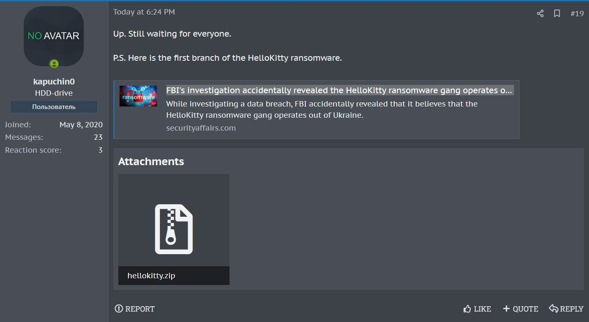
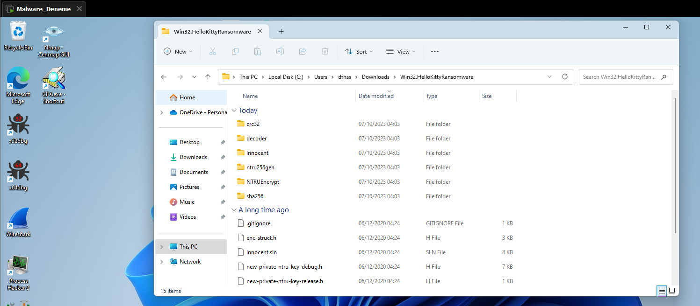
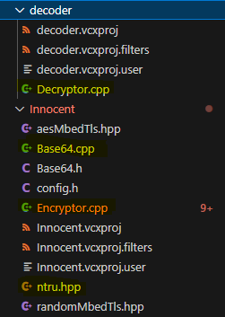
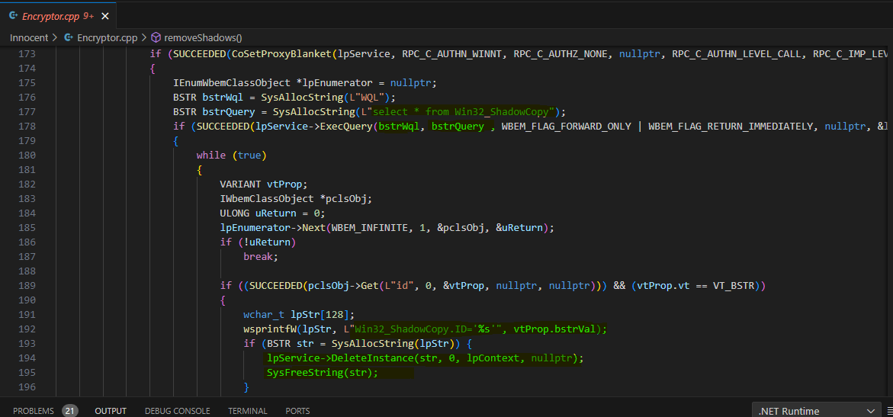
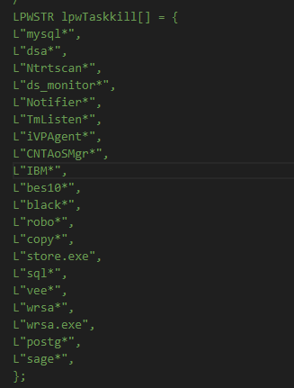
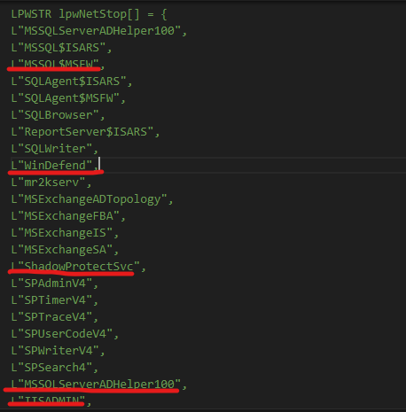
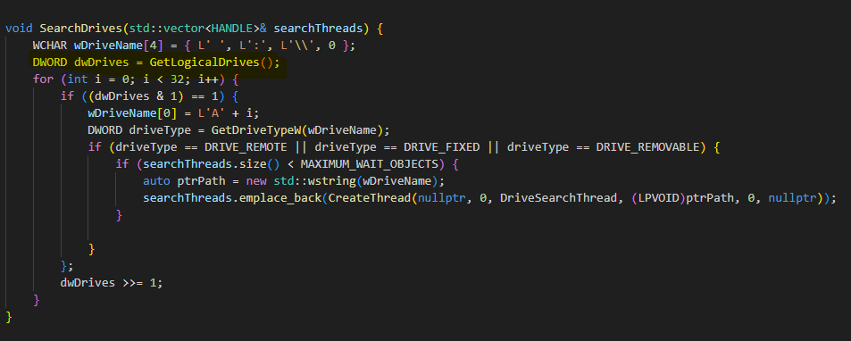
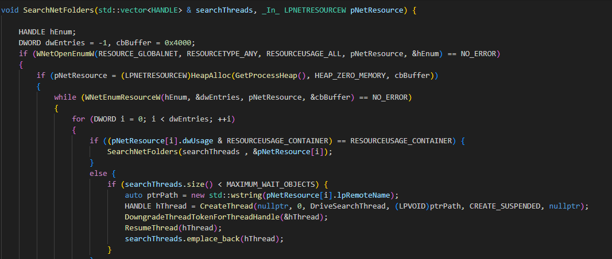
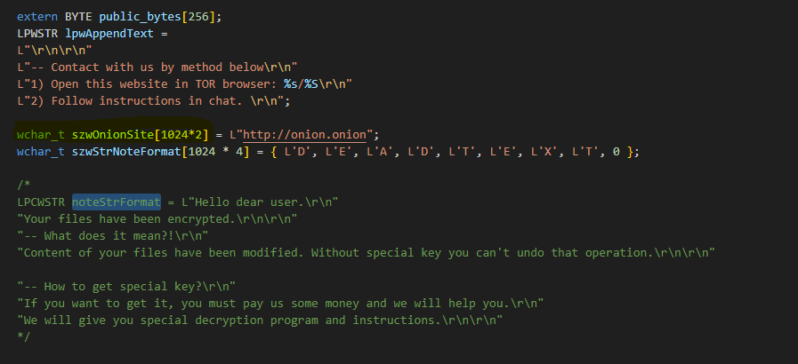

<link rel="stylesheet" href="../../CSS/style.css" type="text/css">

# HelloKitty Ransomware IoC Analizi | Kaynak Kodu Sızdırılmış Ransomware

<!-- SEO Meta Tags -->
<meta name="description" content="HelloKitty ransomware analizi ve IoC çalışması. Siber güvenlik uzmanı Ali Can Gönüllü'den kaynak kodu sızdırılmış HelloKitty ransomware detaylı analizi.">
<meta name="keywords" content="HelloKitty, ransomware, malware analizi, IoC, threat intelligence, siber güvenlik, kaynak kodu, ransomware analizi, zararlı yazılım">
<meta name="author" content="Ali Can Gönüllü">
<meta name="robots" content="index, follow">
<meta property="og:title" content="HelloKitty Ransomware IoC Analizi">
<meta property="og:description" content="Kaynak kodu sızdırılmış HelloKitty ransomware detaylı analizi ve IoC çalışması.">
<meta property="og:type" content="article">
<meta property="og:url" content="https://github.com/alicangonullu/CTI_Arastirmalarim/IoC/HelloKitty_IoC/">
<meta property="og:image" content="https://alicangnll.github.io/CTI_Arastirmalarim/IoC/HelloKitty_IoC/info.png">
<meta name="twitter:card" content="summary_large_image">
<meta name="twitter:title" content="HelloKitty Ransomware IoC Analizi">
<meta name="twitter:description" content="Kaynak kodu sızdırılmış ransomware detaylı analizi.">
<meta name="twitter:image" content="https://github.com/alicangonullu/CTI_Arastirmalarim/IoC/HelloKitty_IoC/info.png">

    
<strong>Ali Can Gönüllü</strong> | Siber Güvenlik Uzmanı | <a href="mailto:alicangonullu@yahoo.com">alicangonullu@yahoo.com</a> 
    <em>LinkedIn: <a href="https://linkedin.com/in/alicangonullu" target="_blank">linkedin.com/in/alicangonullu</a></em>
 
    <strong>Merhabalar,</strong> 
    Bu yazımda sizlerle birlikte <strong>HelloKitty</strong> adlı kaynak kodları sızdırılmış olan ransomware ve korunma yöntemlerini detaylıca inceleyeceğiz.
    Öncelikle bu haberi şahsen <strong>Twitter / X</strong> üzerinde duydum ve kaynak kodlarını <strong>vx-underground</strong> adlı malware analizi yapan GitHub sayfasından indirdim ve incelemeye başladım.
    <strong>Kaynak:</strong> <a href="https://twitter.com/3xp0rtblog/status/1710387356979560800" target="_blank">https://twitter.com/3xp0rtblog/status/1710387356979560800</a>
      
    
      

# Disclaimer | Yasal Uyarı

  Bu blog yazısında sağlanan bilgiler yalnızca eğitim ve bilgilendirme amaçlıdır. <b>Bilgisayar korsanlığı, siber saldırılar veya bilgisayar sistemlerine, ağlara veya verilere herhangi bir şekilde yetkisiz erişim de dahil olmak üzere herhangi bir yasa dışı veya etik olmayan faaliyeti</b> teşvik etme veya reklam etme amacı taşımaz.
  
  Disclaimer: The information provided in this blog post is intended for educational and informational purposes only. It is not intended to encourage or promote any illegal or unethical activities, including hacking, cyberattacks, or any form of unauthorized access to computer systems, networks or data.

# Yayılış Biçimi

    Zararlı yazılım genel olarak her şekilde bulaşabilmektedir. Linux için ELF, macOS için DMG ve Windows için EXE gibi pek çok formatta bu virüsü görebilmekteyiz. Fakat Windows tarafında asıl tehdidi yaratmaktadır.

# Çalışma Mantığı

    Öncelikle kodlarını ilk açtığımızda düzene baktığımızda Win32 kütüphanelerinin kullanılmasından elimizdeki sürümünün "Windows" sürümü olduğunu anlıyoruz.
      
    
      
    Bu analizimizi yaptıktan sonra kodlarımızda dosya ve klasör şifreleme algoritmaları olduğunu görüyoruz. Bu da bir fidye zararlı yazılımı olduğu ve bir kaynakla haberleştiği konusunda şüphemizi arttırıyor.
      
    
      
    Biraz daha araştırdığımızda şifre çözmeden önce Windows WMI arayüzünü kullanarak ShadowCopy adı verilen Windows tarafından dosyaların tutulduğu gizli alanların varlığına dair sorgu yapıldığını görüyoruz. <a href="https://github.com/alicangnll/pyshadow">ShadowCopy hakkında detaylı bilgi için konumu okuyabilirsiniz.</a>
      
    
      
    Ardından bazı uygulamaları sistemde tarayıp onları tamamen durdurduğunu görüyoruz. Muhtemelen sistemde dosya ve klasör şifrelemenin doğru bir şekilde yapılması ve özellikle veritaban vb. dosyaların bozulmaması için bu işlem yapılıyor.
      
    
      
    Aynı şekilde güvenlik duvarı yazılımlarının da internet bağlantılarının kesildiğini görüyoruz.
      
    
      
    Ardından taskill.exe , net.exe ve calculator.exe ile uygulama tetikleyen bir kesim kod görüyoruz. Fakat bunlar yorum satırında olduğu için buraya ekran görüntülerini eklemeye gerek duymadım.
    Kriptolamadan önce ağ ve yerel disklerin listesini çıkarıyor. Bu şekilde diğer ağ cihazlarına da ulaşmayı planlıyor.
      
    
      
    
      
    Klasik bir ransomware. Şuana kadar beni şaşırtmadı.
    Kriptolama esnasında sistemin bozulmaması ve kurbanının görmesi için bazı dizinleri ve dosyaları hariç olarak işaretliyor.
      
    
      
    Ardından en bomba yere geliyoruz. Tam da tahmin ettiğimiz gibi bir Onion web sitesi üzerinden kendisinin yüklendiğine dair haber gönderiyor ve her fidye yazılımında olduğu gibi bir not bırakıyor.
      
    
      
    Bu kaynak kodunda onion sitesi geçmiyor fakat aynı zararlı yazılımın farklı versiyonlarına baktığımızda <b>"gunyhng6pabzcurl7ipx2pbmjxpvqnu6mxf2h3vdeenam34inj4ndryd.onion/SIFRE_SHA_KODU"</b> adresine dosyaları şifrelediği SHA kodunu ve DOSYA ŞİFRELERİNİ İKİ GET İSTEĞİ İÇERİSİNDE GÖNDERİYOR.

# Çözüm Önerisi
<ul>
    <li>Ağ üzerinde Proxy kullanımını kapatma</li>
    <li>Onion sitelere ulaşmayı sağlayan TOR Proxy'lerini güvenlik duvarı üzerinden engelleme</li>
</ul>

# Yazar | Author 

  Ali Can GÖNÜLLÜ 
  Siber Güvenlik Uzmanı 
  alicangonullu[at]yahoo.com

