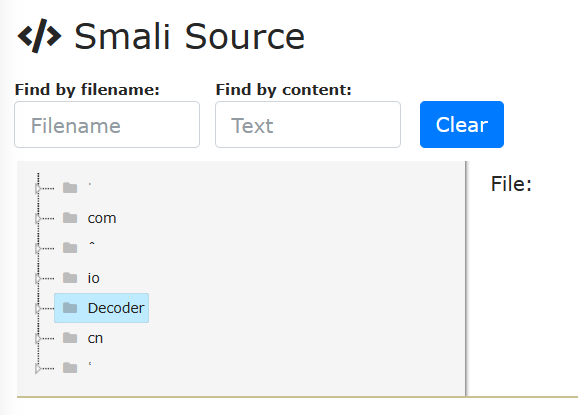
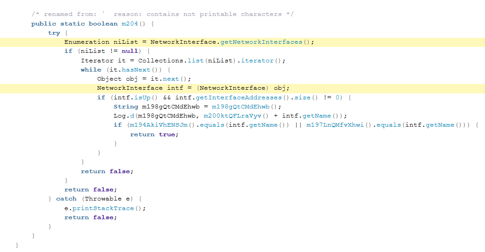
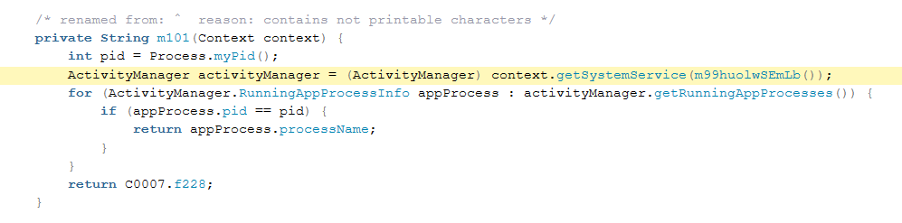
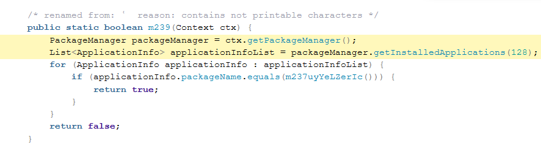
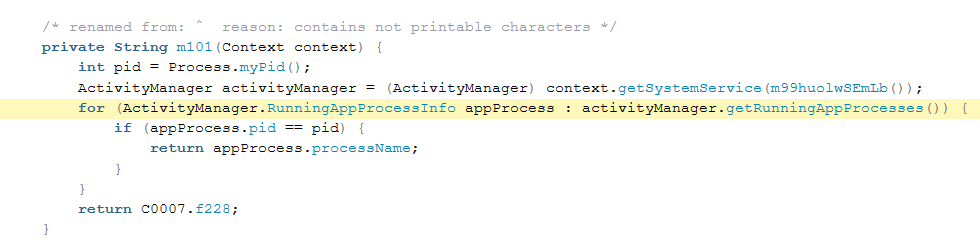
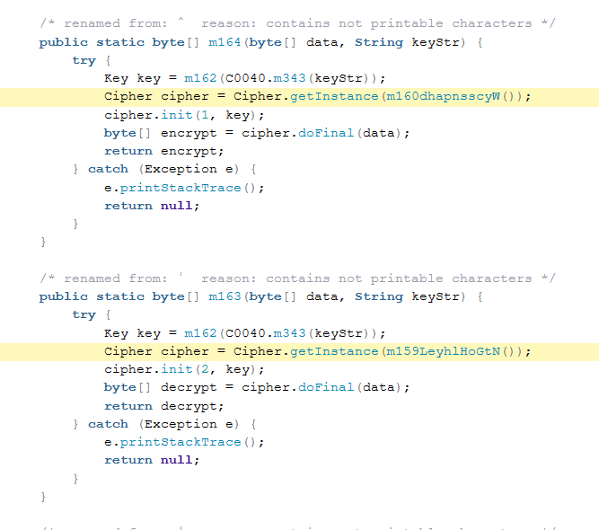
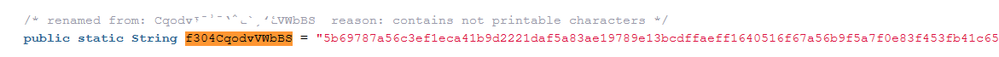
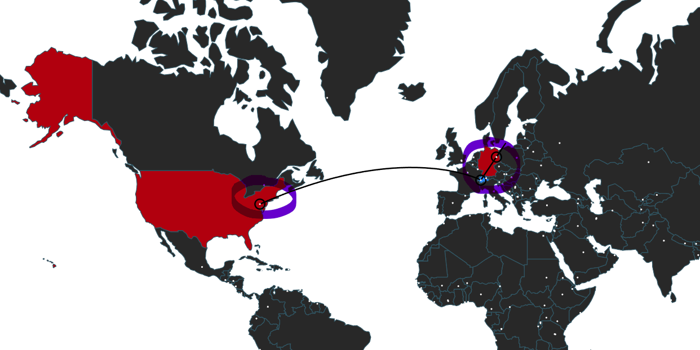
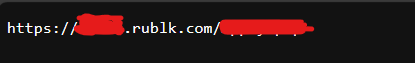
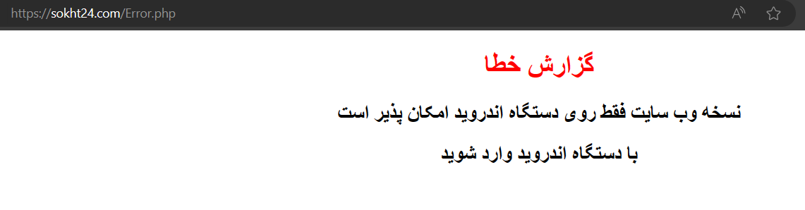

<link rel="stylesheet" href="../../CSS/style.css" type="text/css">

# IRATA Ransomware IoC Analizi | İran Kaynaklı Mobil Ransomware

<!-- SEO Meta Tags -->
<meta name="description" content="IRATA İran kaynaklı mobil ransomware analizi ve IoC çalışması. Siber güvenlik uzmanı Ali Can Gönüllü'den IRATA ransomware detaylı analizi.">
<meta name="keywords" content="IRATA, ransomware, İran, malware analizi, IoC, threat intelligence, siber güvenlik, mobil ransomware, zararlı yazılım">
<meta name="author" content="Ali Can Gönüllü">
<meta name="robots" content="index, follow">
<meta property="og:title" content="IRATA Ransomware IoC Analizi">
<meta property="og:description" content="İran kaynaklı IRATA mobil ransomware detaylı analizi ve IoC çalışması.">
<meta property="og:type" content="article">
<meta property="og:url" content="https://github.com/alicangonullu/CTI_Arastirmalarim/IoC/IRATA_IoC/">
<meta property="og:image" content="https://alicangnll.github.io/CTI_Arastirmalarim/IoC/IRATA_IoC/smali.png">
<meta name="twitter:card" content="summary_large_image">
<meta name="twitter:title" content="IRATA Ransomware IoC Analizi">
<meta name="twitter:description" content="İran kaynaklı mobil ransomware detaylı analizi.">
<meta name="twitter:image" content="https://github.com/alicangonullu/CTI_Arastirmalarim/IoC/IRATA_IoC/smali.png">

    
<strong>Ali Can Gönüllü</strong> | Siber Güvenlik Uzmanı | <a href="mailto:alicangonullu@yahoo.com">alicangonullu@yahoo.com</a> 
    <em>LinkedIn: <a href="https://linkedin.com/in/alicangonullu" target="_blank">linkedin.com/in/alicangonullu</a></em>
 
    <strong>Merhabalar,</strong> 
    Arkadaşlar bu yazımda sizlerle beraber <strong>İran kaynaklarını hedef alan IRATA</strong> adlı mobil ransomware yazılımını detaylıca inceleyeceğiz.

# Disclaimer | Yasal Uyarı

  Bu blog yazısında sağlanan bilgiler yalnızca eğitim ve bilgilendirme amaçlıdır. <b>Bilgisayar korsanlığı, siber saldırılar veya bilgisayar sistemlerine, ağlara veya verilere herhangi bir şekilde yetkisiz erişim de dahil olmak üzere herhangi bir yasa dışı veya etik olmayan faaliyeti</b> teşvik etme veya reklam etme amacı taşımaz.
  
  Disclaimer: The information provided in this blog post is intended for educational and informational purposes only. It is not intended to encourage or promote any illegal or unethical activities, including hacking, cyberattacks, or any form of unauthorized access to computer systems, networks or data.

# Aşama 1 - Ransomware Kodlarını Dekripte Etme

    Öncelikle Ransomware'in bulaşma çeşidinden bahsedecek olursak bir eğitim yazılımı gibi bulaşmaktadır. Hedef Iran vatandaşları olduğu için yazılar tamamen Farsça yazılmış durumda. 
    Derhal kaynak kodlarını ayırıyoruz ve içeriğine bakıyoruz.
      
    
      
    Kaynak kodları içerisinde gezerken cihazın network bilgilerini istediğini fark ediyoruz.
      
    
      
    Cihazın sistem bilgilerini aldığını görüyoruz
      
    
      
    Cihazda yüklü uygulamaların listesini aldığını görüyoruz ve bu aşamada acaba zararlı yazılımın kripto / fidye amaçlı mı çalıştığını düşünmeye başlıyoruz.
      
    
      
    Cihazda çalışan tüm uygulamaların listesini getiriyor
      
    
      
    Veee bingo! Aradığımızı buluyoruz. Dosyaları kriptolayan ve kriptoyu açan kodu buluyoruz fakat bu ransomware grubu pek acemi zira kriptoladıkları string değerini değişkenler arasına gizlemişler.
      
    
      
    Kriptoyu ise "5b69787a56c3ef1eca41b9d2221daf5a83ae19789e13bcdffaeff1640516f67a56b9f5a7f0e83f453fb41c654f042a48fda9b8500fda2eec2d5a55712f37be7c211df4d284f, 7a693118108a825acacc9080bea66a356436" koduyla kriptoladıkları açıkça görülmektedir.
      
    
      

# Aşama 2 - Network Analizi

    Ardından biraz daha araştırma yaparken tüm bu kodların "iirir[.]com" ve "sokht24[.]com" adlı bir web sitesine bağlandığını ve bu web sitesinda bulunan "log.php" dosyasına log atıp "web.txt" dosyasından cihaz kaydını yaptığını görüyoruz.
     
    
     
    Bu aşamada bir TXT dosyası buluyoruz
     
    
     
    Ardından sokht24 sitesine bakıyoruz. 
     
    
     
    "Web sitesi sürümü yalnızca Android cihazlarda kullanılabilir. Android cihazla gir" mesajı alıyoruz.
    Android cihazla girdiğimizde ise "home.php" adresine yönlendirip 404 mesajı alıyoruz. Muhtemelen bu da klasik bir loglama veya kriptolama keylerini aktaran bir script olmalı diye düşünüyoruz.

# Aşama 3 - Sonuç

Teknolojinin gittikçe mobilleşmesiyle telefonlara bulaşan virüsler çok daha tehlikeli hale gelmiştir. Bu virüsler sadece fidye amacıyla olduğu gibi farklı istihbarat faaliyetleri için de kullanılabilmektedir.
Bu konuda alınabilecek önlemler ise,
<ul>
    <li>"sokht24[.]com" ve "iirir[.]com" web sitelerini engellemek ve sürekli web engel listelerini güncel tutmaktır.</li>
    <li>Özellikle işyerlerinde public dediğimiz herkesin bağlanabildiği alanlarda bu korumalar arttırılmalıdır.</li>
</ul>

# Yazar | Author 

  Ali Can GÖNÜLLÜ 
  Siber Güvenlik Uzmanı 
  alicangonullu[at]yahoo.com

