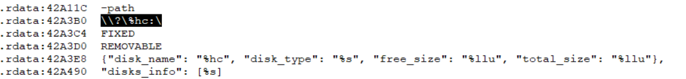
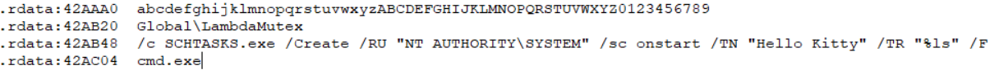
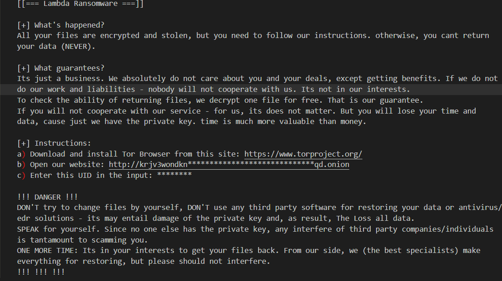

<link rel="stylesheet" href="../../CSS/style.css" type="text/css">

# Lambda Ransomware C2 Zararlı Yazılımı IoC Çalışması

  

  

Ali Can Gönüllü | Siber Güvenlik Uzmanı  alicangonullu[at]yahoo.com
 

# Giriş

    Daha yeni keşfettiğimiz bu ransomware (MD5: d6d92703ad1bd824cbc022a6402d7337), radarımıza hemen yakalanmış ve incelenmeye başlanmıştır. 

# Disclaimer | Yasal Uyarı

  Bu blog yazısında sağlanan bilgiler yalnızca eğitim ve bilgilendirme amaçlıdır. <b>Bilgisayar korsanlığı, siber saldırılar veya bilgisayar sistemlerine, ağlara veya verilere herhangi bir şekilde yetkisiz erişim de dahil olmak üzere herhangi bir yasa dışı veya etik olmayan faaliyeti</b> teşvik etme veya reklam etme amacı taşımaz.
  
  Disclaimer: The information provided in this blog post is intended for educational and informational purposes only. It is not intended to encourage or promote any illegal or unethical activities, including hacking, cyberattacks, or any form of unauthorized access to computer systems, networks or data.

# Zararlı Yazılım Hakkında Bilgi

  Lambda Ransomware, VoidCrypt adlı ransomware grubunun ürettiği bir zararlı yazılımdır.
    
  Lambda ransomware, verilerinize erişimi kısıtlayan bir dosya kilitleme virüsüdür. Dosyalarınızı "[dosya_adi] [ID].lambda" uzantısıyla şifreleyerek, verilere erişim karşılığında kurbanlardan bitcoin ile fidye ödemelerini ister. 
    
  Lambda ransomware, ilk olarak Ekim 2023'te kurumsal bulut ortamlarında keşfedilmiştir. Lambda ransomware, çoğunlukla Çinli kullanıcıları hedef almıştır. Lambda ransomware, dosyalarınızı şifreledikten sonra, fidye ödemesi için talimatlar içeren bir fidye notu gösterir. <b>Lambda ransomware tarafından şifrelenen dosyaları şu anda çözmenin bir yolu yoktur.</b>
    
  Araştırmalarımız devam ederken söz konusu zararlı yazılımın <b>Cyclance Ransomware ile aynı aileden olduğunu gördük.</b>

# Bulaşma Yöntemi

    EXE dosyasının açılması suretiyle dosya / klasör şifreleme işlemi başlamaktadır.

# Çalışma Mantığı

    Öncelikle zararlı yazılım incelendiğinde ilk göze çarpan disk bilgilerini istemesidir.
      
    
      
    Disk bilgilerinin yanında Windows sürümü, ürün adı, Makine GUID ve Microsoft'un "Cryptograph" kütüphanesini çağırdığını görmekteyiz
      
    
      
    Bu bilgileri ve ek olarak disk bilgisi gibi bilgiler de dahil olmak üzere "79[.]133[.]51[.]208" IP adresinin "25518" portunun "r1.php" dosyasına gönderdiği tespit edilmiştir. 
    Aynı zamanda bu IP adresinin bir C2 server olduğu da anlaşılmıştır.
     
    <a href="lambda.pcapng1">PCAP dosyasını indirmek için tıklayın</a>
      
    
      
    Ardından bir zamanlanmış işlem oluşturduğu görülmektedir
      
    
      
    Klasik bir ransomware gibi ShadowCopy alanlarını silmeye çalıştığı görülmüştür
      
    
      
    Bu aşamadan sonra canlı bir ortamda çalıştırarak yaptıklarını gözlemlemeye başlıyoruz.  Canlı ortam testlerinde kriptolamada ".Lambda" uzantısı taşıdığını ve her klasör içerisine bir kripto notu bıraktığını görüyoruz.
      
    
      
    İletişime girdiğimiz IP adresi üzerinde araştırma yaptığımda ise bir Live Chat paneli karşıma çıkıyor (o kadar amatörler ki yazdıkları PHP scriptinde bile zafiyet var :D )
      
    
      
    Daha sonrasında Onionlu siteye de baktığımızda aynı IP adresi üzerinden host edildiğini görüyoruz (script aynı olduğundan böyle bir mantık yürüttüm)
      
    
      
    <b>Sisteme girdiği komutlar daha sonra eklenecektir</b>

# Sonuç

    Sonuç olarak, tekrar hatırlatmalıyım ki bu tip zararlı yazılımlar çok tehlikelidir. Bu ransomware türlerine karşı tüm bilişim yetkilileri ve bilişim dışı çalışanlar bilgili olmalıdır. 

# YARA Kuralı
<pre>
rule Lambda_Malware {
	meta:
                author= "Ali Can Gönüllü"
                description= "Lambda Malware"
	strings:
                $pk1 = {7B 22 6D 69 64 22 3A 20 22 25 73 22 2C 22 75 69 64 22 3A 20 22 25 73 22 2C 22 76 65 72 22 3A 20 22 25 53 22 2C 22 73 74 61 74 5F 66 69 6C 65 73 5F 61 6C 6C 22 3A 20 22 25 6C 75 22 2C 22 73 74 61 74 5F 6E 6F 74 5F 65 6E 63 72 79 70 74 65 64 22 3A 20 22 25 6C 75 22 2C 22 73 74 61 74 5F 73 69 7A 65 22 3A 20 22 25 73 22 2C 22 65 78 65 63 75 74 69 6F 6E 5F 74 69 6D 65 22 3A 20 22 25 6C 75 22 7D}
                $pk2 = {4c 00 41 00 4d 00 42 00 44 00 41 00 5f 00 52 00 45 00 41 00 44 00 4d 00 45 00 2e 00 74 00 78 00 74}
                $pk3 = {7B 22 6D 69 64 22 3A 20 22 25 73 22 2C 22 75 69 64 22 3A 20 22 25 73 22 2C 22 76 65 72 22 3A 20 22 25 53 22 2C 22 6F 73 22 3A 20 22 25 53 22 2C 22 63 6F 6D 70 75 74 65 72 22 3A 20 22 25 53 22 2C 22 75 73 65 72 6E 61 6D 65 22 3A 20 22 25 53 22 2C 22 64 6F 6D 61 69 6E 22 3A 20 22 25 53 22 2C 20 22 61 72 63 68 22 3A 20 22 25 53 22 2C 22 65 6C 65 76 61 74 69 6F 6E 22 3A 20 22 25 6C 75 22 2C 20 25 53 7D}
                $pk4 = {72 00 31 00 2E 00 70 00 68 00 70}
	condition:
                4 of ($pk*)
}
</pre>