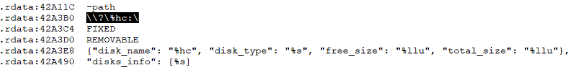
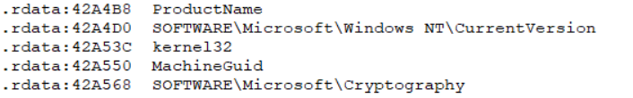
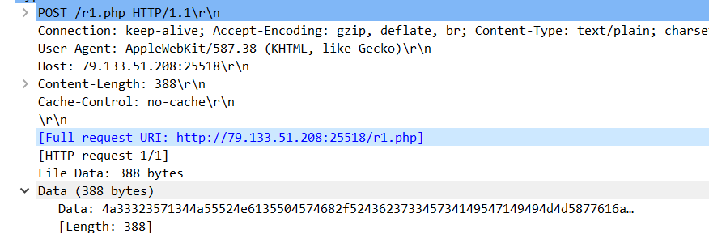
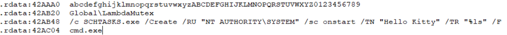
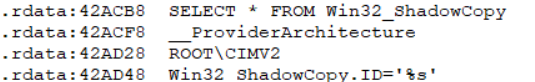
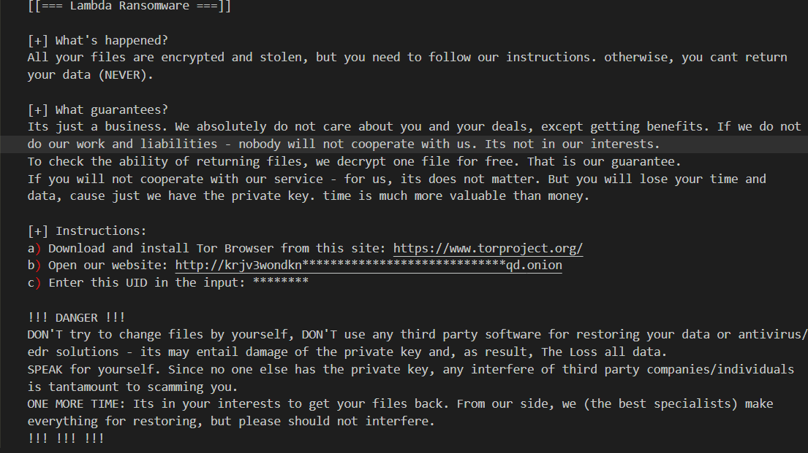
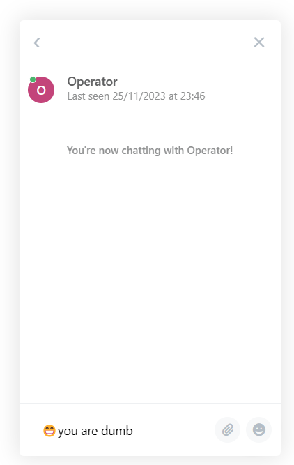
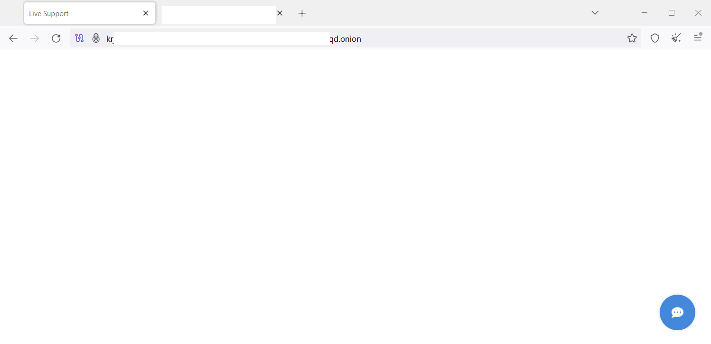

<link rel="stylesheet" href="../../CSS/style.css" type="text/css">

# Lambda Ransomware C2 Harmful Software IoC

  

  

Ali Can Gönüllü | Cyber Security Specialist  alicangonullu[at]yahoo.com
 

# Giriş

    Daha yeni keşfettiğimiz bu ransomware (MD5: d6d92703ad1bd824cbc022a6402d7337), radarımıza hemen yakalanmış ve incelenmeye başlanmıştır. 

# Disclaimer | Yasal Uyarı

  Disclaimer: The information provided in this blog post is intended for educational and informational purposes only. It is not intended to encourage or promote any illegal or unethical activities, including hacking, cyberattacks, or any form of unauthorized access to computer systems, networks or data.

# Informations About Harmful Software

  Lambda Ransomware is a malicious software produced by the ransomware group named VoidCrypt.
    
  Lambda ransomware is a file-locking virus that restricts access to your data. It encrypts your files with the extension “[file_name] [ID].lambda” and demands bitcoin ransom payments from victims in exchange for access to their data.
    
  Lambda ransomware was first discovered in October 2023 in corporate cloud environments. Lambda ransomware has mostly targeted Chinese users. After encrypting your files, Lambda ransomware displays a ransom note containing instructions for ransom payment. There is currently no way to decrypt files encrypted by Lambda ransomware.
    
  As our research continues, we have found that this malware is from the same family as Cyclance Ransomware.

# Infection

    File/folder encryption process starts by opening the EXE file

# Running

    The first thing that stands out when examining the malware is that it requests disk information.
      
    
      
    In addition to disk information, we see that it calls Windows version, product name, Machine GUID, and Microsoft’s "Cryptograph" library.
      
    
      
    It has been determined that it sends this information, including disk information, to the “r1.php” file on “25518” port of “79[.]133[.]51[.]208” IP address. It has also been understood that this IP address is a C2 server. 
     
    <a href="lambda.pcapng1">Click here to download the PCAP file</a>
      
    
      
    Then, it is seen that it creates a scheduled task.
      
    
      
    It has been observed that it tries to delete ShadowCopy areas like a classic ransomware.
      
    
      
    After this stage, we start observing what it does by running it in a live environment. In live environment tests, we see that it carries “.Lambda” extension in encryption and leaves a crypto note in each folder.
      
    
      
    When I researched the IP address we contacted, I encountered a Live Chat panel.
      
    
      
    Later, when we looked at the Onion site, we saw that it was hosted on the same IP address (I made this assumption because the script was the same).
      
    
      

# Sonuç

    As a result, I must remind you again that these types of malicious software are very dangerous. All IT authorities and non-IT employees should be knowledgeable about these ransomware types. 

# YARA Kuralı
<pre>
rule Lambda_Malware {
	meta:
                author= "Ali Can Gönüllü"
                description= "Lambda Malware"
	strings:
                $pk1 = {7B 22 6D 69 64 22 3A 20 22 25 73 22 2C 22 75 69 64 22 3A 20 22 25 73 22 2C 22 76 65 72 22 3A 20 22 25 53 22 2C 22 73 74 61 74 5F 66 69 6C 65 73 5F 61 6C 6C 22 3A 20 22 25 6C 75 22 2C 22 73 74 61 74 5F 6E 6F 74 5F 65 6E 63 72 79 70 74 65 64 22 3A 20 22 25 6C 75 22 2C 22 73 74 61 74 5F 73 69 7A 65 22 3A 20 22 25 73 22 2C 22 65 78 65 63 75 74 69 6F 6E 5F 74 69 6D 65 22 3A 20 22 25 6C 75 22 7D}
                $pk2 = {4c 00 41 00 4d 00 42 00 44 00 41 00 5f 00 52 00 45 00 41 00 44 00 4d 00 45 00 2e 00 74 00 78 00 74}
                $pk3 = {7B 22 6D 69 64 22 3A 20 22 25 73 22 2C 22 75 69 64 22 3A 20 22 25 73 22 2C 22 76 65 72 22 3A 20 22 25 53 22 2C 22 6F 73 22 3A 20 22 25 53 22 2C 22 63 6F 6D 70 75 74 65 72 22 3A 20 22 25 53 22 2C 22 75 73 65 72 6E 61 6D 65 22 3A 20 22 25 53 22 2C 22 64 6F 6D 61 69 6E 22 3A 20 22 25 53 22 2C 20 22 61 72 63 68 22 3A 20 22 25 53 22 2C 22 65 6C 65 76 61 74 69 6F 6E 22 3A 20 22 25 6C 75 22 2C 20 25 53 7D}
                $pk4 = {72 00 31 00 2E 00 70 00 68 00 70}
	condition:
                4 of ($pk*)
}
</pre>