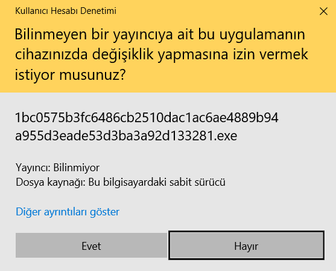
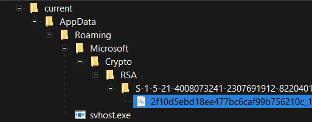
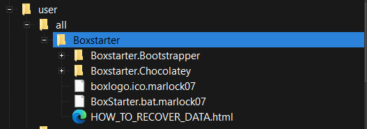
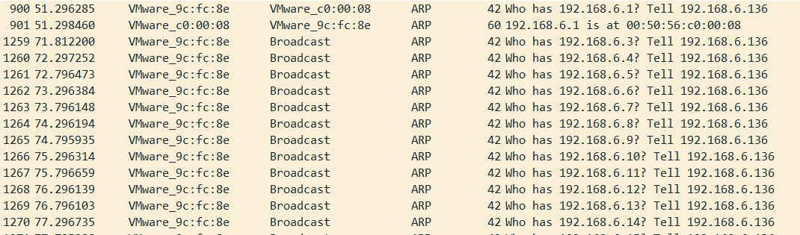
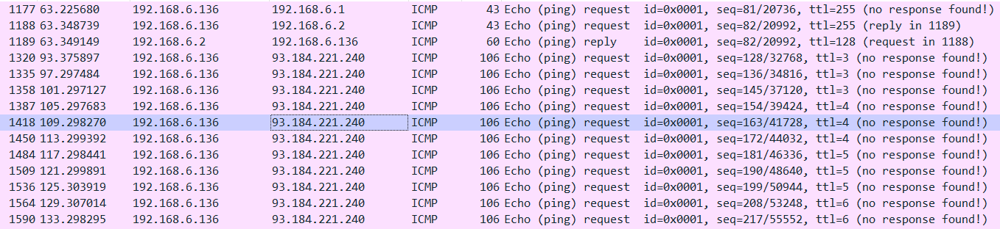
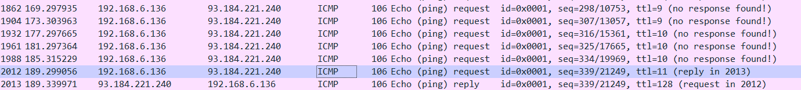
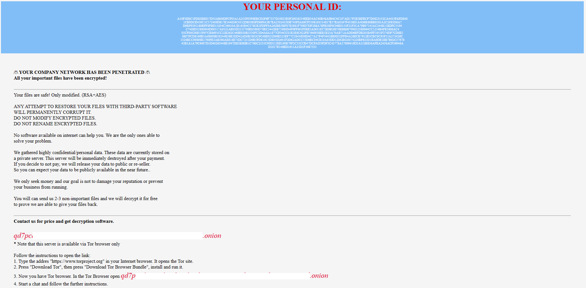

<link rel="stylesheet" href="../../CSS/style.css" type="text/css">

# Medusa C2 Ransomware IoC Analizi | Ransomware Ailesi

<!-- SEO Meta Tags -->
<meta name="description" content="Medusa C2 ransomware analizi ve IoC çalışması. Siber güvenlik uzmanı Ali Can Gönüllü'den Medusa ransomware ailesi detaylı analizi.">
<meta name="keywords" content="Medusa, ransomware, C2, malware analizi, IoC, threat intelligence, siber güvenlik, ransomware ailesi, zararlı yazılım">
<meta name="author" content="Ali Can Gönüllü">
<meta name="robots" content="index, follow">
<meta property="og:title" content="Medusa C2 Ransomware IoC Analizi">
<meta property="og:description" content="Medusa ransomware ailesi detaylı analizi ve C2 malware IoC çalışması.">
<meta property="og:type" content="article">
<meta property="og:url" content="https://github.com/alicangonullu/CTI_Arastirmalarim/IoC/Medusa_IoC/">
<meta property="og:image" content="medusa.png">
<meta name="twitter:card" content="summary_large_image">
<meta name="twitter:title" content="Medusa C2 Ransomware IoC Analizi">
<meta name="twitter:description" content="Medusa ransomware ailesi detaylı analizi.">
<meta name="twitter:image" content="medusa.png">

  

  

    
<strong>Ali Can Gönüllü</strong> | Siber Güvenlik Uzmanı | <a href="mailto:alicangonullu@yahoo.com">alicangonullu@yahoo.com</a> 
    <em>LinkedIn: <a href="https://linkedin.com/in/alicangonullu" target="_blank">linkedin.com/in/alicangonullu</a></em>
 
    <strong>Merhabalar,</strong> 
    Bu yazımda sizlerle birlikte <strong>Medusa</strong> adlı ransomware ve korunma yöntemlerini detaylıca inceleyeceğiz. 

# Disclaimer | Yasal Uyarı

  Bu blog yazısında sağlanan bilgiler yalnızca eğitim ve bilgilendirme amaçlıdır. <b>Bilgisayar korsanlığı, siber saldırılar veya bilgisayar sistemlerine, ağlara veya verilere herhangi bir şekilde yetkisiz erişim de dahil olmak üzere herhangi bir yasa dışı veya etik olmayan faaliyeti</b> teşvik etme veya reklam etme amacı taşımaz.
  
  Disclaimer: The information provided in this blog post is intended for educational and informational purposes only. It is not intended to encourage or promote any illegal or unethical activities, including hacking, cyberattacks, or any form of unauthorized access to computer systems, networks or data.

# Grup Bilgisi

Medusa ransomware grubu, sağlık sektörünü hedef alan saldırılarıyla ün kazanan, henüz çok bilinmeyen ama güçlü bir ransomware grubudur. COVID-19 pandemisi sırasında yaşanan karmaşa ve kargaşadan yararlanan bu grup, sistemleri enfekte edip şifreleyerek, şifreli verilerin geri alınması için yüklü fidyeler talep etmektedir. 

Medusa ransomware grubu, 2021 yılında ortaya çıkmış ve 2023 yılında dünya çapında işletmelere milyon dolarlık fidye talepleriyle saldırmaya başlamıştır. Medusa operasyonu Haziran 2021'de başlamış, ancak çok fazla kurban ya da faaliyet gözlenmemiştir. 

Medusa ransomware grubu, Ransomware-as-a-Service (RaaS) modeli altında çalışmaktadır. Bu modelde, ransomware geliştiricisi ve kurban sistemlerine ransomware bulaştıran çeşitli ortaklar bulunmaktadır. Medusa ransomware grubu, fidye ödemelerini ortaklara yüzde 55-60, geliştiriciye ise geri kalanını vererek bölüştürmektedir. 

Medusa ransomware grubu, kurbanların ağlarına erişmek için çoğunlukla Zayıf Uzak Masaüstü Protokolü (RDP) yapılandırmalarından yararlanmaktadır [ T1133 ]. Ayrıca, başlangıç saldırı vektörü olarak e-posta yoluyla kimlik avı ve istenmeyen e-posta kampanyalarını kullanmaktadır [ T1566 ]. 

Medusa ransomware grubu, sistemlere bulaştıktan sonra PowerShell komut dosyası invoke-ReflectivePEInjection [ T1059.001 ] kullanarak Medusa ransomware'yi ağ boyunca yaymaktadır. Bu komut dosyası, enfekte makinenin kayıt defterindeki EnableLinkedConnections değerini düzenleyerek, enfekte makinenin bağlı ana bilgisayarları ve ağları Internet Control Message Protocol (ICMP) ile ve paylaşılan depolama alanlarını Server Message Block (SMB) Protokolü ile algılamasını sağlar. Medusa ransomware daha sonra: 
<ul>
  <li>LanmanWorkstation servisini yeniden başlatır, bu da kayıt defteri düzenlemelerinin etkinleşmesini sağlar.</li>
  <li>Bilinen güvenlik, muhasebe ve adli yazılımların süreçlerini sonlandırır.</li>
  <li>Veri kurtarmayı önlemek için gölge kopya yedeklerini siler.</li>
  <li>Sistem ayrıcalıklarını yükseltir, savunma mekanizmalarını devre dışı bırakır ve ağ üzerinde yayılır.</li>
  <li>Saldırının sonucunda verileri şifreler ve şifre çözme karşılığında fidye talep eden bir not bırakır.</li>
</ul>

# Bulaşma Şekli

    Zararlı yazılım EXE formatında sisteme bulaşmaktadır ve ardından AES - RSA algoritmalarını kullanmak suretiyle sistemdeki kişisel verileri şifrelemektedir.

# Çalışma Mantığı

    Zararlı yazılım çalıştırıldığı anda ilk dikkat çeken UAC penceresinde "Hayır" dense dahi kendisini sürekli olarak yeniden başlatmasıdır.
      
    
      
    Zararlı yazılım çalıştırıldıktan sonra "svhost.exe", "svhost.job" ve "Crypto\RSA\" klasörü içerisine "2f10d5ebd18ee477bc6caf99b756210c_14398686-b917.dll" dosyalarını oluşturmaktadır.
      
    
      
    "WMIC.exe" ile etkileşime geçerek "wmic.exe SHADOWCOPY /nointeractive" komutuyla sorgulaması yapmakta. Klasik bir ransomware gibi derhal ShadowCopy'leri silmeye çalışmaktadır. 
    Bunların ardından "rundll32.exe" çalıştırmakta ve sistemde kriptolama işlemine başlamaktadır.
      
    
      
    Ardından da tüm ağı cihazın subnet adresine uygun olarak ARP protokolü yardımıyla taramaya başlamaktadır.
      
    
      
    Ardından önce yerel ağdaki ana bilgisayara (192.168.6.1 oluyor) ardından da C2 adresine (93[.]184[.]221[.]240 oluyor) devamlı olarak PING isteği göndermektedir. <a href="medusa.pcapng">PCAP dosyasına buradan ulaşabilirsiniz.</a>
      
    
      
    PING işlemini yaparken sürekli TTL değiştirmektedir. Son olarak TTL değeri 11 olarak ayarlandığında serverdan yanıt almaktadır.
      
    
      
    PING işlemini de tamamladıktan sonra ransomware tamamlanıyor ve şifrenin çözülmesi için bir User Key atanarak verilerin çözülmesi için bir miktar fidye ile qd7pcafnc******************[.]onion adresiyle iletişime geçilmesini istenmektedir. 
    Elbette verilerinizin çözülmesi için bir süre verilmekte (en az 9 gün) ve eğer fidye ücretini ödemezseniz verileriniz yayınlanmaktadır.
      
    
      

# Çözüm Önerileri

  Öncelikle bu tarz zararlı yazılımların RSA - AES algoritmalarını kullandığını siz de görebilirsiniz. Bu algoritmaların çözümü zor olduğu için haliyle kurban olduğunuz takdirde iyi bir Veri Kurtarma Uzmanına ihtiyacınız olacaktır. 
  Bu mağduriyeti yaşamamanız için EDR / XDR sistemlerinizi güncel tutarak bu saldırıları büyük oranda engelleyebilirsiniz. 
  <a href="../YARA_Rules/Medusa_Ransomware.yara">YARA dosyasına buradan ulaşabilirsiniz</a>

# Yazar | Author 

  Ali Can GÖNÜLLÜ 
  Siber Güvenlik Uzmanı 
  alicangonullu[at]yahoo.com

