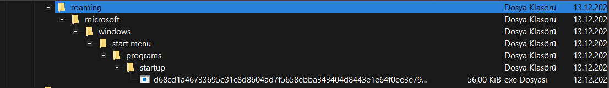
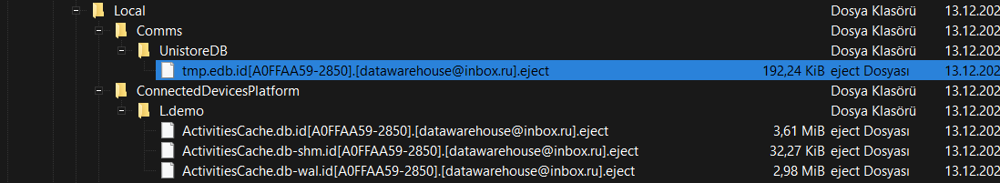
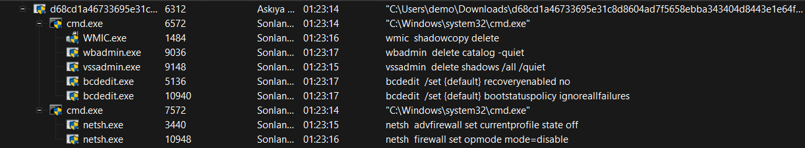
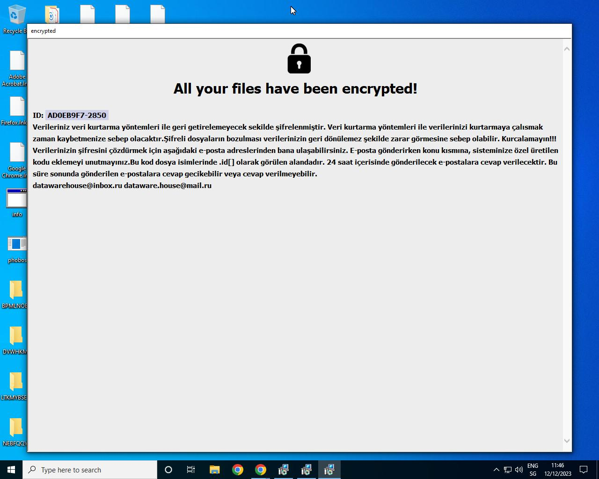
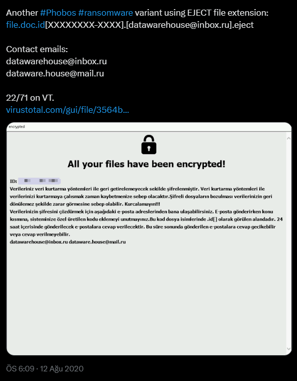
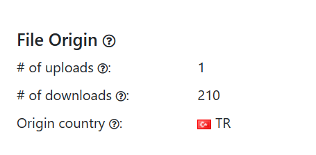
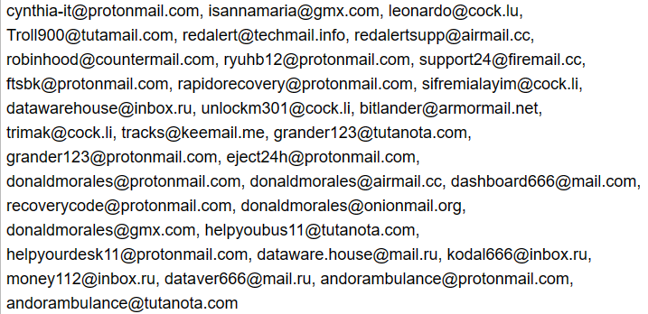

<link rel="stylesheet" href="../../CSS/style.css" type="text/css">

# Small and medium-sized Organizations Targetted! - Hunting Phobos Ransomware
  

  

Ali Can Gönüllü | Cyber Security Specialist  alicangonullu[at]yahoo.com

Hello World!

Bugün mesaj kutuma gelen bir zararlı yazılım örneğinin kaynağını araştırırken aslında Phobos Ransomware adlı zararı yazılımla aynı aileden geldiğini gördüm. Bunun üzerine detaylı bir çalışmayı kaleme aldım.

Bu çalışmayı yaparken OSINT kaynaklarından çok detaylıca yararlandım. Umarım beğenirsiniz.

# Disclaimer
The information provided in this blog post is intended for educational and informational purposes only. It is not intended to encourage or promote any illegal or unethical activities, including hacking, cyberattacks, or any form of unauthorized access to computer systems, networks or data.

# About Phobos Ransomware
Phobos ransomware is a type of malware that encrypts files on both local drives and network shares. It was first discovered in December 2018 and primarily targets small and medium-sized organizations. The perpetrators behind Phobos tend to focus on smaller businesses that may not have the resources to pay large ransoms. Phobos is capable of encrypting files both in local drives as well as network shares. In 8Base campaigns, the ransomware component is embedded in SmokeLoader's encrypted payloads, which is then decrypted and loaded into the SmokeLoader process' memory. 

Our analysis of Phobos' configuration revealed a number of interesting capabilities, including a user access control (UAC) bypass technique and reporting victim infections to an external URL. Notably, in all samples of Phobos released since 2019 that we analyzed, the same RSA key protected the encryption key. This led us to conclude that attaining the associated private key could enable decryption of all these samples.

# Hunting
Zararlı yazılımı çalıştırdığımızda, zararlı yazılımın bilgisayar kapandığında dahi tekrardan çalıştırabilmesi için "Startup" klasörü içerisine kopyaladığı görülmektedir.
  

  
Zararlı yazılımın aynı zamanda kişisel dosyaları "[dosya_adi].[uzantisi].id[A0FFAA59-2850].[datawarehouse@inbox.ru].eject" adıyla şifrelediği görülmüştür.
  

  
Komutun sadece kendini kopyalamadığı aynı zamanda şifrelenmiş verilerin kurtaramaması için WMI ile bilgisayarda depolanan ShadowCopy yedeklerini de sildiği görülmüştür.

WMI, Windows Management Instrumentation'ın kısaltmasıdır. WMI, Windows işletim sistemlerinde hemen hemen her nesnenin kontrol edilebilmesini sağlayan, işletim sistemindeki operasyonları ve yönetim işlevlerini gerçekleştirebilen bir teknolojidir. 

WMI, yazılım ve yönetim komut dosyalarının Windows işletim sisteminizin durumu ve üzerindeki veriler hakkında bilgi istemesi için standartlaştırılmış bir yol sağlayan bir Windows özelliğidir. "WMI Provider" istendiğinde bu bilgileri sağlar. Örneğin, yazılım veya komutlar BitLocker sürücü şifrelemesinin durumu hakkında bilgi bulabilir, olay günlüğündeki girdileri görüntüleyebilir veya WMI sağlayıcısı içeren yüklü uygulamalardan veri isteyebilirsiniz.

Shadow Copy (Gölge Kopya), Windows işletim sistemlerinde paylaşılan dosya ve klasörleri belirli zaman aralıklarında yedekleyen ve kullanıcılara geri dönüş olanağı sunan bir hizmettir. Shadow Copy sayesinde yanlışlıkla silinen veya içeriği değiştirilen dosya ve klasörleri geçmiş zamandaki bir durumuna geri getirme işlemi mümkün hale gelir. 

Shadow Copy, verilerinizi korumanıza ve yanlışlıkla silinen dosyaları geri getirmenize yardımcı olur. Shadow Copy, bilgisayar kullanımdayken bile bilgisayardaki birimlerin bir kopyasını oluşturarak geri yükleme imkanı sağlamaktadır. Shadow Copy özelliği FAT dosya sisteminde aktif hale getirilemez, yalnızca NTFS disk üzerinde kullanılabilir. 

Zararlı yazılımın sadece sanal veri kopyalarını (ShadowCopy) silmediği aynı zamanda "wbadmin delete catalog -quiet" komutuyla arka planda yerel yedekleri de sildiği görülmüştür.

wbadmin, Windows işletim sistemlerinde yerleşik bir yedekleme aracıdır. Bu araç, işletim sistemi, diskler, dosyalar, klasörler ve uygulamaları yedeklemek ve geri yüklemek için kullanılabilir. Bu aracı kullanarak düzenli bir yedekleme planlamak için, Yöneticiler grubunun bir üyesi veya uygun izinlerin atanmış olması gerekir. Ayrıca, wbadmin'i yükseltilmiş bir komut istemiyle çalıştırmalısınız. 

"bcedit" komutlarıyla boot sırasında oluşan hataların ignore edilmesi ve Windows içerisinde yerel olarak bulunan yedekleme sistemlerini tamamen devre dışı bıraktığı görülmektedir.

Tüm bu işlemlerin ardından "netsh" komutuyla Windows yerel bilgisayarda bulunan güvenlik duvarı özelliğini tamamen devre dışı bırakarak bilgisayardan farklı bir ağa gerçekleşebilecek işlemlere karşı yerel bilgisayarı savunmasız bırakmaktadır
  

  
Tüm bunların ardından işlemini tamamlamaktadır ve tüm dosyaları şifrelemektedir. 
  

  
Bu işlemler sırasında herhangi bir ağ hareketine ilginç bir şekilde rastlanılamamıştır

# OSINT

OSINT amacıyla kişisel dosyalar kriptolanırken girilmiş olan "datawarehouse@inbox.ru" mail adresini sorguluyoruz ve sorgulamalarımız esnasında 12 Ağustos 2020 tarihinde yaygın olan sürümünün elimizde olduğu (MD5: 2680a0e23ec4966fa69e3613d1e2e731) ve bu yazılımın çokça farklı versiyonu olduğunu görüyoruz.
  

  
Açık kaynak araştırmalarımız devam ederken bu zararlı yazılımın Türkiye'de de yaygın olarak görüldüğünü görüyoruz.
  

  
Devam ettiğimizde aynı zararlı yazılım grubunun bir çok mail adresi olduğunu görüyoruz. Bu mail adreslerine biz de birkaç ekleme yapmak istiyoruz
  

  
Mail Adresleri : zuzka1819@tuta.io

# Sonuç

Zararlı yazılım hakkında henüz bir YARA kuralı yazmadım. Bu sebeple önerim zararlı yazılımları avlayan güvenlik yazılımlarınızın sürümlerini güncellemeniz olacaktır.
