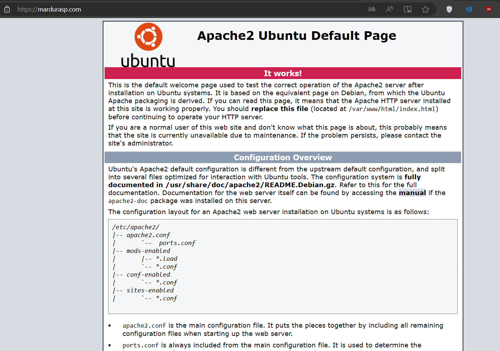

# Pikabot PDF Malware Hunting

# Disclaimer

  The information provided in this blog post is intended for educational and informational purposes only. It is not intended to encourage or promote any illegal or unethical activities, including hacking, cyberattacks, or any form of unauthorized access to computer systems, networks or data.

# About Pikabot

# Hunting
İlk olarak incelemememize PDF dosyasının hex analizini yaparak başlıyoruz. İncelememiz esnasında mardurasp[.]com linkine sahip bir URL buluyoruz.
  

  
PDF dosyasını IoC için Sandbox içerisinde açtığımızda da şu şekilde bir pencereyle karşılaşıyoruz ve pencerede herhangi bir yere tıklandığında da mardurasp[.]com adresine yönlendirildiğini görüyoruz.
  

  
URL içeriğine girdiğimizde bir Apache server üzerinden yönetildiğini ve Ubuntu kurulduğunu görüyoruz.
  

  
URL içeriğini araştırdığımızda bir veriye ulaşamıyoruz fakat OSINT araştırmalarımız esnasında bir MSI dosyası indirdiğini görüyoruz. Muhtemelen MSI dosyası aracılığıyla zararlı yazılımı yüklemekte ve PDF 