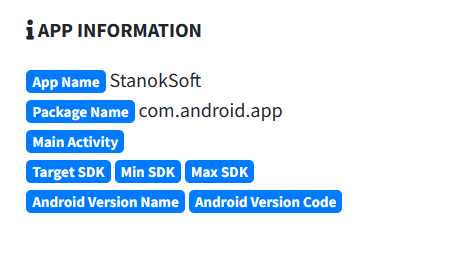

<link rel="stylesheet" href="../../CSS/style.css" type="text/css">

# SMSAgent C2 Malware IoC Analizi | Android SMS Stealer

<!-- SEO Meta Tags -->
<meta name="description" content="SMSAgent Android SMS stealer malware analizi ve IoC çalışması. Siber güvenlik uzmanı Ali Can Gönüllü'den SMSAgent APK detaylı analizi.">
<meta name="keywords" content="SMSAgent, Android, SMS stealer, malware analizi, IoC, threat intelligence, siber güvenlik, APK, zararlı yazılım, mobile security">
<meta name="author" content="Ali Can Gönüllü">
<meta name="robots" content="index, follow">
<meta property="og:title" content="SMSAgent C2 Malware IoC Analizi">
<meta property="og:description" content="SMSAgent Android SMS stealer malware detaylı analizi ve C2 IoC çalışması.">
<meta property="og:type" content="article">
<meta property="og:url" content="https://github.com/alicangonullu/CTI_Arastirmalarim/IoC/SMSAgent_IoC/">
<meta property="og:image" content="title_pic.png">
<meta name="twitter:card" content="summary_large_image">
<meta name="twitter:title" content="SMSAgent C2 Malware IoC Analizi">
<meta name="twitter:description" content="SMSAgent Android SMS stealer malware detaylı analizi.">
<meta name="twitter:image" content="title_pic.png">

  

  

<strong>Ali Can Gönüllü</strong> | Siber Güvenlik Uzmanı | <a href="mailto:alicangonullu@yahoo.com">alicangonullu@yahoo.com</a> 
<em>LinkedIn: <a href="https://linkedin.com/in/alicangonullu" target="_blank">linkedin.com/in/alicangonullu</a></em>
 

# Disclaimer | Yasal Uyarı

  Bu blog yazısında sağlanan bilgiler yalnızca eğitim ve bilgilendirme amaçlıdır. <b>Bilgisayar korsanlığı, siber saldırılar veya bilgisayar sistemlerine, ağlara veya verilere herhangi bir şekilde yetkisiz erişim de dahil olmak üzere herhangi bir yasa dışı veya etik olmayan faaliyeti</b> teşvik etme veya reklam etme amacı taşımaz.
  
  Disclaimer: The information provided in this blog post is intended for educational and informational purposes only. It is not intended to encourage or promote any illegal or unethical activities, including hacking, cyberattacks, or any form of unauthorized access to computer systems, networks or data.

# Zararlı Hakkında

    SMSAgent APK zararlı yazılımı, Android cihazlara bulaşabilen ve SMS yoluyla kişisel bilgileri çalmaya çalışan Rusya kökenli bir kötü amaçlı yazılımdır. Bu yazılım, genellikle sahte uygulamalar veya güncellemeler olarak gizlenir ve kurbanın cihazına indirilir. SMSAgent APK zararlı yazılımı, kurbanın cihazından gelen SMS mesajlarını, rehberini, konumunu ve diğer hassas verileri uzaktan bir sunucuya gönderir. Bu veriler, siber suçlular tarafından kimlik hırsızlığı, dolandırıcılık veya fidye talebi gibi amaçlarla kullanılabilir.

# Bulaşma Şekli

    Yazılım APK formatında bulaşmakta ve bulaştıktan sonra C2 server ile temas kurmakta.

# Çalışma Mantığı

    Öncelikle "StanokSoft.apk" adlı bir dosya ile Android cihazı hedef aldığını ve bu virüsün bir Telegram grubundan sızdırıldığı bilinmektedir.
      
    
      

