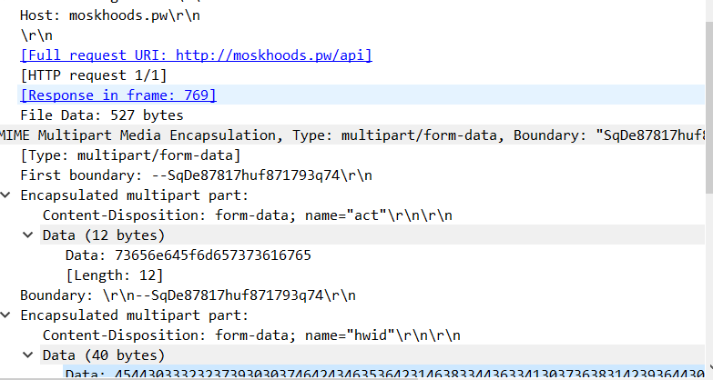
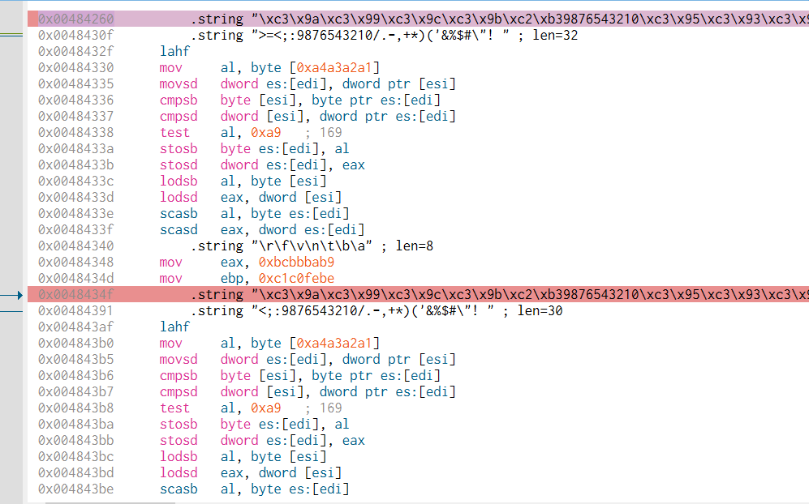

# LummaStealer C2 IoC Çalışması

  Merhaba, 
  Bu yazımda LummaStealer C2 adlı malware üzerinde yaptığımız tespit çalışmalarının aşamalarını anlatacağım.

## Disclaimer | Yasal Uyarı

  Bu blog yazısında sağlanan bilgiler yalnızca eğitim ve bilgilendirme amaçlıdır. <b>Bilgisayar korsanlığı, siber saldırılar veya bilgisayar sistemlerine, ağlara veya verilere herhangi bir şekilde yetkisiz erişim de dahil olmak üzere herhangi bir yasa dışı veya etik olmayan faaliyeti</b> teşvik etme veya reklam etme amacı taşımaz.
  
  Disclaimer: The information provided in this blog post is intended for educational and informational purposes only. It is not intended to encourage or promote any illegal or unethical activities, including hacking, cyberattacks, or any form of unauthorized access to computer systems, networks or data.

### Virüsün İncelenmesi

  Öncelikle zararlı yazılımın bir örneğini abuse sitesinden elde ettik. Daha sonrasında inceleme amacıyla Debugger uygulamasına koyduk. İnceleme esnasında zararlı yazılımın aslında bir loader olduğunu ve içerisinde asıl zararlıyı Veil kod sistemiyle bulundurduğunu fark ettik.
   
  
   
  Ardından bu Veil kodunun işleyişini test ettiğimizde içerisinde Antivirüs sistemlerini bypass etmek için bulunan bir string ve bu string değerini ayıklayan bir fonksiyon bulduk.

### Ağ İncelenmesi

  Bu fonksiyon uygulandığında yazılımın bir C2 server'a bağlandığını, bu server'a HWID, Edge Browser Geçmişi gibi kayıtları gönderdiğini fark ettik.
   
  
   
  Ardından bu C2 server IP adresinin CloudFlare altyapısında kendi IP adresini gizlediğini, domain adresinin moskhoods[.]pw olduğunun ve IP adreslerinin <b>172[.]67[.]176[.]151 ve 104[.]21[.]83[.]129</b> olduğunu tespit ettik.

### Çözüm Önerisi

  Buna dair çözüm önerisi olarak <b>moskhoods[.]pw, 172[.]67[.]176[.]151 ve 104[.]21[.]83[.]129</b> IP adreslerinin engellenmesini önermekteyiz.

## Kaynaklar
<ul>
    <li>https://bazaar.abuse.ch/sample/eb2a0541c88a8d839a3506d67260951e8f6bcf4e46741658cb69c7178da93634/</li>
</ul>