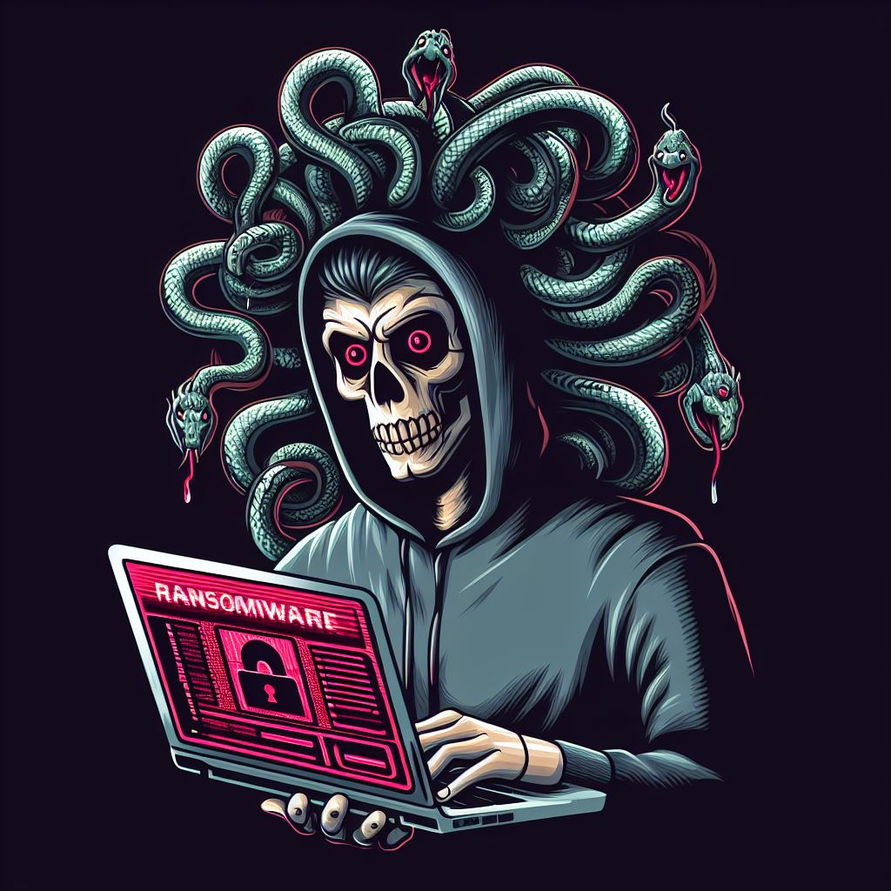
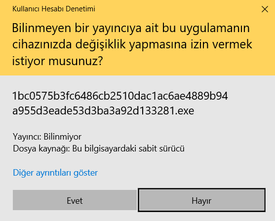
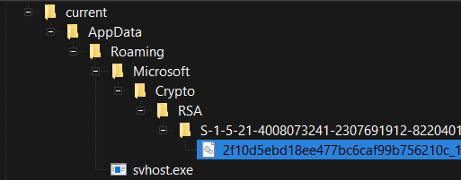
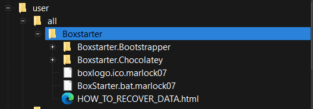
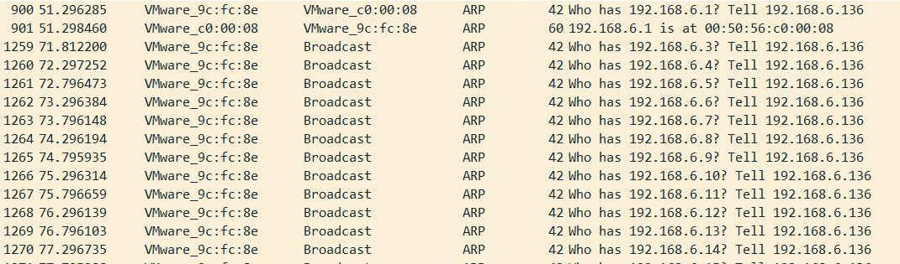
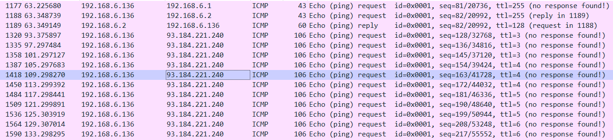
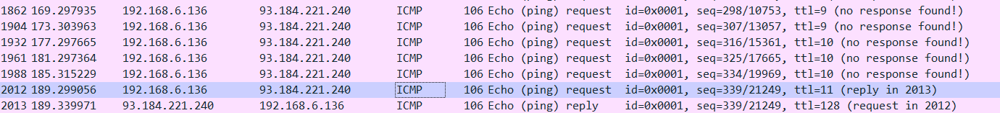
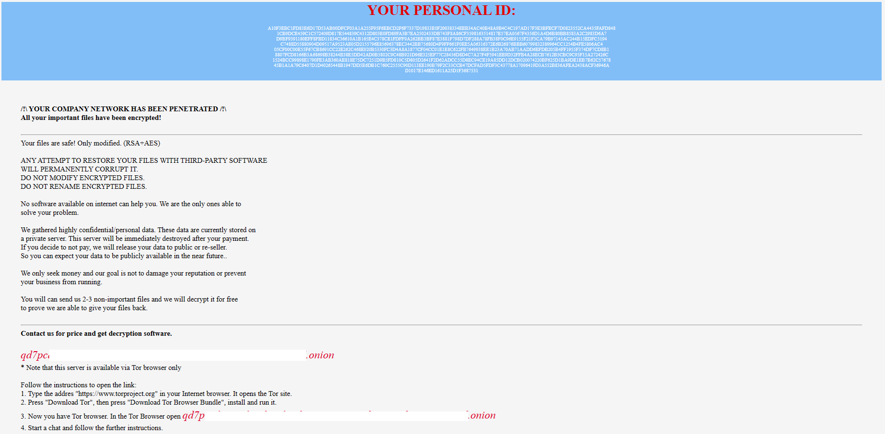

# Medusa C2 Zararlı Yazılımı IoC Çalışması
  

  

    
Siber Güvenlik Uzmanı - alicangonullu[at]yahoo.com
 
    Merhabalar, 
    Bu yazımda sizlerle birlikte Medusa adlı ransomware ve korunma yöntemlerini inceleyeceğiz. 

# Disclaimer | Yasal Uyarı

  Bu blog yazısında sağlanan bilgiler yalnızca eğitim ve bilgilendirme amaçlıdır. <b>Bilgisayar korsanlığı, siber saldırılar veya bilgisayar sistemlerine, ağlara veya verilere herhangi bir şekilde yetkisiz erişim de dahil olmak üzere herhangi bir yasa dışı veya etik olmayan faaliyeti</b> teşvik etme veya reklam etme amacı taşımaz.
  
  Disclaimer: The information provided in this blog post is intended for educational and informational purposes only. It is not intended to encourage or promote any illegal or unethical activities, including hacking, cyberattacks, or any form of unauthorized access to computer systems, networks or data.

# Grup Bilgisi

# Bulaşma Şekli

    Zararlı yazılım EXE formatında sisteme bulaşmaktadır

# Çalışma Mantığı

    Zararlı yazılım çalıştırıldığı anda ilk dikkat çeken UAC penceresinde "Hayır" dense dahi kendisini sürekli olarak yeniden başlatmasıdır.
      
    
      
    Zararlı yazılım çalıştırıldıktan sonra "svhost.exe", "svhost.job" ve "Crypto\RSA\" klasörü içerisine "2f10d5ebd18ee477bc6caf99b756210c_14398686-b917.dll" dosyalarını oluşturmaktadır.
      
    
      
    "WMIC.exe" ile etkileşime geçerek "wmic.exe SHADOWCOPY /nointeractive" komutuyla sorgulaması yapmakta. Klasik bir ransomware gibi derhal ShadowCopy'leri silmeye çalışmaktadır. 
    Bunların ardından "rundll32.exe" çalıştırmakta ve sistemde kriptolama işlemine başlamaktadır.
      
    
      
    Ardından da tüm ağı cihazın subnet adresine uygun olarak ARP protokolü yardımıyla taramaya başlamaktadır.
      
    
      
    Ardından önce yerel ağdaki ana bilgisayara (192.168.6.1 oluyor) ardından da C2 adresine (93[.]184[.]221[.]240 oluyor) devamlı olarak PING isteği göndermektedir.
      
    
      
    PING işlemini yaparken sürekli TTL değiştirmektedir. Son olarak TTL değeri 11 olarak ayarlandığında serverdan yanıt almaktadır.
      
    
      
    PING işlemini de tamamladıktan sonra ransomware tamamlanıyor ve şifrenin çözülmesi için bir User Key atanarak verilerin çözülmesi için bir miktar fidye ile qd7pcafnc******************[.]onion adresiyle iletişime geçilmesini istenmektedir. 
    Elbette verilerinizin çözülmesi için bir süre verilmekte (en az 9 gün) ve eğer fidye ücretini ödemezseniz verileriniz yayınlanmaktadır.
      
    
      

# Çözüm Önerileri

  Öncelikle bu tarz zararlı yazılımların RSA - AES algoritmalarını kullandığını siz de görebilirsiniz. Bu algoritmaların çözümü zor olduğu için haliyle kurban olduğunuz takdirde iyi bir Veri Kurtarma Uzmanına ihtiyacınız olacaktır. 
  Bu mağduriyeti yaşamamanız için EDR / XDR sistemlerinizi güncel tutarak bu saldırıları büyük oranda engelleyebilirsiniz. 
  YARA kuralı daha sonra eklenecektir.

# Yazar | Author 

  Ali Can GÖNÜLLÜ 
  Siber Güvenlik Uzmanı - alicangonullu[at]yahoo.com

