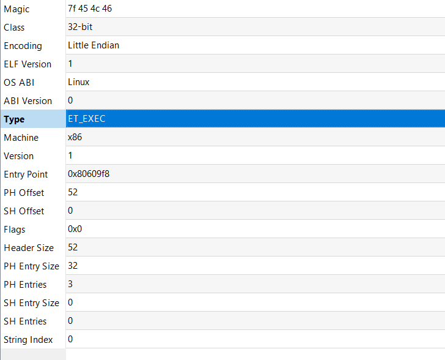
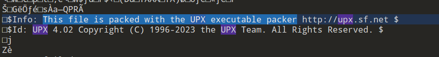
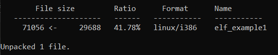
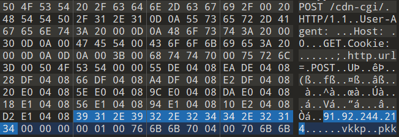
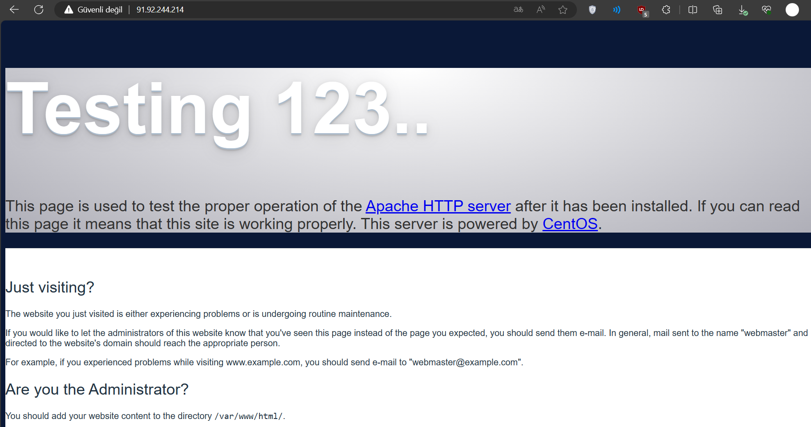
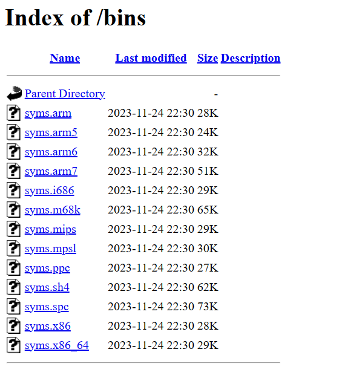

# Mirai Linux Zararlı Yazılımı IoC Çalışması

  

  

Ali Can Gönüllü | Siber Güvenlik Uzmanı  alicangonullu[at]yahoo.com
 

# Giriş

    Teknolojiyle arası iyi olan herkesin bildiği "Linux'a virüs bulaşmaz" başlıklı şehir efsanesi vardır. Bu yazımda sizlere Linux'a da virüs bulaşabildiğini göstererek bu şehir efsanesini de yıkacağız.

# Disclaimer | Yasal Uyarı

  Bu blog yazısında sağlanan bilgiler yalnızca eğitim ve bilgilendirme amaçlıdır. <b>Bilgisayar korsanlığı, siber saldırılar veya bilgisayar sistemlerine, ağlara veya verilere herhangi bir şekilde yetkisiz erişim de dahil olmak üzere herhangi bir yasa dışı veya etik olmayan faaliyeti</b> teşvik etme veya reklam etme amacı taşımaz.
  
  Disclaimer: The information provided in this blog post is intended for educational and informational purposes only. It is not intended to encourage or promote any illegal or unethical activities, including hacking, cyberattacks, or any form of unauthorized access to computer systems, networks or data.

# Grup Hakkında

    Mirai zararlı yazılımı, Linux işletim sistemine sahip ağa bağlı cihazları, özellikle IP kameralar ve ev yönlendiricileri gibi, uzaktan kontrol edilebilen botlara dönüştüren bir kötü amaçlı yazılımdır. Bu botlar, büyük ölçekli ağ saldırılarında, örneğin dağıtılmış hizmet reddi (DDoS) saldırılarında, bir botnet'in parçası olarak kullanılabilirler.
      
    Mirai zararlı yazılımı ilk olarak Ağustos 2016'da bir beyaz şapka kötü amaçlı yazılım araştırma grubu olan MalwareMustDie tarafından bulundu. Mirai, en büyük ve en yıkıcı DDoS saldırılarından bazılarında kullanıldı. Bunlar arasında bilgisayar güvenliği gazetecisi Brian Krebs'in web sitesine, Fransız web sunucusu OVH'ye ve internet altyapısı sağlayıcısı Dyn'a yapılan saldırılar sayılabilir.
      
    Mirai'nin kaynak kodu daha sonra Hack Forums üzerinde açık kaynak olarak yayınlandı. Kaynak kodu yayınlandığından beri, teknikler diğer kötü amaçlı yazılım projelerine uyarlandı.

# Bulaşma Yöntemi

    UPX 4.x ile paketlenmiş bir ELF dosyası yardımıyla bulaşmaktadır.

# Çalışma Mantığı

    ELF uzantılı olduğu için öncelikle dosya header kısmına bakıyoruz
      
    
      
    ELF paketini incelerken UPX 4.02 sürümüyle 29 KB boyutuna kadar paketlendiğini görüyoruz
      
    
      
    Bu bilgiyi edindikten sonra UPX dosyasını decompile ediyoruz ve karşımıza 69 KB boyutunda bir dosya görüyoruz
      
    
      
    Ardından 91[.]92[.]244[.]214 IP adresine sahip server ile POST isteğiyle haberleştiğini görüyoruz
      
    
      
    IP adresine baktığımızda CentOS 9 üzerinde Apache kullandığını görüyoruz.
      
    
      
    IP adresinden bir dosya indirildiğini gördüğüm anda direkt araştırmalara başladım ve bu IP adresinin "bins" klasörü içerisinde farklı mimariler için üretilmiş yine Mirai olan zararlı yazılımlar gördük. 
    Dosya tarihlerini de incelediğimizde bu virüsün dün (bugün 25 Kasım 2023) bu servera eklendiğini görüyoruz.
      
    
      
    <b>Şu an elimde Linux kurulu olmadığı için komutlarının açıklamalarını daha sonra yazacağım.</b>

# MD5 List 
<pre>
syms.arm7	67e277a283e813aa51aa76476a0521fb	
syms.arm	7b80cc56b6539a3d1008f33448ed0638
syms.i686	e0809cadf1c6ac82f0b8ce9ee041580a	
syms.m68k	55ddda91a45a847db276cec7ee865e5a	
syms.mips	28c937e7b9c02f4734d5ebbf5aed9779	
syms.mpsl	0747f2e4db871eb4580f04dfd1a12891
syms.ppc	55e1f62d96f71dac9a65525924d6a83a
syms.sh4	38da4d6c7f5b39265e24ef3c46bcf6f3
syms.spc	a520844db783b1bf4c006abb50eb649b
syms.x86	00647653f805433d148e059d6a29c680
syms.x86_64	faa2b28b60ca260b3ce1095e65f4c31e
</pre>

# Sonuç

    Bir şehir efsanesini daha yıktığımıza göre Linux'ta korunma yöntemlerine değinelim. Linux'ta korunmak, Windows'ta korunmaktan daha kolaydır. Sisteminize ClamAV kurmanız, düzenli güncelleme yaptırarak düzenli tarama yaptırmanız çok çok yetecektir.

# YARA Kuralı
<pre>
rule Mirai_Malware1 {
	meta:
                author= "Ali Can Gönüllü"
                description= "Mirai Malware"
	strings:
                $pk1 = {50 4f 53 54 20 2f 63 64 6e 2d 63 67 69 2f 00 20 48 54 54 50 2f 31 2e 31 0d 0a 55 73 65 72 2d 41 67 65 6e 74 3a 20 00 0d 0a 48 6f 73 74 3a 20 00 30 0d 0a 00 47 45 54 00 43 6f 6f 6b 69 65 3a 20 00 0d 0a 0d 0a 00 3b 00 68 74 74 70 00 75 72 6c 3d 00 50 4f 53 54 00 00 55 de 04 08 ea de 04 08 28 df 04 08 66 df 04 08 a4 df 04 08 e2 df 04 08 20 e0 04 08 5e e0 04 08 9c e0 04 08 da e0 04 08 18 e1 04 08 56 e1 04 08 94 e1 04 08 10  e2 04 08 d2 e1 04 08 39 31 2e 39 32 2e 32 34 34 2e 32 31 34 00 00 00 00 01 00}
	condition:
                1 of ($pk*)
}
</pre>

# Kaynaklar
<ul>
    <li>https://www.virustotal.com/gui/url/c63e1a9f849872a65dbc8a8b88833e1070c3b6819b4380055206def5c662a27d</li>
    <li>https://bazaar.abuse.ch/sample/86a5ba2ab546e68ace5b67abbb9fb628b2c3864b739e7dd365bf38027f1ed9f6/</li>
</ul>