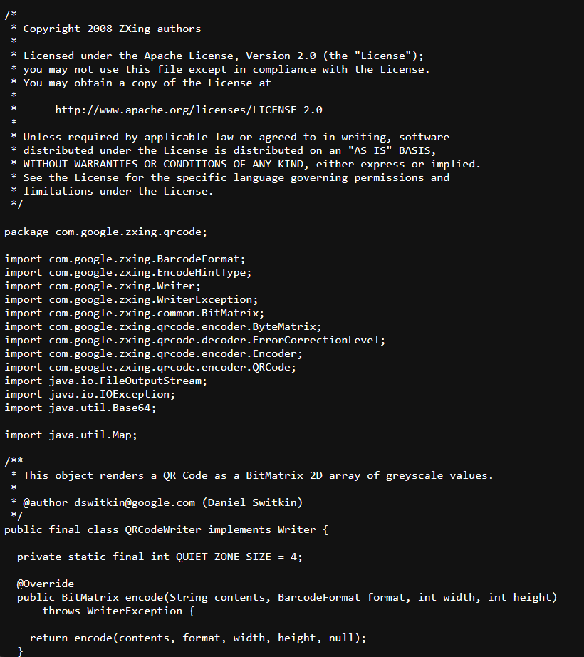
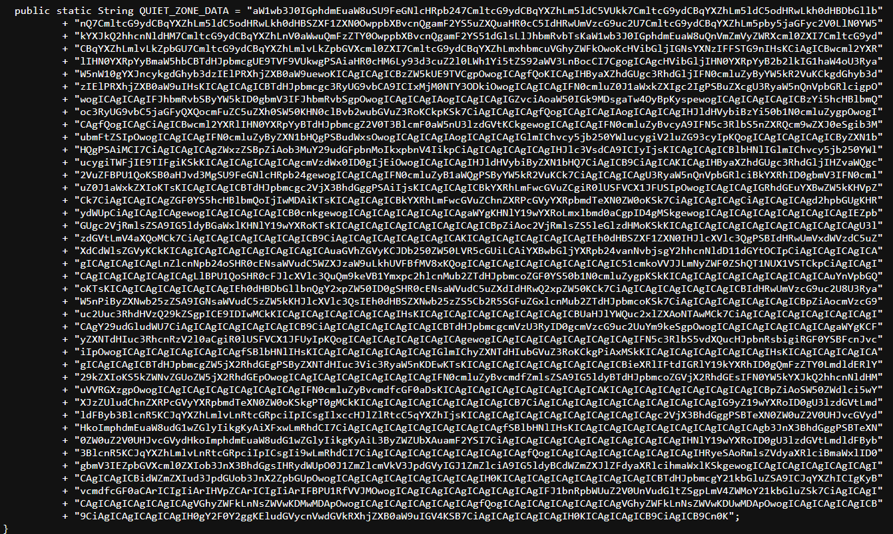
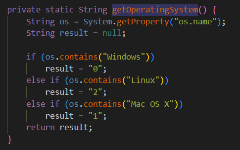
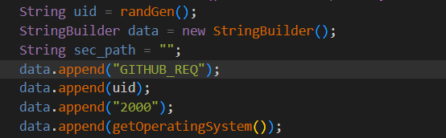
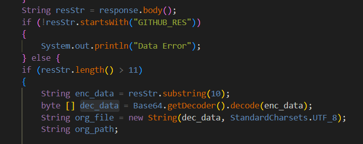
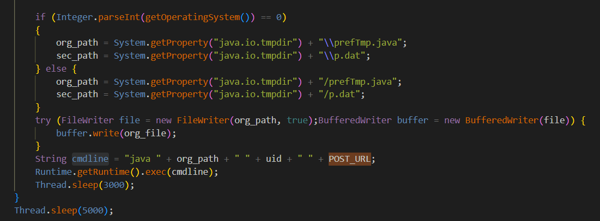

# QRLog (Fake QR Reader) C2 Zararlı Yazılımı IoC Çalışması

  

  

    
Ali Can Gönüllü | Siber Güvenlik Uzmanı - alicangonullu[at]yahoo.com
 
    Merhabalar, 
    Arkadaşlar bu yazımda sizlerle beraber sahte bir QR okuyucu olarak ortaya çıkan ve 4 ay önce kodları CTI araştırmacıları tarafından sızdırılan "QRLog" adlı zararlı yazılımı inceleyeceğiz.

# Disclaimer | Yasal Uyarı

  Bu blog yazısında sağlanan bilgiler yalnızca eğitim ve bilgilendirme amaçlıdır. <b>Bilgisayar korsanlığı, siber saldırılar veya bilgisayar sistemlerine, ağlara veya verilere herhangi bir şekilde yetkisiz erişim de dahil olmak üzere herhangi bir yasa dışı veya etik olmayan faaliyeti</b> teşvik etme veya reklam etme amacı taşımaz.
  
  Disclaimer: The information provided in this blog post is intended for educational and informational purposes only. It is not intended to encourage or promote any illegal or unethical activities, including hacking, cyberattacks, or any form of unauthorized access to computer systems, networks or data.

# Bulaşma Şekli

    Program kendisini QR Okuyucu olarak tanıtarak kurbana kendisini yüklettirmeyi amaçlar. Kurban eğer buna inanırsa ve dosyayı çalıştırırsa sistemde backdoor açılır.

# Çalışma Mantığı

    Öncelikle zararlı yazılımın Java dili ile yazıldığını belirtmek isterim. İlgili kod karşımıza <a href="https://raw.githubusercontent.com/birminghamcyberarms/QRLog/main/samples/QRCodeWriter.java">QRCodeWriter.java</a> adıyla çıkmaktadır.
      
    
      
    İncelemeye devam ederken BASE64'ü text'e dönüştüren bir kod parçası görmekteyiz
    <pre>byte [] b64dec = Base64.getDecoder().decode(QUIET_ZONE_DATA);</pre> 
    Bu kodun text halinden dönüştürüldükten sonra "QRLog.java" dosya adıyla şu komutla derlenip çalıştırıldığını görmekteyiz
    <pre>
    if (os.contains("Windows"))
        errPath = System.getProperty("java.io.tmpdir")+ "\\QRLog.java";
    else
        errPath = System.getProperty("java.io.tmpdir")+ "/QRLog.java";
    FileOutputStream qrW = new FileOutputStream(errPath);
    qrW.write(b64dec);
    </pre> 
    Hemen bu kodun birkaç satır altında da BASE64 kodunu görmekteyiz.
      
    
      
    Base64 kodunu da string değerine çevirdiğimizde karşımıza bir kod parçası gelmekte ve ilk önce işletim sisteminin bilgilerinin kontrol edildiğini görüyoruz.
      
    
      
    Program kodlarının devamında <b>C2 server olan "git-hub[.]me" adresinin "view.php" adresine POST isteğiyle sistemin kontrol edilmesi için bir UID kodunun ve işletim sistemi bilgisinin GITHUB_REQ olarak gösterilmek suretiyle gönderildiğini</b> görmekteyiz.
      
    
      
    Ardından "resStr" string değişkeni ile gelen yanıtın alındığını, eğer gelen verinin uzunluğu 11'den yüksekse "enc_data" değişkeni ile "substring(10)" edilerek gelen verinin 10. satırını okuduğunu görüyoruz. 
    "dec_data" değişkeniyle ise bu verinin dekripte edildiğini ve "org_file" değişkenine string olarak ve UTF-8 formatında atandığını görüyoruz.
      
    
      
    Bu işlemden sonra işletim sistemine göre "java.io.tmpdir" ile Java için belirlenmiş temporary yani atıl alana "prefTmp.java" dosyasına yazıldığını ve "java -cp /tmp/c2_file QRLog" komutuyla kodun derlenerek C2 adresinden gelen verinin de komut olarak gönderildiğini görüyoruz.
      
    
      

# Sonuç

    Sahte uygulamalarla kandırılma olayları çok sıklıkla normal kullanıcı tarafında yaşanmaktadır. İşletmeler için en önemli kısım da bu sahte uygulamalara inanan personellerdir. Bu konuda en önemli aşama <b>personellere gerekli eğitimin verilmesidir. Bu eğitimler için Siber Güvenlik Uzmanları ve Siber Güvenlik Firmalarından destek alabilirsiniz</b>
    Ayrıca güvenlik sistemlerine dahil edilmesi için YARA kuralı ise aşağıdaki gibidir.

<pre>
rule Fake_QRCode_C2 {
	meta:
        author= "Ali Can Gönüllü"
        description= "Fake QR Code App"
	strings:
        $pk1 = {74 74 70 73 3a 2f 2f 77 77 77 2e 67 69 74 2d 68 75 62 2e 6d 65 2f 76 69 65 77 2e 70 68 70}
        $pk2 = {68 74 74 70 73 3a 2f 2f 77 77 77 2e 67 69 74 2d 68 75 62 2e 6d 65 2f 76 69 65 77 2e 70 68 70 01}
        $pk3 = {47 49 54 48 55 42 5f 52 45 51}
	condition:
        3 of ($pk*)
}
</pre>

