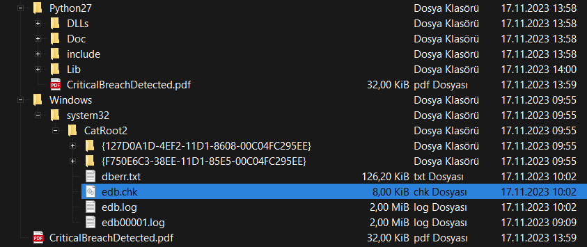
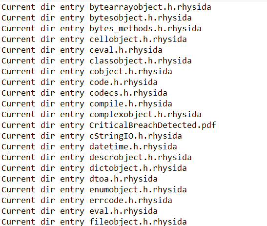
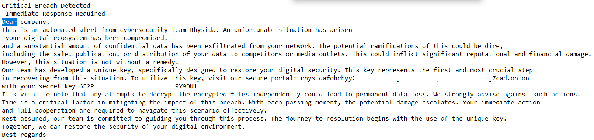
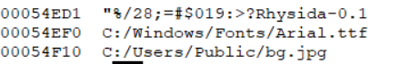
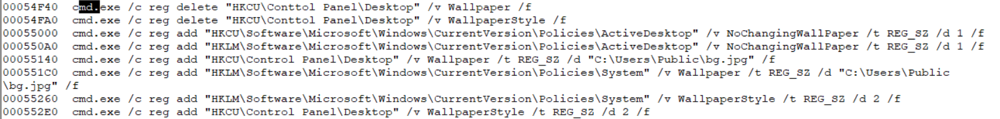
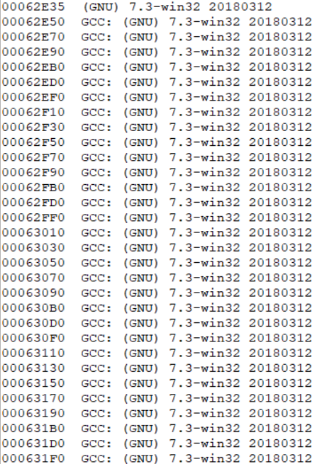

# Ryhsida Fidye (Ransomware) Zararlı Yazılımı IoC Çalışması

    Merhabalar, 
    Arkadaşlar bu yazımda sizlerle beraber <a href="FBI_Rhysida_Report.pdf">FBI raporlarına bile yüksek risk derecesinde girmiş olan</a> Ryhsida Ransomware fidye zararlı yazılımını inceleyeceğiz.

## Disclaimer | Yasal Uyarı

  Bu blog yazısında sağlanan bilgiler yalnızca eğitim ve bilgilendirme amaçlıdır. <b>Bilgisayar korsanlığı, siber saldırılar veya bilgisayar sistemlerine, ağlara veya verilere herhangi bir şekilde yetkisiz erişim de dahil olmak üzere herhangi bir yasa dışı veya etik olmayan faaliyeti</b> teşvik etme veya reklam etme amacı taşımaz.
  
  Disclaimer: The information provided in this blog post is intended for educational and informational purposes only. It is not intended to encourage or promote any illegal or unethical activities, including hacking, cyberattacks, or any form of unauthorized access to computer systems, networks or data.

# Bulaşma Yöntemi

    Bulaşma yöntemi olarak çok sıklıkla PDF formatını kullanmaktadır. PDF.EXE dosyasıyla ulaştıktan sonra içerisinden PDF dosyasını çıkarır ve kurbana bildirip para ister

# Çalışma Mantığı

    Öncelikle bulaştığı bilgisayarda çalıştığı anda sistemin çalıştığı ana disk içerisine "CriticalBreachDetected.pdf" adlı bir dosya çıkarır. Ardından Python 2.7 sürümünü bilgisayara yükler.
      
    
      
    Ardından Python ile kriptolama işlemine başlar ve ".rhysida" uzantısı ile "src/prngs/chacha20.c" algoritmasıyla tüm dosyaları kriptolar
      
    
      
    PDF dosyasının içeriğine bakıldığında da "verilerinin kriptolandığına dair" bir mesaj görürüz
      
    
      
    Ardından yazılımın aktivitelerini incelemek için içeriğini incelerken yazılım sürümünün "Rhysida-0.1" olduğunu görüyoruz.
      
    
      
    Cihazın wallpaper'ını değiştiren bir kod olduğunu fark ediyoruz
      
    
      
    Ardından yazılımın hangi compiler programı tarafından hazırlandığı bilgisiyle C/C++ ile yazıldığını anlıyoruz
      
    
      
    Ardından cihazın hiçbir network etkileşimi olmadığını görüyoruz. Fidye yazılımı "rhysidafohrhyy2aszi7bm32tnjat5xri65fopcxkdfxhi4tidsg7cad[.]onion" sitesine girilen "6F2PQ14O2POZ1JB5PSD65HUJP19Y9DU1" key ile ödeme işlemini alır ve fidyenin unlock yazılımını verir

# YARA Kuralı ve Önlemler
<ul>
    <li>TOR erişimlerini tüm ağda engellemelisiniz.</li>
    <li>YARA kurallarına aşağıda bıraktığım kuralları ekleyebilirsiniz.</li>
</ul>
  
<pre>
rule Rhysida_Ransom {
meta:
        author= "Ali Can Gönüllü"
        filetype= "Win64 exe"
        description= "Rhysida 0.1 Ransomware"
strings:
        $ver= {52 68 79 73 69 64 61 2D 30 2E 31}
        
        $str1= {43 72 69 74 69 63 61 6C 42 72 65 61 63 68 44 65 74 65 63 74 65 64 2E 70 64 66}
        $str2= {43 3A 2F 55 73 65 72 73 2F 50 75 62 6C 69 63 2F 62 67 2E 6A 70 67}
        $str3= {72 68 79 73 69 64 61 66 6F 68 72 68 79 79 32 61 73 7A 69 37 62 6D 33 32 74 6E 6A 61 74 35 78 72 69 36 35 66 6F 70 63 78 6B 64 66 78 68 69 34 74 69 64 73 67 37 63 61 64 2E 6F 6E 69 6F 6E}
        $string4= {63 68 61 63 68 61 32 30}

        $cmd1= {63 6D 64 2E 65 78 65 20 2F 63 20 72 65 67 20 64 65 6C 65 74 65 20 22 48 4B 43 55 5C 43 6F 6E 74 ?? 6F 6C 20 50 61 6E 65 6C 5C 44 65 73 6B 74 6F 70 22 20 2F 76 20 57 61 6C 6C 70 61 70 65 72 20 2F 66}
        $cmd2= {63 6D 64 2E 65 78 65 20 2F 63 20 72 65 67 20 64 65 6C 65 74 65 20 22 48 4B 43 55 5C 43 6F 6E 74 ?? 6F 6C 20 50 61 6E 65 6C 5C 44 65 73 6B 74 6F 70 22 20 2F 76 20 57 61 6C 6C 70 61 70 65 72 53 74 79 6C 65 20 2F 66}
        $cmd2= {63 6D 64 2E 65 78 65 20 2F 63 20 72 65 67 20 61 64 64 20 22 48 4B 43 55 5C 53 6F 66 74 77 61 72 65 5C 4D 69 63 72 6F 73 6F 66 74 5C 57 69 6E 64 6F 77 73 5C 43 75 72 72 65 6E 74 56 65 72 73 69 6F 6E 5C 50 6F 6C 69 63 69 65 73 5C 41 63 74 69 76 65 44 65 73 6B 74 6F 70 22 20 2F 76 20 4E 6F 43 68 61 6E 67 69 6E 67 57 61 6C 6C 50 61 70 65 72 20 2F 74 20 52 45 47 5F 53 5A 20 2F 64 20 31 20 2F 66}
        $cmd3= {63 6D 64 2E 65 78 65 20 2F 63 20 72 65 67 20 61 64 64 20 22 48 4B 43 55 5C 43 6F 6E 74 72 6F 6C 20 50 61 6E 65 6C 5C 44 65 73 6B 74 6F 70 22 20 2F 76 20 57 61 6C 6C 70 61 70 65 72 20 2F 74 20 52 45 47 5F 53 5A 20 2F 64 20 22 43 3A 5C 55 73 65 72 73 5C 50 75 62 6C 69 63 5C 62 67 2E 6A 70 67 22 20 2F 66}
        $cmd4= {63 6D 64 2E 65 78 65 20 2F 63 20 72 65 67 20 61 64 64 20 22 48 4B 4C 4D 5C 53 6F 66 74 77 61 72 65 5C 4D 69 63 72 6F 73 6F 66 74 5C 57 69 6E 64 6F 77 73 5C 43 75 72 72 65 6E 74 56 65 72 73 69 6F 6E 5C 50 6F 6C 69 63 69 65 73 5C 53 79 73 74 65 6D 22 20 2F 76 20 57 61 6C 6C 70 61 70 65 72 20 2F 74 20 52 45 47 5F 53 5A 20 2F 64 20 22 43 3A 5C 55 73 65 72 73 5C 50 75 62 6C 69 63 5C 62 67 2E 6A 70 67 22 20 2F 66}
condition:
        uint16(0) == 0x5A4D and
        (
                $ver and 
                4 of ($str*) and
                4 of ($cmd*)
        )
}

rule Rhysida_Ransomware{
meta:
        author= "Venus Chhantel"
        filetype= "Win64 exe"
        description= "Detecting Rhysida 0.1 Ransomware"
strings:
        $version= {52 68 79 73 69 64 61 2D 30 2E 31}
        
        $string1= {43 72 69 74 69 63 61 6C 42 72 65 61 63 68 44 65 74 65 63 74 65 64 2E 70 64 66}
        $string2= {43 3A 2F 55 73 65 72 73 2F 50 75 62 6C 69 63 2F 62 67 2E 6A 70 67}
        $string3= {72 68 79 73 69 64 61 66 6F 68 72 68 79 79 32 61 73 7A 69 37 62 6D 33 32 74 6E 6A 61 74 35 78 72 69 36 35 66 6F 70 63 78 6B 64 66 78 68 69 34 74 69 64 73 67 37 63 61 64 2E 6F 6E 69 6F 6E}
        $string4= {63 68 61 63 68 61 32 30}
        $string5= {49 6D 6D 65 64 69 61 74 65 20 52 65 73 70 6F 6E 73 65 20 52 65 71 75 69 72 65 64}
        $string6= {54 68 69 73 20 69 73 20 61 6E 20 61 75 74 6F 6D 61 74 65 64 20 61 6C 65 72 74 20 66 72 6F 6D 20 63 79 62 65 72 73 65 63 75 72 69 74 79 20 74 65 61 6D 20 52 68 79 73 69 64 61}

        $cmd1= {63 6D 64 2E 65 78 65 20 2F 63 20 72 65 67 20 64 65 6C 65 74 65 20 22 48 4B 43 55 5C 43 6F 6E 74 ?? 6F 6C 20 50 61 6E 65 6C 5C 44 65 73 6B 74 6F 70 22 20 2F 76 20 57 61 6C 6C 70 61 70 65 72 20 2F 66}
        $cmd2= {63 6D 64 2E 65 78 65 20 2F 63 20 72 65 67 20 64 65 6C 65 74 65 20 22 48 4B 43 55 5C 43 6F 6E 74 ?? 6F 6C 20 50 61 6E 65 6C 5C 44 65 73 6B 74 6F 70 22 20 2F 76 20 57 61 6C 6C 70 61 70 65 72 53 74 79 6C 65 20 2F 66}
        $cmd3= {63 6D 64 2E 65 78 65 20 2F 63 20 72 65 67 20 61 64 64 20 22 48 4B 43 55 5C 53 6F 66 74 77 61 72 65 5C 4D 69 63 72 6F 73 6F 66 74 5C 57 69 6E 64 6F 77 73 5C 43 75 72 72 65 6E 74 56 65 72 73 69 6F 6E 5C 50 6F 6C 69 63 69 65 73 5C 41 63 74 69 76 65 44 65 73 6B 74 6F 70 22 20 2F 76 20 4E 6F 43 68 61 6E 67 69 6E 67 57 61 6C 6C 50 61 70 65 72 20 2F 74 20 52 45 47 5F 53 5A 20 2F 64 20 31 20 2F 66}
        $cmd4= {63 6D 64 2E 65 78 65 20 2F 63 20 72 65 67 20 61 64 64 20 22 48 4B 43 55 5C 43 6F 6E 74 72 6F 6C 20 50 61 6E 65 6C 5C 44 65 73 6B 74 6F 70 22 20 2F 76 20 57 61 6C 6C 70 61 70 65 72 20 2F 74 20 52 45 47 5F 53 5A 20 2F 64 20 22 43 3A 5C 55 73 65 72 73 5C 50 75 62 6C 69 63 5C 62 67 2E 6A 70 67 22 20 2F 66}
        $cmd5= {63 6D 64 2E 65 78 65 20 2F 63 20 72 65 67 20 61 64 64 20 22 48 4B 4C 4D 5C 53 6F 66 74 77 61 72 65 5C 4D 69 63 72 6F 73 6F 66 74 5C 57 69 6E 64 6F 77 73 5C 43 75 72 72 65 6E 74 56 65 72 73 69 6F 6E 5C 50 6F 6C 69 63 69 65 73 5C 53 79 73 74 65 6D 22 20 2F 76 20 57 61 6C 6C 70 61 70 65 72 20 2F 74 20 52 45 47 5F 53 5A 20 2F 64 20 22 43 3A 5C 55 73 65 72 73 5C 50 75 62 6C 69 63 5C 62 67 2E 6A 70 67 22 20 2F 66}
        $cmd6= {63 6D 64 2E 65 78 65 20 2F 63 20 72 65 67 20 61 64 64 20 22 48 4B 4C 4D 5C 53 6F 66 74 77 61 72 65 5C 4D 69 63 72 6F 73 6F 66 74 5C 57 69 6E 64 6F 77 73 5C 43 75 72 72 65 6E 74 56 65 72 73 69 6F 6E 5C 50 6F 6C 69 63 69 65 73 5C 53 79 73 74 65 6D 22 20 2F 76 20 57 61 6C 6C 70 61 70 65 72 53 74 79 6C 65 20 2F 74 20 52 45 47 5F 53 5A 20 2F 64 20 32 20 2F 66}
        $cmd7= {63 6D 64 2E 65 78 65 20 2F 63 20 72 65 67 20 61 64 64 20 22 48 4B 43 55 5C 43 6F 6E 74 72 6F 6C 20 50 61 6E 65 6C 5C 44 65 73 6B 74 6F 70 22 20 2F 76 20 57 61 6C 6C 70 61 70 65 72 53 74 79 6C 65 20 2F 74 20 52 45 47 5F 53 5A 20 2F 64 20 32 20 2F 66}
        $cmd8= {72 75 6E 64 6C 6C 33 32 2E 65 78 65 20 75 73 65 72 33 32 2E 64 6C 6C 2C 55 70 64 61 74 65 50 65 72 55 73 65 72 53 79 73 74 65 6D 50 61 72 61 6D 65 74 65 72 73}
        $cmd9= {63 6D 64 2E 65 78 65 20 2F 63 20 73 74 61 72 74 20 70 6F 77 65 72 73 68 65 6C 6C 2E 65 78 65 20 2D 57 69 6E 64 6F 77 53 74 79 6C 65 20 48 69 64 64 65 6E 20 2D 43 6F 6D 6D 61 6E 64 20 53 6C 65 65 70 20 2D 4D 69 6C 6C 69 73 65 63 6F 6E 64 73 20 ?? ?? ?? 3B}
        $cmd10= {52 65 6D 6F 76 65 2D 49 74 65 6D 20 2D 46 6F 72 63 65 20 2D 50 61 74 68 20 22}
        $cmd11= {22 20 2D 45 72 72 6F 72 41 63 74 69 6F 6E 20 53 69 6C 65 6E 74 6C 79 43 6F 6E 74 69 6E 75 65 3B}

condition:
        uint16(0) == 0x5A4D and
        (
                $version and 
                4 of ($string*) and
                5 of ($cmd*)
        )
}
</pre>