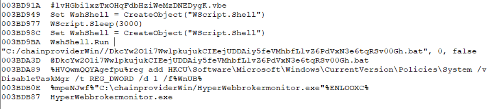
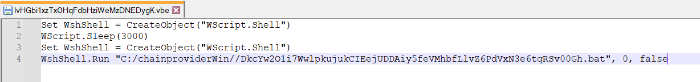
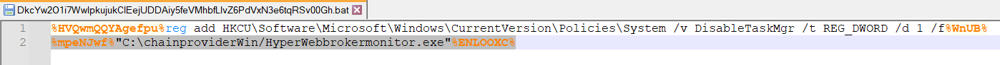
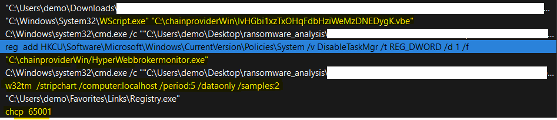
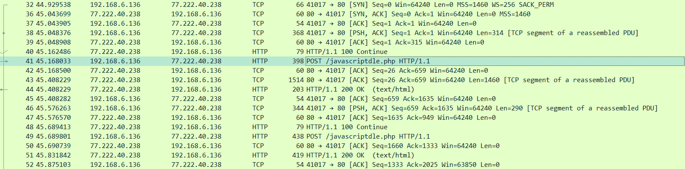

# Zyklon C2 Zararlı Yazılımı IoC Çalışması

  

  

Ali Can Gönüllü | Siber Güvenlik Uzmanı  alicangonullu[at]yahoo.com
 

# Disclaimer | Yasal Uyarı

  Bu blog yazısında sağlanan bilgiler yalnızca eğitim ve bilgilendirme amaçlıdır. <b>Bilgisayar korsanlığı, siber saldırılar veya bilgisayar sistemlerine, ağlara veya verilere herhangi bir şekilde yetkisiz erişim de dahil olmak üzere herhangi bir yasa dışı veya etik olmayan faaliyeti</b> teşvik etme veya reklam etme amacı taşımaz.
  
  Disclaimer: The information provided in this blog post is intended for educational and informational purposes only. It is not intended to encourage or promote any illegal or unethical activities, including hacking, cyberattacks, or any form of unauthorized access to computer systems, networks or data.

# Zararlı Hakkında

    Zyklon HTTP Backdoor Malware, bir bilgisayarın arka kapısını açan, klavye kaydı, parola çalma, ek eklentiler indirme ve çalıştırma, DDoS saldırıları yapma, kendini güncelleme ve kaldırma gibi özelliklere sahip, kamuya açık bir zararlı yazılımdır. Bu zararlı yazılım, Microsoft Office'in bazı açıklarını kullanarak sisteme bulaşabilir. Bu konuda bir resim üretmeye çalışacağım.
      
    Zyklon malware, a publicly available malware that can open a backdoor on a computer, perform keylogging, steal passwords, download and execute additional plugins, launch DDoS attacks, update and remove itself, and more. This malware can infect the system by exploiting some vulnerabilities in Microsoft Office.

# Bulaşma Şekli

    Yazılım açıldığı anda içerisinde oluşturduğu VBE, EXE ve BAT dosyalarıyla bulaşma işlemini tamamlar.

# Çalışma Mantığı

    Öncelikle zararlı yazılımımızın içerisindeki String değerlerini kontrol ettiğimizde WScript ve BAT dosyası olduğunu görüyoruz. Virüsün ana dosyasının bir loader olduğunu buradan anlıyoruz.
      
    
      
    BAT dosyasının VBE dosyasıyla başlatıldığı görülmüştür.
      
    
      
    EXE içerisindeki VBE ve BAT dosyalarını sıkıntısız almak için işlemlere başlarken BAT dosyası içerisindeki "reg add HKCU\Software\Microsoft\Windows\CurrentVersion\Policies\System /v DisableTaskMgr /t REG_DWORD /d 1 /f" komutuyla virüsün "taskmgr" uygulamasını devre dışı bırakmaya çalıştığını gördük. 
    Aynı BAT dosyasıyla da %mpeNJwf%"C:\chainproviderWin/HyperWebbrokermonitor.exe"%ENLOOXC% komutunun çağırıldığı görülmüştür.
      
    
      
    Ardından "w32tm /stripchart /computer:localhost /period:5 /dataonly /samples:2" çalıştırılarak hedef bilgisayarın saati ile kaynak bilgisayarın saatlerini kıyaslamaktadır. 
    "chcp 65001" komutu ile de karakter sınırı aşılmaktadır.
      
    
      
    Ardından "12112.ru.swtest[.]ru" C2 server olarak gördüğümüz "javascriptdle.php" dosyasına belirli aralıklarla çeşitli şifreler / şifreli mesajlar gönderildiği görülmüştür. 
    <a href="zyklon.pcapng">PCAP dosyasını buradan indirebilirsiniz</a>
      
    
         

# Sonuç

    En problemli yazılımlar genelde VBE ve BAT uzantısıyla bulaşmaktadır. Bu zararlı yazılımlar genelde kişisel kullanıcıları hedef almakla beraber kişisel kullanıcıların gittiği mekanlarda yayılabilmektedir. Bu sebeple sürekli olarak EDR / XDR sistemlerine YARA kurallarının girilmesi ve Snort gibi IDS/IPS sistemlerini kullanmak en iyisidir. 
    YARA kuralı ise aşağıdaki gibidir.

<pre>
rule Zyklon_Malware1 {
	meta:
                author= "Ali Can Gönüllü"
                description= "Zyklon Malware"
	strings:
                $pk1 = {72 65 67 20 61 64 64 20 48 4b 43 55 5c 53 6f 66 74 77 61 72 65 5c 4d 69 63 72 6f 73 6f 66 74 5c 57 69 6e 64 6f 77 73 5c 43 75 72 72 65 6e 74 56 65 72 73 69 6f 6e 5c 50 6f 6c 69 63 69 65 73 5c 53 79 73 74 65 6d 20 2f 76 20 44 69 73 61 62 6c 65 54 61 73 6b 4d 67 72 20 2f 74 20 52 45 47 5f 44 57 4f 52 44 20 2f 64 20 31 20 2f 66}
                $pk2 = {43 3a 5c 63 68 61 69 6e 70 72 6f 76 69 64 65 72 57 69 6e 2f 48 79 70 65 72 57 65 62 62 72 6f 6b 65 72 6d 6f 6e 69 74 6f 72 2e 65 78 65}
                $pk3 = {63 68 61 69 6e 70 72 6f 76 69 64 65 72 57 69 6e}
                $pk4 = {31 32 31 31 32 2e 72 75 2e 73 77 74 65 73 74 2e 72 75}
	condition:
                4 of ($pk*)
}
</pre>